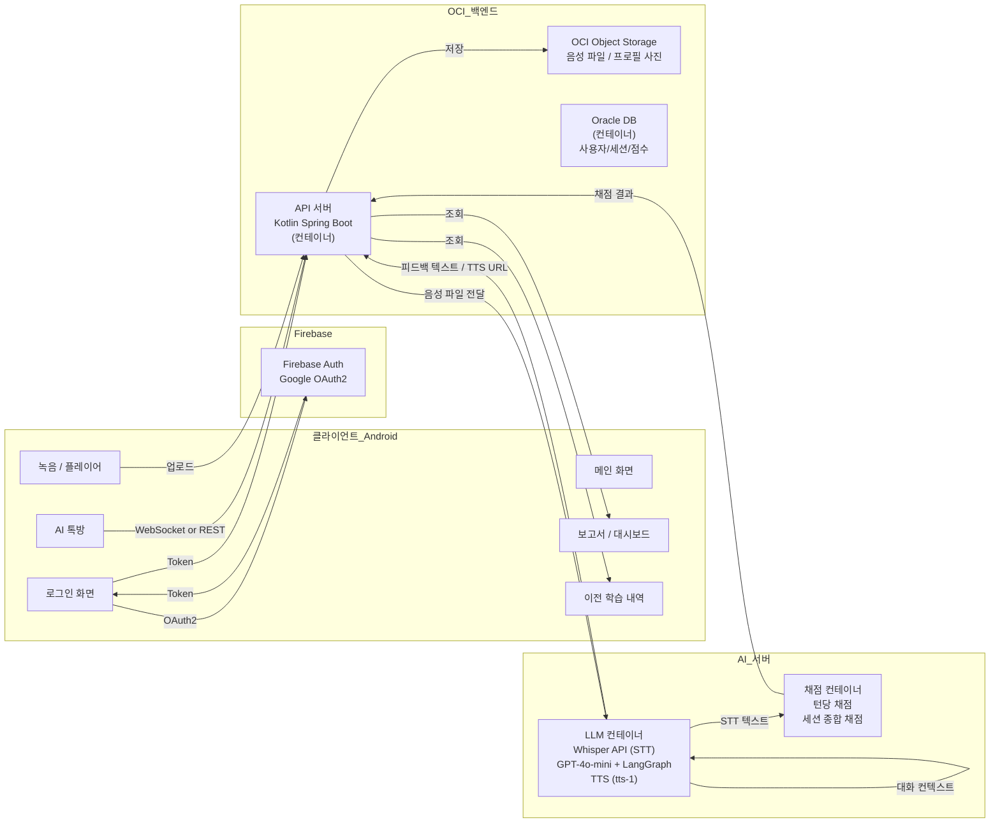
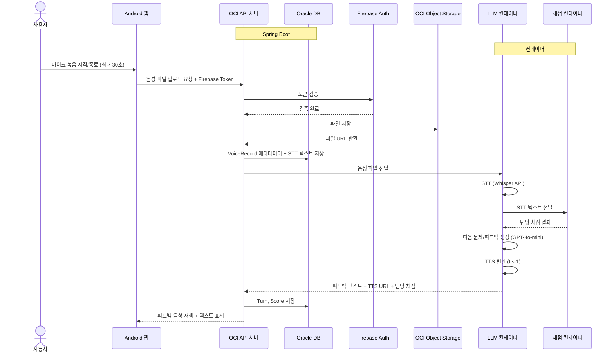

# 소프트웨어 요구사항 정의서 (Software Requirements Specification)

## 1. 목적 및 범위

### 1.1 목적
본 문서는 "AI 기반 발화 연습·대화형 에이전트 앱"의 소프트웨어 요구사항을 정의한다. 발화에 어려움을 겪는 실어증 환자를 대상으로 하며, AI와의 음성 대화를 통해 발화 훈련 및 피드백을 제공하는 것을 목표로 한다.

### 1.2 범위
- Android 단일 플랫폼 (Google Play 대상)
- 클라이언트: Kotlin Native (Android Studio)
- 백엔드: OCI (Oracle Cloud Infrastructure) 직접 구축 — **Oracle이 제공한 Tenancy 사용, Always Free 미사용**
- 인증: **Firebase Authentication (Google OAuth2)**
- AI 파이프라인: OpenAI Whisper API (STT, LLM 컨테이너 내부 처리), OpenAI TTS (tts-1), 발화 채점 컨테이너, 대화 진행 LLM 컨테이너. 구체적인 내부 구현 방식은 시스템 설계서/AI 파이프라인 문서에서 TBD로 정의.
- **DB: 백엔드 인스턴스 내 컨테이너로 Oracle DB 직접 구축 (OCI ADB 미사용)**
- **파일 저장: OCI Object Storage (음성 파일, 프로필 사진)**

### 1.3 우선순위 정의
- **P0 (Must Have):** 없으면 데모 불가능한 핵심 기능
- **P1 (Should Have):** 데모 품질을 크게 높여주는 기능
- **P2 (Nice to Have):** 데이터가 쌓여야 의미 있는 기능
- **P3 (Advanced):** 코어 완성 후 시간이 남으면 구현
- **P4 (Future / BM):** 발표 언급 또는 곁다리 기능
- **P5 (Polish):** QA 및 최종 다듬기

---

## 2. 시스템 개요

---

## 3. 기능적 요구사항

### 3.1 사용자 관리

| ID | 요구사항 | 우선순위 | 설명 | 비고 |
|----|----------|--------|------|------|
| FR-001 | 구글 소셜 로그인 | **P0** | Firebase Auth Google Sign-In 연동 | 최우선 인증 방식 |
| FR-002 | 카카오 소셜 로그인 | P3 | 카카오 OAuth2 연동 | 프로토타입 화면에 버튼만 배치 가능 |
| FR-003 | 네이버 소셜 로그인 | P3 | 네이버 OAuth2 연동 | 프로토타입 화면에 버튼만 배치 가능 |
| FR-004 | 일반 회원가입 / 로그인 | P3 | ID/PW 기반 로그인 | MVP 이후 구현. 관련 필드는 nullable로 유지 |
| FR-005 | 자동 로그인 | **P0** | 토큰 갱신 및 자동 로그인 유지 | Firebase ID Token / Refresh Token 관리 |
| FR-006 | 아이디 / 비밀번호 찾기 | P3 | 이메일 인증 기반 | |
| FR-007 | 프로필(필수정보) 조회 및 수정 | **P1** | 닉네임, 프로필 사진 URL, 이메일 | uuid(서버 식별). 프로필 사진은 OCI Object Storage 저장 |
| FR-008 | 개인화 정보(민감정보) 조회 및 수정 | **P4** | 성별, 나이, 직업, 수술/질병 여부, 관심사 | nullable. 프로토타입에서는 미사용 |
| FR-009 | 친구 목록 관리 | P3 | 소셜 친구 연동 | |

### 3.2 AI 음성 대화 흐름 (코어)

| ID | 요구사항 | 우선순위 | 설명 | 비고 |
|----|----------|--------|------|------|
| FR-010 | AI 톡방 입장 | **P0** | 학습 컨텐츠 선택 후 AI 대화 세션 시작 | 세션 ID 생성. 세션 유형: 오늘의 학습 / 유형별 연습 / 종합 연습 |
| FR-011 | AI 인사 출력 | **P0** | 톡방 입장 시 TTS로 인사말 출력 | |
| FR-012 | 문제 읽기 및 마이크 녹음 | **P0** | 화면에 문제 텍스트 표시 + 마이크 녹음 버튼 | **최대 30초**. 클라이언트에서 남은 시간 표시. 녹음 포맷: MP3 또는 WAV |
| FR-013 | 음성 파일 생성 및 업로드 | **P0** | 녹음 종료 시 파일 생성 → 백엔드 전송 → Object Storage 저장 | 메타데이터(사용자ID, 세션ID, 턴 번호) 포함 |
| FR-014 | 백엔드 라우팅 | **P0** | 음성 파일 및 세션 정보를 LLM 컨테이너로 라우팅 | Spring `@Async` 내부 스레드 풀로 처리 (메시지 큐 미사용) |
| FR-015 | STT 음성→텍스트 변환 | **P0** | LLM 컨테이너 내부에서 OpenAI Whisper API 호출하여 사용자 음성을 텍스트로 변환 | |
| FR-016 | 턴당 발화 채점 | **P0** | 채점 컨테이너에서 STT 결과를 기반으로 발화 점수 산출 | 컨텐츠 타입별 채점 |
| FR-017 | 한 턴 피드백 생성 | **P0** | 발화 채점 결과를 바탕으로 텍스트 피드백 생성 | LLM 컨테이너 활용 |
| FR-018 | 한 턴 피드백 음성 출력 | **P0** | 생성된 피드백을 OpenAI TTS (tts-1)로 음성 변환하여 재생 | |
| FR-019 | 문답 및 피드백 누적 | **P0** | 세션별로 사용자-AI 문답 기록 및 피드백 누적 저장 | 턴 단위 관리 |
| FR-020 | 사용자 응답 문맥 피드백 | **P0** | 단순 발화 외에 대화 문맥에 대한 피드백 제공 | |
| FR-021 | 다음 대화/문제 생성 | **P0** | 현재 턴을 기반으로 다음 문제 또는 대화 주제 생성 | 대화 진행 LLM 컨테이너 사용 (GPT-4o-mini API + LangGraph) |
| FR-022 | 학습 세션 종료 | **P0** | 사용자가 세션 종료 선택 또는 모든 턴 완료 시 종료 | |
| FR-023 | 세션 종합 보고서 요청 | **P0** | 세션 종료 시 Android에서 백엔드에 종합 보고서 생성 요청 | |
| FR-024 | 최종 보고서 생성 | **P0** | 채점 컨테이너에서 DB의 턴 데이터를 기반으로 종합 보고서 생성 | **5개 평가지표의 평균으로 종합 점수 산출** |
| FR-025 | 보고서 확인 | **P0** | 사용자가 최종 보고서를 화면에서 조회 | |
| FR-026 | 보고서 DB 저장 | **P0** | 생성된 보고서 및 점수 데이터를 DB에 영속 저장 | |

### 3.3 컨텐츠 유형 (v0.4 확정 — 2026-08-31)

> **⚠️ 기획 전환 (v0.4):** 앱 성격이 "AI 대화형 에이전트"에서 **"문제풀이 앱"**(마이크로 답안 제출, AI TTS 진행 유지)으로 재정의됨. TURN = "AI 제시 1회 + 사용자 반응 1세트".

| ID | 요구사항 | 우선순위 | 설명 | 비고 |
|----|----------|--------|------|------|
| FR-027 | 알아듣기 (LISTEN) | **P0** | 언어를 듣거나 보고 → 의미를 이해 → 판단/선택. 지문 + 보기(텍스트 또는 복수 이미지)를 탭으로 선택. 정답/보기/사용자선택 저장 | A타입(일반/채점) |
| FR-028 | 이름대기 (NAMING) | **P0** | 사물 이미지를 보고 단어를 인출하여 **말로 답변**. 단서는 시간 초과 시 의미단서→음운단서 순 제공(각 1개) | A타입. 단서는 hint JSON(ASSOCIATION/CHOSUNG)에서 조회 |
| FR-029 | 따라말하기 (SHADOWING) | **P0** | 발화를 듣고 따라 말하기. AI 제시 문장이 곧 문제 | A타입. 이미지 미사용 |
| FR-030a | 스스로말하기·자발화 (SELF_TALK) | **P0** | 그림/상황 이미지를 보고 스스로 설명하기 | A타입. 이미지 필수 |
| FR-030b | 이야기하기 (STORYTELLING) | **P0** | AI의 질문 → 사용자 답변 → 다음 대화. 점수 책정 없음(단, 사용자 발화 지표는 기록) | B타입(대화/무채점) |

> **세션 구성 (오늘의 학습):** A타입 4종을 무작위 순서로 각 2회씩 진행 후 이야기하기 N턴. 한 세션은 학습 테마(카페, 병원 등) 안에서 진행. 구 "컨텐츠 A/B/C 3종(TBD)" 정의는 위 5종으로 대체.

> **사용자 발화 지표 (채점 재료):** syllables(음절 수)·response_time(첫 단어 완성 시점까지)·articulation_rate(조음속도) — 이야기하기 포함 모든 사용자 음성에 기록 (최근 n회 평균 산정). 측정은 컨테이너가, 백엔드는 저장만 담당.

> ℹ️ v0.4에서 컨텐츠 유형에 FR-030a/030b 임시 번호를 사용해 기존 FR-030+ 번호 충돌을 회피함. 다음 문서 동기화 시 일괄 재번호 예정.

### 3.4 학습 이력 / 대시보드

| ID | 요구사항 | 우선순위 | 설명 | 비고 |
|----|----------|--------|------|------|
| FR-030 | 복습 기능 | P1 | 점수가 낮은 문제는 별도 저장 후 빠른 시일 내 "오늘의 학습"에 재출제 | |
| FR-031 | 간략화된 대시보드 (꺾은선) | P1 | 날짜별 점수 또는 학습량 꺾은선 그래프 표시 | |
| FR-032 | 방사형 그래프 (능력치) | P1 | **5개 평가지표별 유저 수준 점수**를 방사형 그래프로 시각화 | 대시보드에 표시 |
| FR-033 | 연속 학습 기록 | P2 | 스트릭(Streak) 기능 | |
| FR-034 | 컨텐츠 유형별 집중 연습 | P2 | 특정 유형의 문제를 모아서 연습 | |

### 3.5 사람 간 대화

| ID | 요구사항 | 우선순위 | 설명 | 비고 |
|----|----------|--------|------|------|
| FR-035 | 사람 간 매칭 기능 | P3 | 다른 사용자와 1:1 매칭 | |
| FR-036 | 실시간 대화 | P3 | 매칭된 사용자와 실시간 음성/텍스트 대화 | WebSocket 필요 |
| FR-037 | 대화 종료 후 평가지표 | P3 | 대화 종료 시 발화 평가 지표 출력 | 토글로 점수 제거 가능 |

### 3.6 설정

| ID | 요구사항 | 우선순위 | 설명 | 비고 |
|----|----------|--------|------|------|
| FR-038 | 알림 ON/OFF | P1 | 푸시 알림 설정 | |
| FR-039 | 고객센터 / 문의 | P1 | 문의하기 메일 또는 폼 연결 | |
| FR-040 | 접근성 메뉴 | P3 | 폰트 크기/스타일 변경, 색약 모드 | 실어증 환자를 고려한 기능이나 개발 복잡도로 인해 P3 |

### 3.7 이전 학습 기록

| ID | 요구사항 | 우선순위 | 설명 | 비고 |
|----|----------|--------|------|------|
| FR-041 | 세션 리스트 조회 | P3 | 하단 바 "이전 학습 내역"에서 이전 세션 리스트 조회 | |
| FR-042 | 세션 상세 조회 | P3 | 세션 선택 시 턴별 문항, 응답(STT 텍스트 + 음성 파일), 피드백, 점수 확인 | |

### 3.8 유저 수준 시스템

| ID | 요구사항 | 우선순위 | 설명 | 비고 |
|----|----------|--------|------|------|
| FR-043 | 유저 수준 산정 | P4 | 최근 10개 종합보고서(오늘의 학습 또는 종합 연습) 중 각 평가지표별 상위 5개 평균으로 수준 점수 계산 | 대표 점수 = 5개 지표 평균 |
| FR-044 | 유저 레벨 표시 | P4 | 0~100점을 10등분하여 레벨 1~10 표시 | 대시보드 및 프로필에 표시 |
| FR-045 | 문제 출제 난이도 반영 | P4 | 유저 수준에 따라 AI 문제 난이도 조절 | |

### 3.9 BM (수익 모델)

| ID | 요구사항 | 우선순위 | 설명 | 비고 |
|----|----------|--------|------|------|
| FR-046 | 종합보고서 일일 횟수 제한 | P4 | 하루에 생성할 수 있는 종합보고서는 최대 2회 | 추가 사용 시 유료 옵션 |
| FR-047 | 저장 문제 재풀이 | P4 | 이전에 풀었던 문제를 원할 때 다시 볼 수 있는 기능 | |
| FR-048 | 이전 학습 기록 보관 제한 | P4 | 기본 3일 보관. 구독 시 무제한 보관 | |

---

## 4. User Story & Use Case

### 4.1 User Story

#### US-001: 소셜 로그인
- **As a** 사용자
- **I want to** Google 계정으로 간편하게 로그인할 수 있다
- **So that** 별도의 회원가입 절차 없이 서비스를 즉시 이용할 수 있다
- **Acceptance Criteria:**
  - Google Sign-In 버튼을 누르면 Firebase Auth 연동이 된다
  - 최초 로그인 시 서버에서 uuid를 발급받고 자동으로 프로필이 생성된다
  - 이후 자동 로그인이 유지된다

#### US-002: 오늘의 학습 시작
- **As a** 사용자
- **I want to** 메인 화면에서 "오늘의 학습"을 시작할 수 있다
- **So that** AI와 음성 대화를 통해 발화 훈련을 할 수 있다
- **Acceptance Criteria:**
  - 톡방 화면으로 진입하면 AI가 TTS로 인사말을 출력한다
  - 첫 턴의 문제가 화면에 표시된다
  - "오늘의 학습" 세션 ID가 생성된다

#### US-003: 음성 녹음 및 피드백 수신
- **As a** 사용자
- **I want to** 마이크 버튼을 눌러 음성을 녹음하고, 녹음 종료 후 AI 피드백을 받을 수 있다
- **So that** 내 발화가 어떤지 평가받고 개선 방향을 알 수 있다
- **Acceptance Criteria:**
  - 녹음 최대 30초, 남은 시간이 화면에 표시된다
  - 녹음 종료 후 파일이 업로드되고 15초 이내에 피드백 음성이 재생된다
  - 채점 결과와 피드백 텍스트가 함께 표시된다

#### US-004: 세션 종료 및 종합 보고서
- **As a** 사용자
- **I want to** 학습을 마치면 종합 보고서를 확인할 수 있다
- **So that** 내 전체 발화 역량을 한눈에 파악할 수 있다
- **Acceptance Criteria:**
  - 세션 종료 시 보고서 생성 요청이 전송된다
  - 보고서에는 종합 점수(5개 평가지표 평균)와 각 지표별 점수가 포함된다
  - 하루 최대 2회까지만 생성 가능하다

#### US-005: 대시보드 확인
- **As a** 사용자
- **I want to** 대시보드에서 내 학습 이력과 수준을 확인할 수 있다
- **So that** 꾸준한 학습 동기를 얻을 수 있다
- **Acceptance Criteria:**
  - 날짜별 점수 꺾은선 그래프가 표시된다
  - 5개 평가지표별 방사형 그래프가 표시된다
  - 유저 레벨(1~10)이 표시된다

#### US-006: 이전 학습 기록 조회
- **As a** 사용자
- **I want to** 이전에 했던 학습 기록을 다시 확인할 수 있다
- **So that** 복습하거나 어느 부분이 약한지 스스로 점검할 수 있다
- **Acceptance Criteria:**
  - "이전 학습 내역"에서 세션 리스트를 볼 수 있다
  - 세션 상세에서 턴별 문항, STT 텍스트, 음성 재생, 피드백, 점수를 확인할 수 있다

#### US-007: 복습 기능
- **As a** 사용자
- **I want to** 점수가 낮은 문제를 다시 연습할 수 있다
- **So that** 약점을 집중적으로 보완할 수 있다
- **Acceptance Criteria:**
  - 점수가 낮은 턴은 자동으로 복습 후보에 등록된다
  - 다음 "오늘의 학습"에 해당 문제가 재출제될 수 있다

#### US-008: 프로필 수정
- **As a** 사용자
- **I want to** 닉네임과 프로필 사진을 변경할 수 있다
- **So that** 내 프로필을 원하는 대로 설정할 수 있다
- **Acceptance Criteria:**
  - 프로필 사진은 OCI Object Storage에 저장되고 URL이 DB에 기록된다
  - 닉네임은 즉시 수정 가능하다

#### US-009: 설정 관리
- **As a** 사용자
- **I want to** 알림 ON/OFF와 고객센터에 접근할 수 있다
- **So that** 서비스를 내 환경에 맞게 설정할 수 있다
- **Acceptance Criteria:**
  - 알림 설정 토글이 동작한다
  - 고객센터 메일 또는 폼으로 연결된다

### 4.2 Use Case

#### UC-001: 음성 대화 학습 흐름

**액터:** 사용자, Android 앱, Spring Boot API, LLM 컨테이너, 채점 컨테이너

**기본 시나리오:**
1. 사용자가 "오늘의 학습"을 선택하여 톡방에 입장한다
2. AI가 TTS로 인사말을 출력한다
3. 화면에 첫 턴의 문제가 표시된다
4. 사용자가 마이크 버튼을 눌러 음성을 녹음한다 (최대 30초)
5. 녹음 종료 시 파일이 생성되어 Spring Boot로 업로드된다
6. Spring Boot가 Object Storage에 저장하고, LLM 컨테이너에 음성 파일을 전달한다
7. LLM 컨테이너가 Whisper API로 STT를 수행한다
8. STT 텍스트를 채점 컨테이너에 전달하여 턴당 채점을 수행한다
9. LLM 컨테이너가 GPT-4o-mini로 다음 문제/피드백 텍스트를 생성한다
10. 피드백 텍스트를 TTS(tts-1)로 변환하여 음성 URL을 생성한다
11. 채점 결과, 피드백 텍스트, TTS URL이 Spring Boot로 취합된다
12. Spring Boot가 Turn, Score를 DB에 저장한다
13. Android에 피드백 텍스트 + TTS URL이 전달된다
14. Android가 TTS 음성을 재생하고 텍스트를 표시한다

**확장 시나리오:**
- 4a. 사용자가 30초 전에 녹음을 중단하면: 중단 시점까지의 음성으로 처리한다
- 7a. STT 실패 시: 에러 메시지를 반환하고 재녹음을 유도한다
- 11a. 채점 컨테이너 타임아웃 시: 채점 결과는 지연 표시하고, LLM 피드백은 먼저 전달한다

**예외 시나리오:**
- 네트워크 단절: 녹음 파일은 로컬에 임시 저장 후 재시도 로직 실행
- LLM 컨테이너 다운: 500 에러 반환, 사용자에게 "잠시 후 다시 시도해 주세요" 안내

#### UC-002: 종합 보고서 생성

**액터:** 사용자, Android 앱, Spring Boot API, 채점 컨테이너

**기본 시나리오:**
1. 사용자가 세션 종료 버튼을 누른다 (또는 마지막 턴 완료)
2. Android가 Spring Boot에 종합 보고서 생성을 요청한다
3. Spring Boot가 해당 세션의 모든 Turn, Score 데이터를 DB에서 조회한다
4. 채점 컨테이너에 세션 데이터를 전달하여 종합 보고서를 생성한다
5. 채점 컨테이너가 5개 평가지표별 점수와 종합 점수(평균)를 산출한다
6. Spring Boot가 Report를 DB에 저장한다
7. Android에 보고서 데이터가 전달되어 화면에 표시된다

**확장 시나리오:**
- 2a. 하루 이미 2회 생성한 경우: "내일 다시 시도해 주세요" 메시지 반환

#### UC-003: 이전 학습 기록 조회

**액터:** 사용자, Android 앱, Spring Boot API

**기본 시나리오:**
1. 사용자가 하단 바 "이전 학습 내역"을 선택한다
2. Android가 Spring Boot에 세션 리스트를 요청한다
3. Spring Boot가 DB에서 해당 사용자의 세션 목록을 조회한다
4. Android에 세션 리스트(날짜, 세션 유형, 종합 점수)가 표시된다
5. 사용자가 특정 세션을 선택한다
6. Android가 Spring Boot에 해당 세션의 턴 상세를 요청한다
7. Spring Boot가 DB에서 Turn, VoiceRecord, Score 데이터를 조회한다
8. Android에 턴별 문항, STT 텍스트, 음성 파일 URL, 피드백, 점수가 표시된다
9. 사용자가 음성 파일 URL을 눌러 녹음을 재생한다

---

## 5. 비기능적 요구사항

| ID | 요구사항 | 우선순위 | 설명 | 비고 |
|----|----------|--------|------|------|
| NFR-001 | 음성 처리 응답 시간 | **P0** | 단계별 응답 시간 목표: ① 녹음 종료 → **첫 피드백(채점 or LLM 중 먼저 도착한 것) 10초 이내** ② 전체 파이프라인 완료 **15초 이내**. STT→채점과 LLM→TTS는 **병렬 처리**하며, 채점 결과는 LLM 음성 재생 중 별도 UI로 지연 표시 허용. | 전체 파이프라인 병렬화 설계 필요 |
| NFR-002 | 앱 실행 성능 | **P0** | 앱 콜드 스타트 3초 이내, 화면 전환 300ms 이내 | |
| NFR-003 | 보안 — OAuth2 | **P0** | Firebase Auth Access/Refresh Token 안전한 저장 및 갱신 | Android Keystore 사용 |
| NFR-004 | 보안 — 민감정보 암호화 | **P4** | 민감정보(수술/질병 여부) 저장 시 암호화 고려 | TLS 1.3, 저장 시 AES-256. 프로토타입에서는 **"고려함" 수준으로 처리**, 당장 구현하지 않음 |
| NFR-005 | 보안 — 음성 데이터 | **P0** | 음성 녹음 파일 접근 제어 및 보관 기간 명시 | OCI Object Storage 접근 제어 및 보안 정책 |
| NFR-006 | 가용성 | P1 | 백엔드 서비스 가동률 99% 이상 (데모 기간 기준) | OCI VM 모니터링 필요 |
| NFR-007 | 접근성 | P1 | 실어증 환자를 고려한 UI: 큰 버튼, 명확한 색상 대비, 간결한 문구 | |
| NFR-008 | 오프라인 대응 | P2 | 네트워크 단절 시 기본적인 앱 동작 및 에러 메시지 제공 | 녹음 및 저장은 온라인 필수 |
| NFR-009 | 확장성 | P2 | 사용자 증가 시 OCI 인스턴스 스케일업 또는 로드밸런서 추가 가능 | |

---

## 6. 외부 인터페이스 요구사항

### 6.1 클라이언트 ↔ 백엔드 (Android ↔ OCI)

| 인터페이스 | 프로토콜 | 데이터 형식 | 설명 |
|-----------|---------|------------|------|
| 인증 API | HTTPS/REST | JSON | Firebase OAuth2 로그인, 토큰 갱신 |
| 세션 API | HTTPS/REST | JSON | 톡방 입장, 문제 조회, 세션 상태 |
| 음성 업로드 | HTTPS/POST | multipart/form-data | 녹음 파일 → Object Storage 경로 반환 |
| 피드백 수신 | HTTPS/REST or WebSocket | JSON | STT 결과, 채점, 피드백 텍스트, TTS URL |
| 보고서 API | HTTPS/REST | JSON | 보고서 생성 요청 및 조회 |
| 대시보드 API | HTTPS/REST | JSON | 학습 이력, 점수, 그래프 데이터 |

### 6.2 백엔드 ↔ AI 서버

| 인터페이스 | 대상 | 설명 | 비고 |
|-----------|------|------|------|
| 통합 AI API | LLM 컨테이너 | 음성 파일 전달 → STT → 대화 진행 → TTS 순차 처리 | 내부적으로 Whisper API, GPT-4o-mini, TTS 호출 |
| 턴당 채점 API | 채점 컨테이너 | LLM 컨테이너가 STT 텍스트를 전달 → 채점 점수 및 피드백 반환 | 백엔드는 LLM 컨테이너와 채점 컨테이너 결과를 취합 |
| 세션 종합 채점 API | 채점 컨테이너 | 세션 종료 시 DB의 턴 데이터 전달 → 종합 보고서(5개 지표 평균) 반환 | |

### 6.3 백엔드 ↔ Firebase

| 인터페이스 | 대상 | 설명 |
|-----------|------|------|
| 토큰 검증 API | Firebase Auth | Android에서 받은 Firebase ID Token 검증 |

### 6.4 클라이언트 ↔ 외부 SDK

| SDK | 용도 | 버전 |
|-----|------|------|
| Google Sign-In SDK | 구글 소셜 로그인 | 최신 안정 버전 |
| ExoPlayer | TTS 음성 파일 재생 | 미디어 재생 |
| Android AudioRecord / MediaRecorder | 마이크 녹음 | 시스템 API |

---

## 7. 제약조건

| ID | 제약조건 | 영향 |
|----|----------|------|
| C-001 | **기한**: 9월 10일 최종 발표 | MVP 범위(P0) 외 기능은 시간 남으면 구현 |
| C-002 | **플랫폼**: Android 단일 | iOS 고려 불필요 |
| C-003 | **언어**: Kotlin (클라이언트 + 백엔드 Spring Boot) | 풀스택 언어 통일 |
| C-004 | **인프라**: OCI Tenancy (Oracle 부트캠프 지원) | 예산 범위 내 MVP 사양 산정 필요. Always Free 미사용, 컨테이너 기반 구축 |
| C-005 | **DB**: Oracle Database 21c XE (컨테이너) | Oracle 문법 및 제약 적용 |
| C-006 | **AI 리소스**: OpenAI API 및 OCI 내 컨테이너 기반 AI 서비스 | 비용 및 API 호출 횟수 제한 고려 |
| C-007 | **개인정보**: 실어증 환자 대상 서비스 | 건강/음성 정보 민감데이터 처리 주의 |
| C-008 | **파일 저장**: OCI Object Storage | 음성 파일 및 프로필 사진 저장. 접근 제어 및 보안 정책 적용 필요 |
| C-009 | **녹음 시간**: 사용자 음성 녹음 최대 30초 | STT 처리 시간 및 사용자 경험 제약 |

---

## 8. 데이터 요구사항 (ERD 설계 전 초안)

### 8.1 주요 엔티티

| 엔티티 | 설명 | 민감정보 여부 |
|--------|------|--------------|
| User | 사용자 기본 정보, 소셜 로그인 식별자 | UUID, 이메일 |
| UserProfile | 필수정보(닉네임, 프로필사진 URL) + 민감정보(성별, 나이, 직업, 수술/질병, 관심사). 모두 nullable. | 수술/질병 여부 (민감) |
| Session | AI 대화 세션 정보 | |
| SessionType | 세션 유형(오늘의 학습, 유형별 연습, 종합 연습) | |
| Turn | 세션 내 각 문답 턴 | |
| VoiceRecord | 음성 녹음 파일 메타데이터(Storage 경로, 길이, 포맷) + STT 텍스트 | 음성 파일 (민감) |
| Score | 발화 채점 결과 (턴당) | |
| Report | 최종 보고서(종합 점수, 5개 평가지표별 점수) | |
| EvaluationMetric | 평가 지표 정의(지표1~5) | |
| UserMetricLevel | 유저의 각 평가지표별 수준 점수 및 대표 점수 | |
| ContentType | 컨텐츠 유형 정의(A, B, C) | |
| ContentEvaluationWeight | 컨텐츠별 평가지표 가중치 | |
| Problem | 컨텐츠/문제 데이터 | |

### 8.2 데이터 흐름

## 9. 용어 정의

| 용어 | 정의 |
|------|------|
| **발화** | 사용자가 음성으로 말하는 행위. 본 서비스의 핵심 입력값. |
| **STT (Speech-to-Text)** | 음성을 텍스트로 변환하는 기술. LLM 컨테이너 내부에서 OpenAI Whisper API 사용. |
| **TTS (Text-to-Speech)** | 텍스트를 음성으로 변환하는 기술. LLM 컨테이너 내부에서 OpenAI TTS (tts-1) 사용. |
| **턴 (Turn)** | AI와 사용자 간의 한 번의 문답 주기. 하나의 세션은 여러 턴을 포함하며, 각 턴은 컨텐츠 타입을 가짐. |
| **세션 (Session)** | 사용자가 학습을 시작부터 종료까지의 하나의 단위. 여러 턴을 포함하며, 세션 유형(오늘의 학습 / 유형별 연습 / 종합 연습)을 가짐. |
| **채점** | 사용자의 발화(STT 결과)를 평가하여 점수를 매기는 과정. 턴당 채점과 세션 종합 채점으로 구분됨. |
| **컨텐츠 유형** | AI 대화의 모드. 현재 3개(A, B, C)로 기획 중. 컨텐츠별 평가지표 가중치는 별도 정의. |
| **보고서** | 하나의 세션 종료 시 생성되는 종합 평가 결과. 5개 평가지표 점수 및 종합 점수(평균)를 포함. |
| **유저 수준** | 사용자의 발화 역량을 수치화한 지표. 5개 평가지표별 점수 + 대표 점수(평균). 0~100점을 10등분하여 레벨 1~10로 표시. |
| **Object Storage** | OCI에서 제공하는 파일 저장소. 음성 파일 및 프로필 사진 저장용으로 사용. |
| **Firebase Auth** | Google OAuth2 인증을 제공하는 Firebase 서비스. Android에서 로그인 후 Spring Boot에서 토큰 검증. |
| **OCI Oracle DB** | OCI 인스턴스 내 컨테이너로 직접 구축한 Oracle 데이터베이스. 사용자/세션/점수 등 구조화 데이터 저장. |
| **LLM 컨테이너** | OCI 내 Docker Compose로 운영되는 AI 서비스 컨테이너. Whisper API(STT) + GPT-4o-mini + LangGraph(대화 진행) + TTS(tts-1)을 통합 운영. 백엔드의 유일한 AI 진입점. |
| **채점 컨테이너** | OCI 내 Docker Compose로 운영되는 AI 서비스 컨테이너. STT 결과를 기반으로 턴당 채점 및 세션 종합 채점(보고서)을 생성. |

---

## 10. 비고 및 TBD (To Be Defined)

### 10.1 발화 채점 기준
- **상태**: 기획 중
- **내용**: 컨텐츠 3개(A, B, C) 각각에 대한 채점 기준 및 평가지표 5개의 구체적 정의
- **영향 받는 문서**: AI 파이프라인 설계서(③), 데이터베이스 설계서(④, Score/EvaluationMetric 엔티티), API 인터페이스 설계서(⑤, 채점 API)
- **조치**: 기획 확정 후 관련 문서들에서 "SRS 10.1 기준으로 작성"이라고 명시할 것

### 10.2 컨텐츠 유형 명칭 및 가중치
- **상태**: 임시 명칭 사용 중 (컨텐츠 A, B, C)
- **영향 받는 문서**: AI 파이프라인 설계서(③), WBS/개발계획서(⑦)
- **조치**: AI 팀원 및 기획과 협의 후 명칭 및 평가지표 가중치 확정

### 10.3 평가지표 명칭
- **상태**: 임시 명칭 사용 중 (지표 1~5)
- **영향 받는 문서**: 데이터베이스 설계서(④, EvaluationMetric), 대시보드 UI 설계
- **조치**: 기획 확정 후 EvaluationMetric 테이블 및 대시보드 스펙 반영

### 10.4 AI 모델 및 API 확정
- **STT**: OpenAI Whisper API 사용 → LLM 컨테이너 내부 호출로 확정
- **TTS**: OpenAI TTS (tts-1) 사용 → LLM 컨테이너 내부 호출로 확정
- **대화 진행 LLM**: GPT-4o-mini API + LangGraph 가정
- **발화 채점 컨테이너**: OCI 내 Docker Compose 컨테이너 기반. 내부 알고리즘/모델은 기획 중
- **영향 받는 문서**: 기술 아키텍처 문서(②), AI 파이프라인 설계서(③), API 인터페이스 설계서(⑤)

### 10.5 OCI 견적서
- **상태**: 부트캠프 지원 Tenancy 사용, **Always Free 미사용**. 컨테이너 기반 직접 구축.
- **예상 구성**: Compute(Arm, 4 OCPU / 16GB) + Object Storage(50GB) + 컨테이너 기반 Oracle XE (OCI ADB 미사용)
- **조치**: 기술 아키텍처 문서(②) 5.2절의 비용 산정 기준으로 견적서 작성

---

## 11. 변경 이력

| 버전 | 날짜 | 작성자 | 변경 내용 |
|------|------|--------|-----------|
| v0.1 | 2026-08-18 | 김윤혁 | 초안 작성 |
| v0.2 | 2026-08-19 | 김윤혁 | 회의 결정 반영: 컨테이너 구조 변경(LLM+채점 2개), 필수/민감정보 분리(P1/P4), 유저 수준 시스템 추가, 컨텐츠 3개 축소(A/B/C), Firebase Auth + OCI Object Storage 추가, 제약조건 교체(팀→프로젝트), 녹음 30초 제한, 이전 학습 기록 추가, 종합보고서 일일 제한 추가 |
| v0.3 | 2026-08-19 | 김윤혁 | 발표일 9/4 → 9/10 수정. User Story & Use Case 섹션(4장) 신규 추가. 외부 인터페이스 요구사항(6장)에 Firebase 토큰 검증 항목 추가. |
| v0.4 | 2026-08-31 | Hermes (Agent) | **기획 전환 반영 (문서 재설계 v0.5 동기):** 앱 재정의 — "AI 대화형 에이전트" → "문제풀이 앱"(마이크로 답안 제출, AI TTS 진행 유지). §3.3 컨텐츠 유형 확정: 구 A/B/C 3종(TBD) → 5종 확정 (LISTEN 알아듣기/NAMING 이름대기/SHADOWING 따라말하기/SELF_TALK 스스로말하기/STORYTELLING 이야기하기 — A 4종은 채점 컨테이너로 점수 산정, B는 무채점). 세션 구성 확정: 오늘의 학습 = A 4종×2회 무작위 → 이야기하기 N턴, 학습 테마(카페/병원 등) 기반. NAMING 답변 형태 확정(말로 답변, 단서 의미→음운 각 1개). 사용자 발화 지표 3종(syllables/response_time/articulation_rate) 요구사항 신설 — STORYTELLING 포함 전 사용자 음성 기록(개인 평균 산정 재료). SELF_TALK/STORYTELLING은 임시 번호 FR-030a/b 부여 — 추후 일괄 재번호 예정 |
