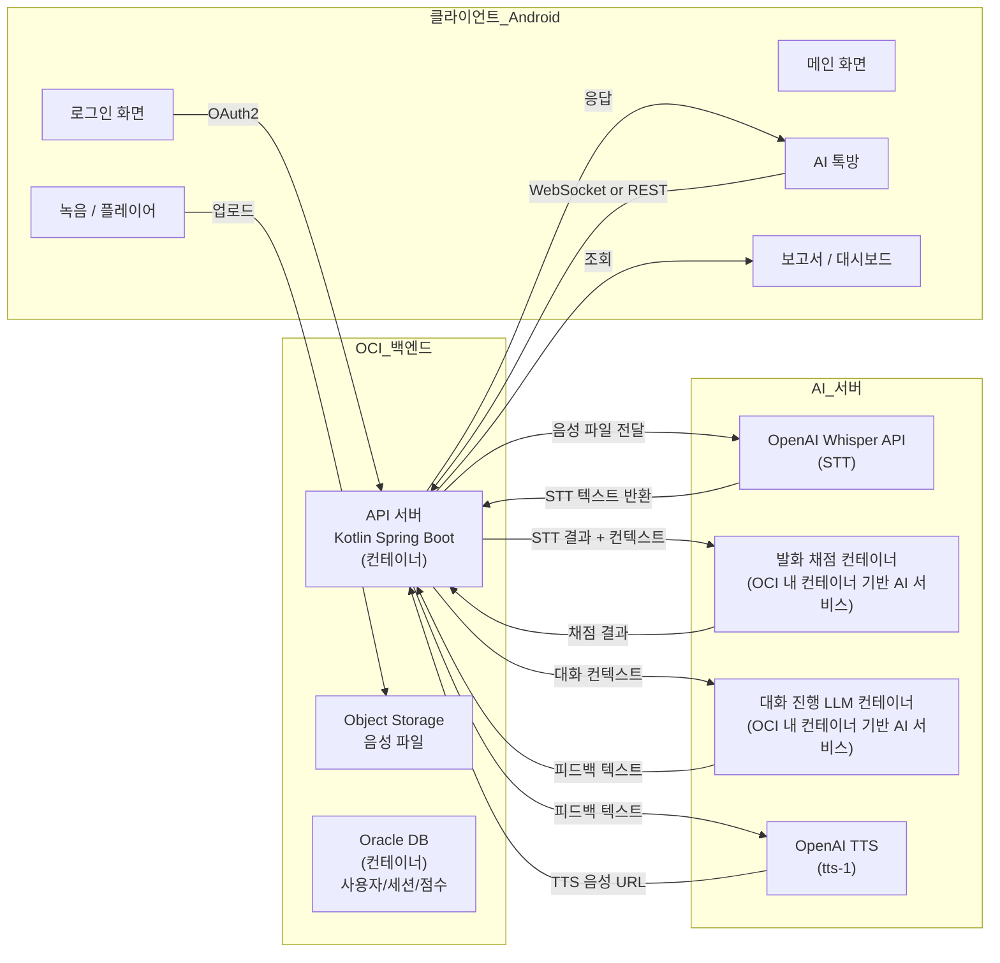
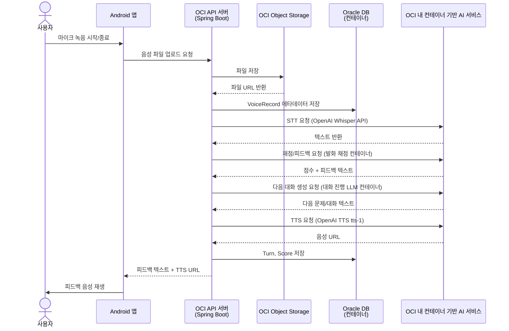

# 소프트웨어 요구사항 정의서 (Software Requirements Specification)

## 1. 목적 및 범위

### 1.1 목적
본 문서는 "AI 기반 발화 연습·대화형 에이전트 앱"의 소프트웨어 요구사항을 정의한다. 발화에 어려움을 겪는 실어증 환자를 대상으로 하며, AI와의 음성 대화를 통해 발화 훈련 및 피드백을 제공하는 것을 목표로 한다.

### 1.2 범위
- Android 단일 플랫폼 (Google Play 대상)
- 클라이언트: Kotlin Native (Android Studio)
- 백엔드: OCI (Oracle Cloud Infrastructure) 직접 구축 — **Oracle이 제공한 Tenancy 사용, Always Free 미사용**
- AI 파이프라인: OpenAI Whisper API (STT), OpenAI TTS (tts-1), 발화 채점 컨테이너, 대화 진행 LLM 컨테이너. 구체적인 내부 구현 방식은 시스템 설계서에서 TBD로 정의.
- **DB: 백엔드 인스턴스 내 컨테이너로 Oracle DB 직접 구축 (OCI ADB 미사용)**

### 1.3 우선순위 정의
- **P0 (Must Have):** 없으면 데모 불가능한 핵심 기능
- **P1 (Should Have):** 데모 품질을 크게 높여주는 기능
- **P2 (Nice to Have):** 데이터가 쌓여야 의미 있는 기능
- **P3 (Advanced):** 코어 완성 후 시간이 남으면 구현
- **P4 (Future / BM):** 발표 언급 또는 곁다리 기능
- **P5 (Polish):** QA 및 최종 다듬기

---

## 2. 시스템 개요

---

## 3. 기능적 요구사항

### 3.1 사용자 관리

| ID | 요구사항 | 우선순위 | 설명 | 비고 |
|----|----------|--------|------|------|
| FR-001 | 구글 소셜 로그인 | **P0** | Google Sign-In SDK 연동 | Firebase Auth 불필요, OAuth2 직접 또는 Spring Security OAuth2 사용 |
| FR-002 | 카카오 소셜 로그인 | P3 | 카카오 OAuth2 연동 | 프로토타입 화면에 버튼만 배치 가능 |
| FR-003 | 네이버 소셜 로그인 | P3 | 네이버 OAuth2 연동 | 프로토타입 화면에 버튼만 배치 가능 |
| FR-004 | 일반 회원가입 / 로그인 | P3 | ID/PW 기반 로그인 | MVP에서는 소셜만으로 충분 |
| FR-005 | 자동 로그인 | **P0** | 토큰 갱신 및 자동 로그인 유지 | Refresh Token 관리 |
| FR-006 | 아이디 / 비밀번호 찾기 | P3 | 이메일 인증 기반 | |
| FR-007 | 프로필 조회 및 수정 | P1 | 닉네임, 프로필 사진, 추가 개인화 정보 | UUID(서버 식별) 필수. 민감정보(수술/질병 여부) 암호화 저장 |
| FR-008 | 친구 목록 관리 | P3 | 소셜 친구 연동 | |

### 3.2 AI 음성 대화 흐름 (코어)

| ID | 요구사항 | 우선순위 | 설명 | 비고 |
|----|----------|--------|------|------|
| FR-009 | AI 톡방 입장 | **P0** | 학습 컨텐츠 선택 후 AI 대화 세션 시작 | 세션 ID 생성 |
| FR-010 | AI 인사 출력 | **P0** | 톡방 입장 시 TTS로 인사말 출력 | |
| FR-011 | 문제 읽기 및 마이크 녹음 | **P0** | 화면에 문제 텍스트 표시 + 마이크 녹음 버튼 | 녹음 포맷: MP3 또는 WAV (AI 개발 담당 확인 필요) |
| FR-012 | 음성 파일 생성 및 업로드 | **P0** | 녹음 종료 시 파일 생성 → 백엔드 전송 → Object Storage 저장 | 메타데이터(사용자ID, 세션ID, 턴 번호) 포함 |
| FR-013 | 백엔드 라우팅 | **P0** | 음성 파일 및 세션 정보를 AI 처리 서버로 라우팅 | Spring `@Async` 내부 스레드 풀로 처리 (메시지 큐 미사용) |
| FR-014 | STT 음성→텍스트 변환 | **P0** | OpenAI Whisper API 호출하여 사용자 음성을 텍스트로 변환 | AI 개발 담당 최종 확인 필요 |
| FR-015 | 발화 채점 | **P0** | STT 결과를 기반으로 발화 점수 산출 | ⚠️ **채점 기준 및 알고리즘 미정**. **시스템 설계서/AI 파이프라인 문서에서 TBD로 상세 정의** |
| FR-016 | 한 턴 피드백 생성 | **P0** | 발화 채점 결과를 바탕으로 텍스트 피드백 생성 | LLM 컨테이너 활용 |
| FR-017 | 한 턴 피드백 음성 출력 | **P0** | 생성된 피드백을 OpenAI TTS (tts-1)로 음성 변환하여 재생 | |
| FR-018 | 문답 및 피드백 누적 | **P0** | "오늘의 문제"별로 사용자-AI 문답 기록 및 피드백 누적 저장 | 세션 단위 관리 |
| FR-019 | 사용자 응답 문맥 피드백 | **P0** | 단순 발화 외에 대화 문맥에 대한 피드백 제공 | |
| FR-020 | 다음 대화/문제 생성 | **P0** | 현재 턴을 기반으로 다음 문제 또는 대화 주제 생성 | 대화 진행 LLM 컨테이너 사용 가정 (GPT-4o-mini API + LangGraph). 구체 구현은 시스템 설계서/AI 파이프라인 문서에서 TBD로 정의 |
| FR-021 | 학습 세션 종료 | **P0** | 사용자가 "오늘은 여기까지" 선택 시 세션 종료 | |
| FR-022 | 최종 보고서 생성 | **P0** | 세션 종료 시 종합 점수 및 방사형 그래프 파라미터 생성 | |
| FR-023 | 보고서 확인 | **P0** | 사용자가 최종 보고서를 화면에서 조회 | |
| FR-024 | 보고서 DB 저장 | **P0** | 생성된 보고서 및 점수 데이터를 DB에 영속 저장 | |

### 3.3 컨텐츠 유형 (AI 대화 모드)

| ID | 요구사항 | 우선순위 | 설명 | 비고 |
|----|----------|--------|------|------|
| FR-025 | 프리스타일 AI 토킹쇼 | **P0** | 자유 주제로 AI와 대화하는 모드 | |
| FR-026 | 작문 보조 | **P0** | LLM 생성 원리처럼 다음 단어 후보를 제시하고 문장 완성 유도 | |
| FR-027 | 문제 풀이 | **P0** | "나는 _______에서 _______를 했다" 등의 빈칸 채우기 | |
| FR-028 | 주제 발화 | **P0** | 주제에 대해 한 문장으로 대답하는 모드 | |

> **⚠️ 비고 (TBD):** 위 4개 컨텐츠 유형 모두 P0로 분류되었으나, **난이도에 따라 MVP 우선순위 및 구현 여부를 재조정할 수 있음**. 세부 난이도 및 구현 방식에 따라 일부는 P1로 조정 가능.

### 3.4 학습 이력 / 대시보드

| ID | 요구사항 | 우선순위 | 설명 | 비고 |
|----|----------|--------|------|------|
| FR-029 | 복습 기능 | P1 | 점수가 낮은 문제는 별도 저장 후 빠른 시일 내 "오늘의 학습"에 재출제 | 100점 만점 기준, 고득점 문제는 저장 없이 통과 |
| FR-030 | 간략화된 대시보드 (꺾은선) | P1 | 날짜별 점수 또는 학습량 꺾은선 그래프 표시 | |
| FR-031 | 연속 학습 기록 | P2 | 스트릭(Streak) 기능 | |
| FR-032 | 방사형 그래프 (능력치) | P1 | 내 현재 수준을 방사형 그래프로 시각화 | 최종 보고서에서 생성된 파라미터 활용 |
| FR-033 | 컨텐츠 유형별 집중 연습 | P2 | 특정 유형의 문제를 모아서 연습 | |

### 3.5 사람 간 대화

| ID | 요구사항 | 우선순위 | 설명 | 비고 |
|----|----------|--------|------|------|
| FR-034 | 사람 간 매칭 기능 | P3 | 다른 사용자와 1:1 매칭 | |
| FR-035 | 실시간 대화 | P3 | 매칭된 사용자와 실시간 음성/텍스트 대화 | WebSocket 필요 |
| FR-036 | 대화 종료 후 평가지표 | P3 | 대화 종료 시 발화 평가 지표 출력 | 토글로 점수 제거 가능 |

### 3.6 설정

| ID | 요구사항 | 우선순위 | 설명 | 비고 |
|----|----------|--------|------|------|
| FR-037 | 알림 ON/OFF | P1 | 푸시 알림 설정 | |
| FR-038 | 고객센터 / 문의 | P1 | 문의하기 메일 또는 폼 연결 | |
| FR-039 | 접근성 메뉴 | P3 | 폰트 크기/스타일 변경, 색약 모드 | 실어증 환자를 고려한 기능이나 개발 복잡도로 인해 P3 |

### 3.7 BM (수익 모델)

| ID | 요구사항 | 우선순위 | 설명 | 비고 |
|----|----------|--------|------|------|
| FR-040 | 레벨별 맞춤 문제 | P4 | 사용자 수준에 맞는 문제 자동 생성 | 발표 언급 또는 곁다리 구현 |
| FR-041 | 저장 문제 재풀이 | P4 | 이전에 풀었던 문제를 원할 때 다시 볼 수 있는 기능 | |
| FR-042 | 사용량 기반 일일 무료 횟수 | P4 | 일일 무료 사용 횟수 제한 및 추가 유료 옵션 | |

---

## 4. 비기능적 요구사항

| ID | 요구사항 | 우선순위 | 설명 | 비고 |
|----|----------|--------|------|------|
| NFR-001 | 음성 처리 응답 시간 | **P0** | 단계별 응답 시간 목표: ① 녹음 종료 → **첫 피드백(채점 or LLM 중 먼저 도착한 것) 10초 이내** ② 전체 파이프라인 완료 **15초 이내**. STT→채점과 LLM→TTS는 **병렬 처리**하며, 채점 결과는 LLM 음성 재생 중 별도 UI로 지연 표시 허용. | 전체 파이프라인 병렬화 설계 필요 |
| NFR-002 | 앱 실행 성능 | **P0** | 앱 콜드 스타트 3초 이내, 화면 전환 300ms 이내 | |
| NFR-003 | 보안 — OAuth2 | **P0** | 소셜 로그인 시 Access/Refresh Token 안전한 저장 및 갱신 | Android Keystore 사용 |
| NFR-004 | 보안 — 데이터 암호화 | **P0** | 민감정보(수술/질병 여부, 음성 파일) 전송 및 저장 시 암호화 | TLS 1.3, 저장 시 AES-256 |
| NFR-005 | 보안 — 음성 데이터 | **P0** | 음성 녹음 파일 접근 제어 및 보관 기간 명시 | 개인정보 처리 방침에 따름 |
| NFR-006 | 가용성 | P1 | 백엔드 서비스 가동률 99% 이상 (데모 기간 기준) | OCI Always Free VM 모니터링 필요 |
| NFR-007 | 접근성 | P1 | 실어증 환자를 고려한 UI: 큰 버튼, 명확한 색상 대비, 간결한 문구 | |
| NFR-008 | 오프라인 대응 | P2 | 네트워크 단절 시 기본적인 앱 동작 및 에러 메시지 제공 | 녹음 및 저장은 온라인 필수 |
| NFR-009 | 확장성 | P2 | 사용자 증가 시 OCI 인스턴스 스케일업 또는 로드밸런서 추가 가능 | |

---

## 5. 외부 인터페이스 요구사항

### 5.1 클라이언트 ↔ 백엔드 (Android ↔ OCI)

| 인터페이스 | 프로토콜 | 데이터 형식 | 설명 |
|-----------|---------|------------|------|
| 인증 API | HTTPS/REST | JSON | OAuth2 로그인, 토큰 갱신 |
| 세션 API | HTTPS/REST | JSON | 톡방 입장, 문제 조회, 세션 상태 |
| 음성 업로드 | HTTPS/POST | multipart/form-data | 녹음 파일 → Object Storage 경로 반환 |
| 피드백 수신 | HTTPS/REST or WebSocket | JSON | STT 결과, 채점, 피드백 텍스트, TTS URL |
| 보고서 API | HTTPS/REST | JSON | 보고서 생성 요청 및 조회 |
| 대시보드 API | HTTPS/REST | JSON | 학습 이력, 점수, 그래프 데이터 |

### 5.2 백엔드 ↔ AI 서버

| 인터페이스 | 대상 | 설명 | 비고 |
|-----------|------|------|------|
| STT API | OpenAI Whisper API | 음성 파일 URL 또는 binary 전송 → 텍스트 반환 | AI 개발 담당 최종 확인 필요 |
| 발화 채점 API | 발화 채점 컨테이너 | STT 결과 텍스트 및 세션 컨텍스트 전송 → 채점 점수 및 피드백 텍스트 반환 | 내부 알고리즘/모델은 시스템 설계서/AI 파이프라인 문서에서 TBD로 정의 |
| 대화 진행 LLM API | 대화 진행 LLM 컨테이너 | 대화 컨텍스트 전송 → 다음 문제/피드백 텍스트 반환 | GPT-4o-mini API + LangGraph 가정. 구체 구현은 시스템 설계서/AI 파이프라인 문서에서 TBD로 정의 |
| TTS API | OpenAI TTS (tts-1) | 피드백 텍스트 전송 → 음성 파일 URL 반환 | AI 개발 담당 최종 확인 필요 |

### 5.3 클라이언트 ↔ 외부 SDK

| SDK | 용도 | 버전 |
|-----|------|------|
| Google Sign-In SDK | 구글 소셜 로그인 | 최신 안정 버전 |
| ExoPlayer | TTS 음성 파일 재생 | 미디어 재생 |
| Android AudioRecord / MediaRecorder | 마이크 녹음 | 시스템 API |

---

## 6. 제약조건

| ID | 제약조건 | 영향 |
|----|----------|------|
| C-001 | **기한**: 9월 4일 최종 발표 | MVP 범위(P0) 외 기능은 시간 남으면 구현 |
| C-002 | **인력**: 4명, 개발 총괄 1명이 클라이언트/백엔드/인프라 전담 | 자동화 도구(LLM Agent 개발) 적극 활용 필요 |
| C-003 | **플랫폼**: Android 단일 | iOS 고려 불필요 |
| C-004 | **언어**: Kotlin (클라이언트 + 백엔드 Spring Boot) | 풀스택 언어 통일 |
| C-005 | **인프라**: OCI Tenancy (Oracle 부트캠프 지원) | 예산 범위 내 MVP 사양 산정 필요. Always Free 미사용, 컨테이너 기반 구축. |
| **AI 리소스** | OpenAI Whisper API, OpenAI TTS (tts-1), 발화 채점 컨테이너, 대화 진행 LLM 컨테이너 | 비용 및 API 호출 횟수 제한 고려 |
| C-007 | **개인정보**: 실어증 환자 대상 서비스 | 건강/음성 정보 민감데이터 처리 주의 |

---

## 7. 데이터 요구사항 (ERD 설계 전 초안)

### 7.1 주요 엔티티

| 엔티티 | 설명 | 민감정보 여부 |
|--------|------|--------------|
| User | 사용자 기본 정보, 소셜 로그인 식별자 | UUID, 이메일 |
| UserProfile | 추가 개인화 정보(성별, 나이, 직업, 수술/질병 여부) | **수술/질병 여부 (민감)** |
| Session | AI 대화 세션 정보 | |
| Turn | 세션 내 각 문답 턴 | |
| VoiceRecord | 음성 녹음 파일 메타데이터(Storage 경로, 길이, 포맷) | **음성 파일 (민감)** |
| Score | 발화 채점 결과 | |
| Report | 최종 보고서(종합 점수, 파라미터) | |
| Problem | 컨텐츠/문제 데이터 | |
| ContentType | 컨텐츠 유형 정의(토킹쇼, 작문, 문제, 주제발화) | |

### 7.2 데이터 흐름

---

## 8. 용어 정의

| 용어 | 정의 |
|------|------|
| **발화** | 사용자가 음성으로 말하는 행위. 본 서비스의 핵심 입력값. |
| **STT (Speech-to-Text)** | 음성을 텍스트로 변환하는 기술. 본 서비스에서는 OpenAI Whisper API 사용 가정. |
| **TTS (Text-to-Speech)** | 텍스트를 음성으로 변환하는 기술. 본 서비스에서는 OpenAI TTS (tts-1) 사용 가정. |
| **턴 (Turn)** | AI와 사용자 간의 한 번의 문답 주기. "오늘의 문제"는 여러 턴으로 구성됨. |
| **세션 (Session)** | 사용자가 "오늘의 학습"을 시작부터 종료까지의 하나의 단위. 여러 턴을 포함. |
| **채점** | 사용자의 발화(STT 결과)를 평가하여 점수를 매기는 과정. |
| **컨텐츠 유형** | AI 대화의 모드(프리스타일 토킹쇼, 작문 보조, 문제 풀이, 주제 발화). |
| **보고서** | 하나의 세션 종료 시 생성되는 종합 평가 결과. 점수 및 방사형 그래프 파라미터 포함. |
| **Object Storage** | OCI에서 제공하는 파일 저장소. 음성 파일 저장용으로 사용. |
| **OCI Oracle DB** | OCI 인스턴스 내 컨테이너로 직접 구축한 Oracle 데이터베이스. 사용자/세션/점수 등 구조화 데이터 저장. |
| **발화 채점 컨테이너** | OCI 내 Docker Compose로 운영되는 AI 서비스 컨테이너. 사용자 발화(STT 결과)를 평가하여 채점 점수 및 피드백 텍스트를 반환. 내부 알고리즘/모델은 시스템 설계서/AI 파이프라인 문서에서 TBD로 정의. |
| **대화 진행 LLM 컨테이너** | OCI 내 Docker Compose로 운영되는 AI 서비스 컨테이너. 대화 컨텍스트를 기반으로 다음 문제 또는 피드백 텍스트를 생성. GPT-4o-mini API + LangGraph 가정. 구체 구현은 시스템 설계서/AI 파이프라인 문서에서 TBD로 정의. |

---

## 9. 비고 및 TBD (To Be Defined)

### 9.1 발화 채점 기준
- **상태**: 미정 
- **영향 받는 문서**: AI 파이프라인 설계서(③), 데이터베이스 설계서(④, Score 엔티티), API 인터페이스 설계서(⑤, 채점 API)
- **조치**: **본 SRS의 FR-015가 확정되면**, 관련 문서들에서 "SRS FR-015 기준으로 작성"이라고 명시할 것.

### 9.2 컨텐츠 유형 우선순위
- **상태**: 4개 전부 P0로 분류되었으나, 구현 난이도를 고려하여 우선순위 재조정 가능
- **영향 받는 문서**: AI 파이프라인 설계서(③), WBS/개발계획서(⑦)
- **조치**: AI 팀원과 협의 후 FR-025 ~ FR-028 중 P0/P1 재분배

### 9.3 AI 모델 및 API 확정
- **STT**: OpenAI Whisper API 사용 가정 → AI 개발 담당 최종 확인 필요
- **TTS**: OpenAI TTS (tts-1) 사용 가정 → AI 개발 담당 최종 확인 필요
- **발화 채점 컨테이너 / 대화 진행 LLM 컨테이너**: OCI 내 Docker Compose 컨테이너 기반 AI 서비스 가정. 세부 모델명, 사양, 엔드포인트 규격은 시스템 설계서/AI 파이프라인 문서에서 TBD로 정의
- **영향 받는 문서**: 기술 아키텍처 문서(②), AI 파이프라인 설계서(③), API 인터페이스 설계서(⑤)

### 9.4 OCI 견적서
- **상태**: 부트캠프 지원 Tenancy 사용, **Always Free 미사용**. 컨테이너 기반 직접 구축.
- **예상 구성**: Compute(Arm, 4 OCPU / 16GB) + Object Storage(50GB) + 컨테이너 기반 Oracle XE (OCI ADB 미사용)
- **조치**: 기술 아키텍처 문서(②) 5.2절의 비용 산정 기준으로 견적서 작성

---

## 10. 변경 이력

| 버전 | 날짜 | 작성자 | 변경 내용 |
|------|------|--------|-----------|
| v0.1 | 2026-08-18 | 김윤혁 | 초안 작성 |
