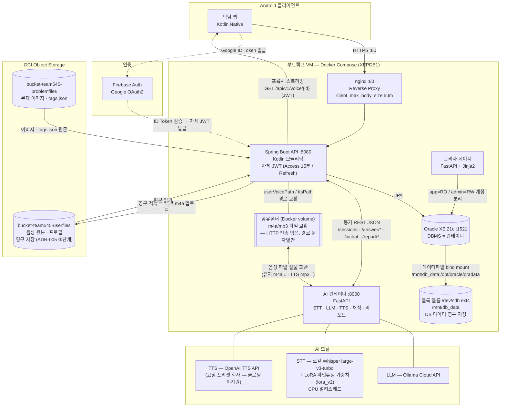

# 시스템 설계서 (System Design Document)

> **버전:** v2.1 (2026-09-09 — 갱신: AI 모델 스택 실측 정정(LLM=Ollama Cloud·STT=Whisper large-v3-turbo+LoRA·TTS=OpenAI API) + §3 구성도 전면 갱신(공유폴더·블록볼륨 bind mount·관리자 페이지)). 구 v2.0 = AI 컨테이너 통합 / nginx / 음성 저장 3단계 / 문제풀이 전환
> **관련:** 요구사항 = `01_Requirements.md` · 계약 = `03_AI_Container_Contract.md` · DB = `04_Database_Design.md` · 클라 API = `05_API_Design.md` · 세션 기획 = `06_Session_Flow_Spec.md`

## 1. 목적 및 범위

발화 연습 문제풀이 앱(덕담)의 기술 아키텍처를 정의한다.

- Android 단일 클라이언트 (Kotlin)
- OCI Compute VM — **Docker Compose** 기반
- **모놀리틱 Spring Boot (Kotlin)** API 서버
- 인증: Firebase Authentication (Google OAuth2) + 자체 JWT (Access/Refresh)
- **통합 AI 컨테이너 1개** (STT + LLM + TTS + 채점 + 리포트) — 구 llm/scoring 컨테이너 통합 (ADR-002)
- 턴 진행: **REST 동기/폴링 기반** (WebSocket은 pending — §6)
- 동시접속 로드맵: 컨테이너 다중 기동 + Redis + Celery (미도입)

## 2. 리포지토리 구조

| 리포지토리 | 기술 스택 | 설명 | 상태 |
|-----------|----------|------|------|
| `SeSAC_SpeechApp_Backend` | Kotlin / Spring Boot 4.x | 모놀리틱 API 서버 | ✅ 운영 중 |
| `SeSAC_SpeechApp_Frontend` | Kotlin (Android) | Android 클라이언트 | ✅ 운영 중 |
| `SeSAC_SpeechApp_Container_DB` | Oracle XE (Docker) + init SQL | DB 컨테이너 정의 | ✅ |
| `SeSAC_ai_container` | Python / FastAPI | **통합 AI 컨테이너** (STT+LLM+TTS+채점+리포트) | ✅ VM 실가동 (2026-09-08) |
| `SeSAC_admin_page` | FastAPI + Jinja2 | DB 웹 관리 콘솔 | ✅ |
| `SeSAC_SpeechApp_Deployment` | Docker Compose | 전체 오케스트레이션 (nginx 포함) | ✅ 부분 |

> 구 `SeSAC_llm_container` + `SeSAC_scoring_container`는 통합으로 병합 (ADR-002).

## 3. 시스템 구성도

> **v2.1 구성도 변경점:** 모델 스택 실측 정정(§8 근거 동일)·공유폴더 음성 교환 보강(03a §0)·DB 데이터 영구 저장 = OCI 블록 볼륨 bind mount(`/mnt/db_data` = `/dev/sdb ext4` — Deployment compose 실측)·관리자 페이지 표기. 발표용 구조도 = `diagrams/architecture.md`

## 4. 음성 파일 3단계 저장 전략 (ADR-005)

| 단계 | 저장소 | 용도 |
|------|--------|------|
| ① 공유폴더 | Docker volume (BE ↔ AI 컨테이너) | HTTP 전송 회피용 임시 교환. 세션 종료/폐기 시 삭제 |
| ② OCI 버킷 | `bucket-team545-userfiles` | **영구 저장 원본.** `containers/llm/{userUUID}/{sessionID}/{turnID}_user.m4a\|_ai.mp3` |
| ③ 클라 서빙 | 백엔드 프록시 스트리밍 | `GET /api/v1/voice/{voiceRecordId}`, JWT 인증 (P2-22 선례) |

## 5. 서버 운영 (부트캠프 VM)

| 항목 | 규칙 |
|------|------|
| VM | `vm-team545-backend` (alias `ssh ocisesac`), Oracle XEPDB1 |
| 백엔드 기동 | `~/app/run_backend.sh start/stop/status/log` — **직접 bootRun 금지** (H2 우발 기동 사고 예방), :8080 포트 기반 중복 감지 |
| 관리자 페이지 | `~/admin_page/run_admin.sh` (OCI 마운트 `docker-compose.override.yml` 보존) |
| nginx | 백엔드 Docker화 A안 확정 — 전체 트래픽 :80 경유, `/ws` WebSocket 업그레이드, 업로드 50MB |
| DB 리셋 | compose down → 데이터 삭제 → 권한 → up → READY 대기 (skill 참고) |

## 6. 통신 방식 결정 현황

| 구간 | 방식 | 비고 |
|------|------|------|
| Android ↔ BE | REST (multipart 업로드, 프록시 스트리밍) | 턴 제출은 논블로킹 — 결과는 세션 결과 화면 일괄 |
| BE ↔ AI 컨테이너 | 동기 REST (FastAPI) + 공유폴더 파일 교환 | 계약: `03_AI_Container_Contract.md` |
| WebSocket | **pending** — 문제풀이 전환으로 불요 가능성. 턴당 채점 수신 방식 상의 결과에 따라 재설계 | WebSocketManager 코드 유지 |

## 7. 보안

| 항목 | 방식 |
|------|------|
| 인증 | Firebase ID Token 검증 → 자체 JWT (Access 15분 / Refresh), EncryptedSharedPreferences 저장 |
| 시크릿 | `.env` / `secrets/` / `.oci/` — **문서·레포에 평문 금지** |
| 버킷 | 비공개 유지, 백엔드 프록시만 노출 |
| DB 계정 | app(RO on CONTENT) / admin(RW) 분리 |

## 8. 동시성/확장 로드맵

| 단계 | 내용 |
|------|------|
| 현재 | AI 컨테이너 1개 직렬 처리 (LLM=Ollama Cloud API — gemma4:cloud, STT=로컬 Whisper large-v3-turbo + LoRA 파인튜닝 가중치 lora_v2 — CPU 멀티스레드, TTS=OpenAI TTS API — 고정 프리셋 화자·클로닝 미지원) |
| 도입 시 | 컨테이너 다중 기동 + Redis + Celery 메시지 큐 오케스트레이션 |
| 병목 시 | 로컬 모델 → 클라우드 모델 교체 (wrapper 구조 유지) |

## 9. 변경 이력

| 버전 | 날짜 | 내용 |
|------|------|------|
| v2.1 | 2026-09-09 | **AI 모델 스택 실측 정정 + §3 구성도 전면 갱신:** LLM=Ollama Cloud API(gemma4:cloud) · STT=로컬 Whisper large-v3-turbo + LoRA 파인튜닝(lora_v2.pt — whisper-timestamped DTW 경로, 없으면 스톡 폴백) · TTS=로컬 Qwen → **OpenAI TTS API**(고정 프리셋 화자 — clone.wav 클로닝 미지원; CLOVA Voice는 NCP 콘솔 미활성화로 미채택) — AI 컨테이너 main.py·hf_stt.py·config.py 실측. §3 구성도: 공유폴더 음성 교환 보강 + DB 데이터 = OCI 블록 볼륨 bind mount(/mnt/db_data = /dev/sdb ext4 — compose 실측) + 관리자 페이지. §2 ai_container 상태 ✅ VM 실가동(09-08). 발표용 도식 신설: diagrams/architecture.md |
| v2.0 | 2026-09-02 | AI 컨테이너 통합 반영(구 llm/scoring 병합), 음성 3단계 저장 전략, nginx A안/운영 규칙 반영, WebSocket pending 정리, 모델 구성 갱신(OpenAI→Ollama Cloud/Whisper/Qwen), 문제풀이 전환 반영 |