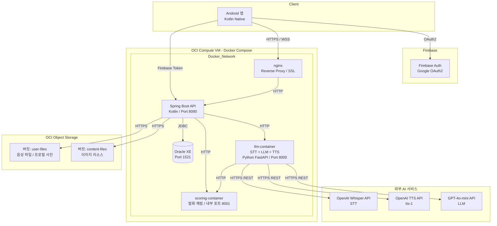
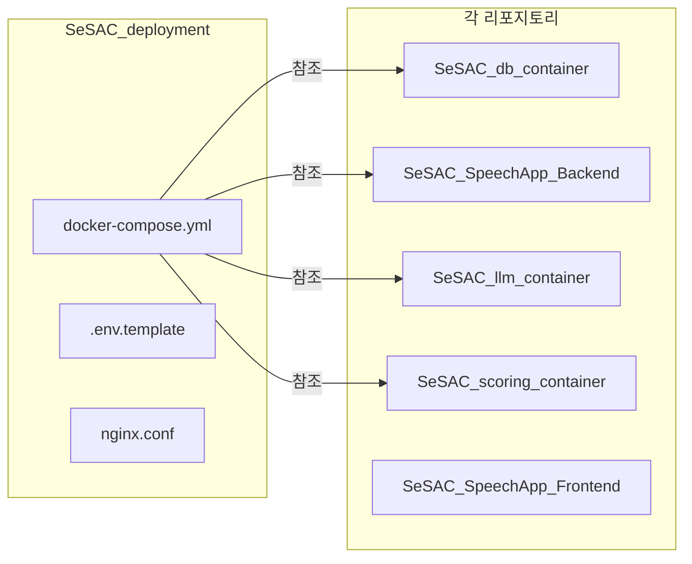
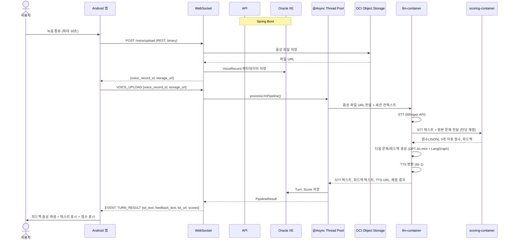
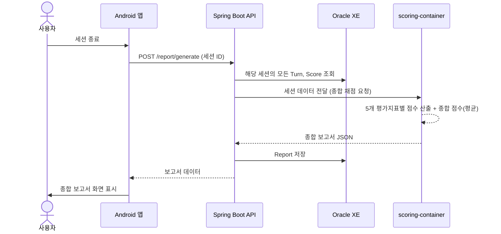

# 시스템 설계서 (System Design Document)

## 1. 목적 및 범위

본 문서는 SRS에 기술된 요구사항을 충족하기 위한 **시스템 기술 아키텍처**를 정의한다.

- Android 단일 클라이언트
- OCI (Oracle Cloud Infrastructure) 상에 **Docker Compose** 기반 백엔드 구축
- **모놀리틱 Spring Boot (Kotlin)** API 서버
- 인증: **Firebase Authentication (Google OAuth2)** — Spring Boot에서 Firebase ID Token 검증
- AI 파이프라인 연동: **LLM 컨테이너 1개** (STT+LLM+TTS 통합) + **채점 컨테이너 1개**
- 음성 대화 흐름: **WebSocket** 기반 실시간 양방향 통신
- 비동기 처리: **Spring `@Async` 내부 스레드 풀**

> **📌 리포지토리 구조:** 각 컨테이너/서비스는 별도의 GitHub 리포지토리로 관리된다. 전체 오케스트레이션은 `SeSAC_deployment` 리포지토리의 `docker-compose.yml`로 통합 관리한다.

| 리포지토리 | 기술 스택 | 설명 |
|-----------|----------|------|
| `SeSAC_SpeechApp_Backend` | Kotlin / Spring Boot 3.x | 모놀리틱 API 서버 |
| `SeSAC_SpeechApp_Frontend` | Kotlin (Android) | Android 클라이언트 앱 |
| `SeSAC_db_container` | Oracle XE (Docker) | 데이터베이스 컨테이너 정의 |
| `SeSAC_llm_container` | Python / FastAPI | LLM 컨테이너 (STT + LLM + TTS) |
| `SeSAC_scoring_container` | Python / FastAPI | 발화 채점 컨테이너 |
| `SeSAC_deployment` | Docker Compose | 전체 서비스 오케스트레이션 (NEW) |

---

## 2. 시스템 아키텍처 개요

### 2.1 전체 구성도



> **참고:** AI 컨테이너(`llm-container`, `scoring-container`)는 동일 OCI VM의 Docker Compose에 포함되어 운영된다. 각 컨테이너는 별도 GitHub 리포지토리(`SeSAC_llm_container`, `SeSAC_scoring_container`)에서 관리되며, `SeSAC_deployment` 리포지토리의 `docker-compose.yml`로 통합 배포된다. 추후 로드 증가로 VM 분리가 필요한 경우, Compose 파일만 별도 VM으로 이전하면 된다.

### 2.2 배포 구조 (SeSAC_deployment)

`SeSAC_deployment` 리포지토리는 전체 서비스의 오케스트레이션을 담당한다.



> **배포 방법:** VM에서 모든 리포지토리를 클론한 후, `SeSAC_deployment` 디렉토리에서 `docker compose up` 실행. 현재 Oracle DB 서비스만 활성화되어 있으며, 나머지 서비스는 placeholder 주석으로 표시되어 있다.

### 2.3 통신 방식 요약

| 구간 | 프로토콜 | 용도 |
|------|---------|------|
| Android ↔ Firebase | OAuth2 | Google 소셜 로그인 |
| Android ↔ Spring Boot | HTTPS | Firebase ID Token 전달 |
| Android ↔ nginx | HTTPS / **WSS** | WebSocket: AI 대화 실시간 양방향 통신 |
| Android ↔ nginx | HTTPS | REST: 로그인, 대시보드, 설정 등 일반 API |
| nginx ↔ Spring Boot | HTTP | 내부 프록시 (같은 Docker Network) |
| Spring Boot ↔ Oracle XE | JDBC (TCP 1521) | SQL 데이터 처리 |
| Spring Boot ↔ Object Storage | HTTPS REST | 음성 파일 업로드/다운로드, 프로필 사진 |
| Spring Boot ↔ llm-container | HTTP | 음성 파일 전달 → STT → 대화 진행 → TTS 결과 수신 |
| llm-container ↔ scoring-container | HTTP | STT 텍스트 전달 → 채점 점수/피드백 수신 |
| Spring Boot ↔ scoring-container | HTTP | 세션 종합 채점: DB 턴 데이터 → 종합 보고서 |
| llm-container ↔ OpenAI APIs | HTTPS REST | Whisper(STT), TTS, GPT-4o-mini(LLM) 호출 |

---

## 3. 컴포넌트 상세 설계

### 3.1 클라이언트: Android (Kotlin Native)

| 항목 | 내용 |
|------|------|
| **언어 / IDE** | Kotlin / Android Studio |
| **최소 SDK** | API 26 (Android 8.0) — 권장: API 28+ |
| **네트워크 라이브러리** | OkHttp + OkHttpEventSource (WebSocket/SSE) |
| **JSON 직렬화** | kotlinx.serialization 또는 Gson |
| **OAuth** | Google Sign-In SDK (Firebase Auth 연동) |
| **오디오** | Android AudioRecord / MediaRecorder (녹음, **최대 30초**), ExoPlayer (재생) |
| **아키텍처 패턴** | MVVM (ViewModel + Repository) |

#### WebSocket 사용 범위
- **AI 톡방 세션**: WebSocket 연결 유지
- **일반 API** (로그인, 대시보드, 설정): REST

### 3.2 백엔드: Spring Boot (모놀리틱)

| 항목 | 내용 |
|------|------|
| **언어 / 프레임워크** | Kotlin / Spring Boot 3.x |
| **빌드 도구** | Gradle (Kotlin DSL) |
| **JDK** | 17+ (21 권장) |
| **데이터 접근** | Spring Data JPA + Hibernate |
| **DB 드라이버** | Oracle JDBC (ojdbc11) |
| **WebSocket** | Spring WebSocket + STOMP (또는 WebSocketHandler 직접 구현) |
| **OAuth2** | Firebase Admin SDK (ID Token 검증) |
| **비동기 처리** | `@Async` + ThreadPoolTaskExecutor |
| **로깅** | Kotlin Logging + Logback |

#### 주요 서비스 계층

```kotlin
@RestController
class ChatController(
    private val chatService: ChatService,
    private val aiService: AiService,
    private val storageService: StorageService,
    private val reportService: ReportService
) {
    // WebSocket 핸들러 — LLM 컨테이너 결과 푸시 및 채점 결과 취합
}

@Service
class AiService {
    // LLM 컨테이너 호출: 음성 파일 전달 → STT+LLM+TTS 결과 수신
    fun processLlmPipeline(voiceUrl: String, sessionContext: SessionContext): LlmResult {
        // LLM 컨테이너에 음성 파일 전달
        // 결과: STT 텍스트, 피드백 텍스트, TTS URL
    }

    // 채점 컨테이너 호출 (세션 종합 보고서)
    fun generateSessionReport(sessionId: UUID): Report {
        // DB에서 해당 세션의 모든 Turn, Score 조회
        // 채점 컨테이너에 전달 → 종합 보고서 수신
    }
}
```

### 3.3 데이터베이스: Oracle XE (컨테이너)

| 항목 | 내용 |
|------|------|
| **버전** | Oracle Database 21c XE |
| **이미지** | `gvenzl/oracle-xe:21-slim` (공식 Slim 이미지) |
| **포트** | 1521 (내부 Docker Network만 노출, 외부 직접 노출 금지) |
| **초기 계정** | SYSTEM / oracle (로컬 개발), 별도 앱 계정 생성 권장 |
| **데이터 볼륨** | Docker Volume 마운트 (`oracle-data:/opt/oracle/oradata`) |
| **메모리 최적화** | XE는 2GB RAM 이내로 운영 가능 (SGA_TARGET=512M, PGA_AGGREGATE_TARGET=256M) |

### 3.4 AI 컨테이너

#### 3.4.1 llm-container (STT + LLM + TTS 통합)

| 항목 | 내용 |
|------|------|
| **기술 스택** | Python / FastAPI + LangGraph |
| **내부 구현** | OpenAI Whisper API (STT) → GPT-4o-mini (대화 진행) → TTS (tts-1) 통합 파이프라인 |
| **입력** | 음성 파일 URL (Spring Boot로부터 전달받음) |
| **내부 처리** | 1) Whisper API로 STT 2) STT 텍스트를 scoring-container로 전달(채점) 3) LangGraph로 다음 문제/피드백 생성 4) TTS로 음성 변환 |
| **출력** | STT 텍스트, 피드백 텍스트, TTS 음성 URL, 턴 번호 |
| **Spring Boot 호출** | HTTP POST (동일 Docker Network 내) |
| **scoring-container 호출** | HTTP POST (동일 Docker Network 내) |

> **참고:** llm-container는 백엔드의 **유일한 AI 진입점**이다. STT, 대화 진행, TTS를 내부적으로 순차 처리하며, STT 결과는 별도 채점 컨테이너로 전달한다.

#### 3.4.2 scoring-container (발화 채점)

| 항목 | 내용 |
|------|------|
| **기술 스택** | Python / FastAPI (또는 Spring Boot가 직접 호출 가능한 HTTP 서버) |
| **내부 구현** | TBD — 자체 모델 기반 채점 또는 LangGraph 기반 파이프라인 |
| **입력 (턴당)** | STT 텍스트, 원본 문제, 컨텐츠 타입 |
| **출력 (턴당)** | 점수(JSON), 5개 평가지표별 점수, 어휘력 피드백 |
| **입력 (세션 종합)** | 세션의 모든 Turn, Score 데이터 (Spring Boot로부터) |
| **출력 (세션 종합)** | 종합 보고서(5개 평가지표별 점수, 종합 점수=평균) |
| **호출자** | llm-container (턴당 채점), Spring Boot (세션 종합 채점) |
| **Spring Boot 호출** | HTTP POST (동일 Docker Network 내) |

> **참고:** scoring-container는 CPU 기반 컨테이너이며, GPU는 불필요하다. 향후 모델 고도화 시 GPU 필요 여부를 재검토한다.

### 3.5 Docker Compose 구성

> **📌 주의:** 아래 `docker-compose.yml`은 `SeSAC_deployment` 리포지토리에서 관리된다. 각 서비스의 이미지는 해당 리포지토리에서 빌드된다. 현재 Oracle DB 서비스만 활성화되어 있으며, 나머지는 placeholder 주석으로 표시되어 있다.

```yaml
# SeSAC_deployment/docker-compose.yml (OCI VM 내 배포)
services:
  oracle-db:
    # SeSAC_db_container 리포지토리의 설정 사용
    image: gvenzl/oracle-xe:21-slim
    container_name: oracle-xe
    environment:
      ORACLE_PASSWORD: ${ORACLE_PASSWORD}
    volumes:
      - oracle-data:/opt/oracle/oradata
    ports:
      - "127.0.0.1:1521:1521"  # 내부만 노출
    networks:
      - backend
    healthcheck:
      test: ["CMD", "sqlplus", "-L", "SYSTEM/${ORACLE_PASSWORD}", "@healthcheck.sql"]
      interval: 30s
      timeout: 10s
      retries: 5

  app:
    image: ${OCI_REGISTRY}/speech-app:latest
    container_name: spring-boot-app
    environment:
      SPRING_DATASOURCE_URL: jdbc:oracle:thin:@oracle-db:1521/XEPDB1
      SPRING_DATASOURCE_USERNAME: ${DB_USER}
      SPRING_DATASOURCE_PASSWORD: ${DB_PASSWORD}
      FIREBASE_PROJECT_ID: ${FIREBASE_PROJECT_ID}
      OCI_STORAGE_NAMESPACE: ${OCI_STORAGE_NAMESPACE}
      OCI_STORAGE_BUCKET: ${OCI_STORAGE_BUCKET}
      LLM_CONTAINER_URL: http://llm-container:8000
      SCORING_CONTAINER_URL: http://scoring-container:8001
    ports:
      - "127.0.0.1:8080:8080"
    depends_on:
      oracle-db:
        condition: service_healthy
      llm-container:
        condition: service_started
      scoring-container:
        condition: service_started
    networks:
      - backend

  llm-container:
    image: ${OCI_REGISTRY}/llm-container:latest
    container_name: llm-container
    environment:
      OPENAI_API_KEY: ${OPENAI_API_KEY}
      GPT_MODEL: gpt-4o-mini
      SCORING_CONTAINER_URL: http://scoring-container:8001
    ports:
      - "127.0.0.1:8000:8000"  # 내부/헬스체크용
    networks:
      - backend
    # CPU 기반; GPU 불필요

  scoring-container:
    image: ${OCI_REGISTRY}/scoring-container:latest
    container_name: scoring-container
    environment:
      # 내부 모델 설정 또는 LangGraph 설정
      MODEL_PATH: ${MODEL_PATH:-/models}
    ports:
      - "127.0.0.1:8001:8001"  # 내부/헬스체크용
    networks:
      - backend
    # CPU 기반; GPU 불필요

  nginx:
    image: nginx:alpine
    container_name: nginx
    volumes:
      - ./nginx.conf:/etc/nginx/nginx.conf:ro
      - ./ssl:/etc/nginx/ssl:ro
    ports:
      - "80:80"
      - "443:443"
    depends_on:
      - app
    networks:
      - backend

volumes:
  oracle-data:

networks:
  backend:
    driver: bridge
```

### 3.6 Object Storage (OCI Bucket)

> **📌 아키텍처 원칙:** Object Storage 관련 OCI SDK 통합은 **Backend(Spring Boot)**에서 담당한다. 데이터베이스에는 메타데이터(`bucket_path` 문자열)만 저장하며, 실제 파일은 Object Storage에 보관한다.

| 항목 | 내용 |
|------|------|
| **버킷 구성** | 2개 버킷 (또는 1개 버킷 + prefix 분리) |
| **버킷 1** | `speech-app-user-files` — 음성 녹음 파일, 프로필 사진 |
| **버킷 2** | `speech-app-content-files` — 이미지 리소스 (IMAGE_RESOURCE) |
| **DB 저장** | 메타데이터만 저장 (`bucket_path` 문자열). 실제 파일은 Object Storage에 보관 |
| **접근 제어** | Pre-Authenticated URL (PAR) 또는 임시 서명 URL 생성 |
| **음성 파일 명명** | `{user-uuid}/{session-id}/{turn-number}.mp3` |
| **프로필 사진 명명** | `{user-uuid}/profile/{timestamp}.jpg` |
| **이미지 리소스 명명** | `content/{image_name}` |
| **수명 주기** | 음성 파일: 30일 후 자동 삭제 (Lifecycle Rule). 프로필 사진/이미지 리소스: 무제한 |
| **암호화** | OCI 기본 서버 측 암호화 (AES-256) |

---

## 4. AI 대화 흐름 상세 설계

### 4.1 턴당 처리 흐름도



### 4.2 세션 종합 보고서 생성 흐름도



### 4.3 WebSocket 이벤트 명세 (초안)

| 방향 | 이벤트명 | 설명 |
|------|---------|------|
| C → S | `SESSION_START` | 톡방 세션 시작 |
| C → S | `VOICE_UPLOAD` | 음성 업로드 완료 통지 (voice_record_id, storage_url 전달) |
| S → C | `TURN_RESULT` | 턴 처리 완료 → STT 텍스트 + 피드백 텍스트 + TTS URL + 점수 |
| S → C | `ERROR` | 처리 실패 (STT 실패, LLM 타임아웃 등) |
| C → S | `SESSION_END` | 세션 종료 → 보고서 생성 요청 |
| S → C | `REPORT_READY` | 최종 보고서 생성 완료 |

---

## 5. OCI 인프라 설계

### 5.1 제안 VM 사양 (MVP)

| 항목 | 제안 사양 | 비고 |
|------|----------|------|
| **VM Shape** | VM.Standard.E4.Flex 또는 VM.Standard.A1.Flex | A1(Arm)이 더 저렴하고 성능 좋음 |
| **OCPU** | 4 | Spring Boot + Oracle XE + llm-container + scoring-container 동시 실행 |
| **메모리** | 16 GB | Oracle XE에 2GB, Spring Boot에 2GB, AI 컨테이너 2개에 각 2~3GB, 나머지 OS/버퍼 |
| **부트 볼륨** | 50 GB | Docker 이미지 + Oracle 데이터 파일 |
| **OS** | Oracle Linux 8 또는 Ubuntu 22.04 | Docker CE 설치 편한 쪽으로 |
| **공인 IP** | 예 | SSL 인증서 발급 및 외부 접속 필요 |
| **VNIC 보안 규칙** | 22(SSH), 80(HTTP), 443(HTTPS) 개방 | DB(1521) 및 AI 컨테이너 포트는 내부 네트워크만 |

### 5.2 예상 비용 (월간)

> 40만원 예산 내에서 안정적으로 운영 가능.

| 항목 | 예상 비용 (월) | 비고 |
|------|--------------|------|
| VM (4 OCPU / 16GB) | 약 20만원 | 개발 중에는 껐다 켰다 → 실제 과금 ↓ |
| Object Storage (50GB) | 약 2만원 | 음성 파일 30일 자동 삭제 + 프로필 사진 |
| 데이터 전송 (Outbound) | 약 1~3만원 | 음성 파일 다운로드 트래픽 |
| OpenAI API (Whisper + TTS + GPT-4o-mini) | 약 3~5만원 | 사용량 기 과금; MVP 기준 월간 예상 |
| **합계** | **약 25~30만원/월** | **2개월 운영 시 50~60만원** |

---

## 6. 보안 설계

### 6.1 데이터 보안

| 항목 | 방식 |
|------|------|
| **전송 중 암호화** | TLS 1.3 (Let's Encrypt 무료 SSL 인증서) |
| **저장 중 암호화** | Oracle TDE (투명 데이터 암호화) 또는 컬럼 레벨 AES-256 |
| **민감정보** | 수술/질병 여부, 음성 파일 — 별도 접근 제어 및 암호화 (P4 구현) |
| **음성 파일 접근** | Pre-Authenticated URL은 TTL 5분으로 제한. 직접 버킷 접근 금지 |

### 6.2 인증 및 인가

| 항목 | 방식 |
|------|------|
| **소셜 로그인** | Firebase Authentication (Google Sign-In SDK) |
| **토큰 검증** | Spring Boot에서 Firebase Admin SDK로 ID Token 검증 |
| **JWT 토큰 (일반 로그인)** | Access Token (15분) + Refresh Token (7일) — P3 구현 시 |
| **토큰 저장** | Android: EncryptedSharedPreferences |
| **WebSocket 인증** | 연결 시 Firebase ID Token을 Query Param 또는 Header로 전달, 서버에서 검증 |

### 6.3 API 키 관리

| 키 | 저장 위치 | 비고 |
|----|----------|------|
| Firebase Admin SDK Service Account | Spring Boot 환경변수 | `.env` 파일로 Docker Compose에 주입, Git 미포함 |
| OpenAI API Key | llm-container 환경변수 | `.env` 파일로 주입 |
| OCI API Key | Spring Boot의 `~/.oci/config` | Object Storage SDK 사용 시 |

---

## 7. 기술 리스크 및 완화 방안

| 리스크 | 영향도 | 완화 방안 |
|--------|--------|-----------|
| OpenAI API 과금 초과 | 중간 | 토큰 사용량 모니터링, Rate Limit 설정, 월간 예산 알림 |
| OpenAI API 응답 지연/타임아웃 | 높음 | connection timeout 10s / read timeout 30s, 재시도 1회, fallback 메시지 |
| Oracle XE 메모리 부족 (SGA/PGA) | 중간 | XE는 2GB RAM 한계; 쿼리 튜닝, 인덱스 최적화, 불필요한 세션 정리 |
| AI 컨테이너 2개 CPU 과부하 | 중간 | VM 사양을 4 OCPU/16GB로 증설, `@Async` Thread Pool 크기 조정 |
| scoring-container 내부 모델 미정 | 중간 | SRS FR-016 확정 전까지 Mock API 또는 LangGraph 프로토타입으로 대체 가능 |
| Whisper API 음성 길이 제한 (25MB) | 낮음 | 25MB 이상 음성은 청크 분할 또는 압축 (MP3 16kHz). 최대 30초 녹음으로 사실상 문제 없음 |
| TTS API 음성 품질 | 낮음 | tts-1 모델 선정, 필요시 음성 샘플 A/B 테스트 |
| Firebase Auth 통신 지연 | 낮음 | Firebase Admin SDK 캐싱, 토큰 검증 최적화 |

---

## 8. 변경 이력

| 버전 | 날짜 | 작성자 | 변경 내용 |
|------|------|--------|-----------|
| v0.1 | 2026-08-18 | 김윤혁 | 초안 작성 |
| v0.2 | 2026-08-18 | - | VM 사양 2 OCPU/8GB → 4 OCPU/16GB 변경. AI 컨테이너 2개(`scoring-container`, `conversation-llm`) 추가. STT: Azure → OpenAI Whisper API. TTS: OpenAI TTS(tts-1) 추가. |
| v0.3 | 2026-08-18 | 김윤혁 | scoring-container 포트 8001로 통일. 음성 업로드 방식 REST-first로 통일. 비용 산정 통일. |
| v0.4 | 2026-08-19 | 김윤혁 | 컨테이너 구조 변경: conversation-llm+Whisper+TTS → **llm-container(통합)**. 인증: Spring OAuth2 → **Firebase Auth**. AI 흐름: Spring이 LLM+채점 각각 호출 → **LLM 컨테이너가 STT 후 채점 컨테이너로 직접 전달**, Spring이 결과 취합. 세션 종합 채점 흐름 추가. Object Storage에 프로필 사진 저장 추가. |
| v0.5 | 2026-08-26 | - | 리포지토리 분리 반영: 각 컨테이너별 별도 GitHub 리포지토리 구조. `SeSAC_deployment` 오케스트레이션 리포지토리 추가. Object Storage 2버킷 분리(user-files/content-files) 및 DB 메타데이터 저장 원칙 명시. Backend OCI SDK 통합 명시. |
