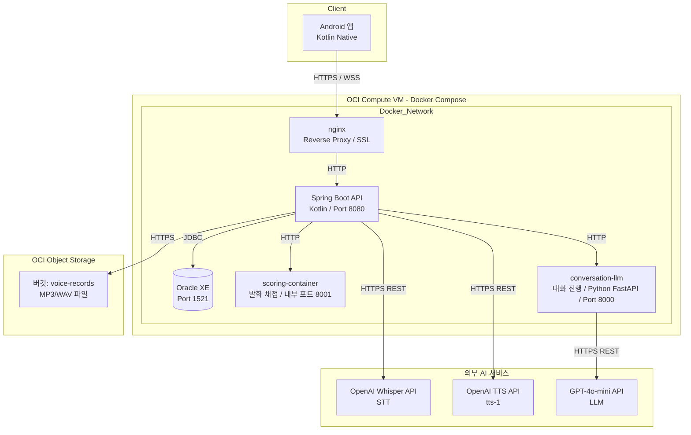
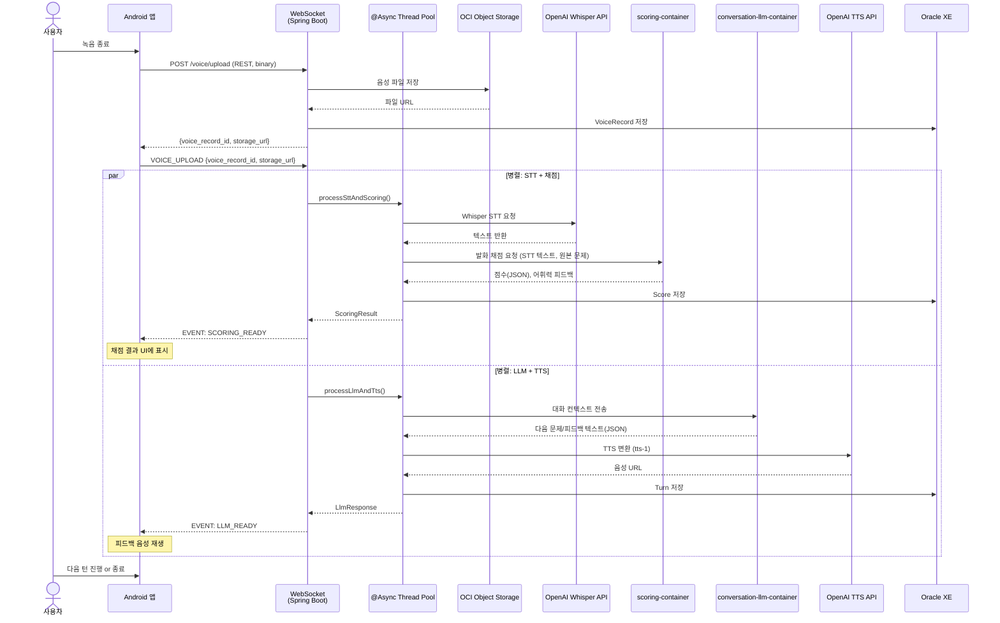

# 시스템 설계서 (System Design Document)

## 1. 목적 및 범위

본 문서는 SRS에 기술된 요구사항을 충족하기 위한 **시스템 기술 아키텍처**를 정의한다.

- Android 단일 클라이언트
- OCI (Oracle Cloud Infrastructure) 상에 **Docker Compose** 기반 백엔드 구축
- **모놀리틱 Spring Boot (Kotlin)** API 서버
- AI 파이프라인 연동: **OpenAI Whisper API + OCI VM 내 AI 컨테이너 2개**
- 음성 대화 흐름: **WebSocket** 기반 실시간 양방향 통신
- 비동기 처리: **Spring `@Async` 내부 스레드 풀**

---

## 2. 시스템 아키텍처 개요

### 2.1 전체 구성도



> **참고:** AI 컨테이너(`scoring-container`, `conversation-llm`)는 현재 동일 OCI VM의 Docker Compose에 포함되어 운영된다. 추후 로드 증가로 VM 분리가 필요한 경우, Compose 파일만 별도 VM으로 이전하면 된다.

### 2.2 통신 방식 요약

| 구간 | 프로토콜 | 용도 |
|------|---------|------|
| Android ↔ nginx | HTTPS / **WSS** | WebSocket: AI 대화 실시간 양방향 통신 |
| Android ↔ nginx | HTTPS | REST: 로그인, 대시보드, 설정 등 일반 API |
| nginx ↔ Spring Boot | HTTP | 내부 프록시 (같은 Docker Network) |
| Spring Boot ↔ Oracle XE | JDBC (TCP 1521) | SQL 데이터 처리 |
| Spring Boot ↔ Object Storage | HTTPS REST | 음성 파일 업로드/다운로드 |
| Spring Boot ↔ scoring-container | HTTP | STT 텍스트 + 원본 문제 → 점수(JSON), 어휘력 피드백 |
| Spring Boot ↔ conversation-llm | HTTP | 대화 컨텍스트(전체 Turn) → 다음 문제/대화 텍스트(JSON) |
| Spring Boot ↔ OpenAI Whisper API | HTTPS REST | 음성 → 텍스트 변환 |
| Spring Boot ↔ OpenAI TTS API | HTTPS REST | 텍스트 → 음성 파일 생성 |
| conversation-llm ↔ GPT-4o-mini API | HTTPS REST | LLM 프롬프팅, 다음 문제/피드백 텍스트 생성 |

---

## 3. 컴포넌트 상세 설계

### 3.1 클라이언트: Android (Kotlin Native)

| 항목 | 내용 |
|------|------|
| **언어 / IDE** | Kotlin / Android Studio |
| **최소 SDK** | API 26 (Android 8.0) — 권장: API 28+ |
| **네트워크 라이브러리** | OkHttp + OkHttpEventSource (WebSocket/SSE) |
| **JSON 직렬화** | kotlinx.serialization 또는 Gson |
| **OAuth** | Google Sign-In SDK |
| **오디오** | Android AudioRecord / MediaRecorder (녹음), ExoPlayer (재생) |
| **아키텍처 패턴** | MVVM (ViewModel + Repository) |

#### WebSocket 사용 범위
- **AI 톡방 세션**: WebSocket 연결 유지
- **일반 API** (로그인, 대시보드, 설정): REST

### 3.2 백엔드: Spring Boot (모놀리틱)

| 항목 | 내용 |
|------|------|
| **언어 / 프레임워크** | Kotlin / Spring Boot 3.x |
| **빌드 도구** | Gradle (Kotlin DSL) |
| **JDK** | 17+ (21 권장) |
| **데이터 접근** | Spring Data JPA + Hibernate |
| **DB 드라이버** | Oracle JDBC (ojdbc11) |
| **WebSocket** | Spring WebSocket + STOMP (또는 WebSocketHandler 직접 구현) |
| **OAuth2** | Spring Security OAuth2 Client |
| **비동기 처리** | `@Async` + ThreadPoolTaskExecutor |
| **로깅** | Kotlin Logging + Logback |

#### 주요 서비스 계층

```kotlin
@RestController
class ChatController(
    private val chatService: ChatService,
    private val aiService: AiService,
    private val storageService: StorageService
) {
    // WebSocket 핸들러 — STT→채점 / LLM→TTS 병렬 실행 결과 푸시
}

@Service
class AiService {
    @Async("taskExecutor")
    fun processSttAndScoring(voiceUrl: String, originalQuestion: String): CompletableFuture<ScoringResult> {
        // 1. OpenAI Whisper API 호출 → STT 텍스트
        // 2. scoring-container HTTP 호출 → 발화 채점
    }

    @Async("taskExecutor")
    fun processLlmAndTts(context: TurnContext): CompletableFuture<LlmResponse> {
        // 1. conversation-llm-container HTTP 호출 → 다음 문제/피드백 텍스트 생성
        // 2. OpenAI TTS API 호출 → 음성 파일 URL 생성
    }
}
```

### 3.3 데이터베이스: Oracle XE (컨테이너)

| 항목 | 내용 |
|------|------|
| **버전** | Oracle Database 21c XE |
| **이미지** | `gvenzl/oracle-xe:21-slim` (공식 Slim 이미지) |
| **포트** | 1521 (내부 Docker Network만 노출, 외부 직접 노출 금지) |
| **초기 계정** | SYSTEM / oracle (로컬 개발), 별도 앱 계정 생성 권장 |
| **데이터 볼륨** | Docker Volume 마운트 (`oracle-data:/opt/oracle/oradata`) |
| **메모리 최적화** | XE는 2GB RAM 이내로 운영 가능 (SGA_TARGET=512M, PGA_AGGREGATE_TARGET=256M) |

### 3.4 AI 컨테이너

#### 3.4.1 scoring-container (발화 채점)

| 항목 | 내용 |
|------|------|
| **기술 스택** | Python / FastAPI (또는 Spring Boot가 직접 호출 가능한 HTTP 서버) |
| **내부 구현** | TBD — 자체 모델 기반 채점 또는 LangGraph 기반 파이프라인 |
| **입력** | STT 텍스트, 원본 문제 |
| **출력** | 점수(JSON), 어휘력 피드백 |
| **Spring Boot 호출** | HTTP POST (동일 Docker Network 내) |

> **참고:** scoring-container는 CPU 기반 컨테이너이며, GPU는 불필요하다. 향후 모델 고도화 시 GPU 필요 여부를 재검토한다.

#### 3.4.2 conversation-llm (대화 진행)

| 항목 | 내용 |
|------|------|
| **기술 스택** | Python / FastAPI + LangGraph |
| **LLM 엔진** | GPT-4o-mini API (외부 REST 호출) |
| **하드웨어** | CPU 컨테이너 (GPU 불필요) |
| **입력** | 대화 컨텍스트(전체 Turn) |
| **출력** | 다음 문제/대화 텍스트(JSON) |
| **Spring Boot 호출** | HTTP POST (동일 Docker Network 내) |

### 3.5 Docker Compose 구성

```yaml
# docker-compose.yml (OCI VM 내 배포)
services:
  oracle-db:
    image: gvenzl/oracle-xe:21-slim
    container_name: oracle-xe
    environment:
      ORACLE_PASSWORD: ${ORACLE_PASSWORD}
    volumes:
      - oracle-data:/opt/oracle/oradata
    ports:
      - "127.0.0.1:1521:1521"  # 내부만 노출
    networks:
      - backend
    healthcheck:
      test: ["CMD", "sqlplus", "-L", "SYSTEM/${ORACLE_PASSWORD}", "@healthcheck.sql"]
      interval: 30s
      timeout: 10s
      retries: 5

  app:
    image: ${OCI_REGISTRY}/speech-app:latest
    container_name: spring-boot-app
    environment:
      SPRING_DATASOURCE_URL: jdbc:oracle:thin:@oracle-db:1521/XEPDB1
      SPRING_DATASOURCE_USERNAME: ${DB_USER}
      SPRING_DATASOURCE_PASSWORD: ${DB_PASSWORD}
      OPENAI_API_KEY: ${OPENAI_API_KEY}
      OCI_STORAGE_NAMESPACE: ${OCI_STORAGE_NAMESPACE}
      OCI_STORAGE_BUCKET: ${OCI_STORAGE_BUCKET}
      SCORING_CONTAINER_URL: http://scoring-container:8001
      CONVERSATION_LLM_CONTAINER_URL: http://conversation-llm:8000
    ports:
      - "127.0.0.1:8080:8080"
    depends_on:
      oracle-db:
        condition: service_healthy
      scoring-container:
        condition: service_started
      conversation-llm:
        condition: service_started
    networks:
      - backend

  scoring-container:
    image: ${OCI_REGISTRY}/scoring-container:latest
    container_name: scoring-container
    environment:
      # 내부 모델 설정 또는 LangGraph 설정
      MODEL_PATH: ${MODEL_PATH:-/models}
    ports:
      - "127.0.0.1:8001:8001"  # 내부/헬스체크용
    networks:
      - backend
    # CPU 기반; GPU 불필요

  conversation-llm:
    image: ${OCI_REGISTRY}/conversation-llm:latest
    container_name: conversation-llm
    environment:
      OPENAI_API_KEY: ${OPENAI_API_KEY}
      GPT_MODEL: gpt-4o-mini
    ports:
      - "127.0.0.1:8000:8000"  # 내부/헬스체크용
    networks:
      - backend
    # CPU 기반; GPU 불필요

  nginx:
    image: nginx:alpine
    container_name: nginx
    volumes:
      - ./nginx.conf:/etc/nginx/nginx.conf:ro
      - ./ssl:/etc/nginx/ssl:ro
    ports:
      - "80:80"
      - "443:443"
    depends_on:
      - app
    networks:
      - backend

volumes:
  oracle-data:

networks:
  backend:
    driver: bridge
```

> **참고:** AI 컨테이너(`scoring-container`, `conversation-llm`)는 현재 동일 OCI VM의 Docker Compose에 포함되어 운영된다. 추후 로드 증가로 VM 분리가 필요한 경우, Compose 파일만 별도 VM으로 이전하면 된다.

### 3.6 Object Storage (OCI Bucket)

| 항목 | 내용 |
|------|------|
| **버킷 이름** | `speech-app-voices` |
| **접근 제어** | Pre-Authenticated URL (PAR) 또는 임시 서명 URL 생성 |
| **파일 명명** | `{user-uuid}/{session-id}/{turn-number}.mp3` |
| **수명 주기** | 30일 후 자동 삭제 (Lifecycle Rule 설정) |
| **암호화** | OCI 기본 서버 측 암호화 (AES-256) |

---

## 4. AI 대화 흐름 상세 설계

### 4.1 병렬 처리 흐름도



### 4.2 WebSocket 이벤트 명세 (초안)

| 방향 | 이벤트명 | 설명 |
|------|---------|------|
| C → S | `SESSION_START` | 톡방 세션 시작 |
| C → S | `VOICE_UPLOAD` | 음성 업로드 완료 통지 (voice_record_id, storage_url 전달) |
| S → C | `SCORING_READY` | 채점 완료 → 텍스트 점수 + 피드백 |
| S → C | `LLM_READY` | LLM+TTS 완료 → 다음 문제 텍스트 + 음성 URL |
| S → C | `ERROR` | 처리 실패 (STT 실패, LLM 타임아웃 등) |
| C → S | `SESSION_END` | 세션 종료 → 보고서 생성 요청 |
| S → C | `REPORT_READY` | 최종 보고서 생성 완료 |

---

## 5. OCI 인프라 설계

### 5.1 제안 VM 사양 (MVP)

| 항목 | 제안 사양 | 비고 |
|------|----------|------|
| **VM Shape** | VM.Standard.E4.Flex 또는 VM.Standard.A1.Flex | A1(Arm)이 더 저렴하고 성능 좋음 |
| **OCPU** | 4 | Spring Boot + Oracle XE + scoring-container + conversation-llm-container 동시 실행 |
| **메모리** | 16 GB | Oracle XE에 2GB, Spring Boot에 2GB, AI 컨테이너 2개에 각 2~3GB, 나머지 OS/버퍼 |
| **부트 볼륨** | 50 GB | Docker 이미지 + Oracle 데이터 파일 |
| **OS** | Oracle Linux 8 또는 Ubuntu 22.04 | Docker CE 설치 편한 쪽으로 |
| **공인 IP** | 예 | SSL 인증서 발급 및 외부 접속 필요 |
| **VNIC 보안 규칙** | 22(SSH), 80(HTTP), 443(HTTPS) 개방 | DB(1521) 및 AI 컨테이너 포트는 내부 네트워크만 |

> **사양 증가 이유:** AI 컨테이너 2개(`scoring-container`, `conversation-llm-container`)가 동일 VM 내 Docker Compose로 추가되었기 때문이다.

### 5.2 예상 비용 (월간)

> 40만원 예산 내에서 안정적으로 운영 가능.

| 항목 | 예상 비용 (월) | 비고 |
|------|--------------|------|
| VM (4 OCPU / 16GB) | 약 20만원 | 개발 중에는 껐다 켰다 → 실제 과금 ↓ |
| Object Storage (50GB) | 약 2만원 | 음성 파일 30일 자동 삭제 |
| 데이터 전송 (Outbound) | 약 1~3만원 | 음성 파일 다운로드 트래픽 |
| OpenAI API (Whisper + TTS + GPT-4o-mini) | 약 3~5만원 | 사용량 기 과금; MVP 기준 월간 예상 |
| **합계** | **약 25~30만원/월** | **2개월 운영 시 50~60만원** |

> **비용 절감 팁:** 개발 기간(2주) 동안에는 **Always Free VM (Arm 4CPU/24GB)**을 임시로 활용하여 부트캠프 지원 Tenancy의 과금을 최소화할 수 있음. OpenAI API는 사용량 기 과금이므로 개발/테스트 시 토큰 사용량을 모니터링한다.

---

## 6. 보안 설계

### 6.1 데이터 보안

| 항목 | 방식 |
|------|------|
| **전송 중 암호화** | TLS 1.3 (Let's Encrypt 무료 SSL 인증서) |
| **저장 중 암호화** | Oracle TDE (투명 데이터 암호화) 또는 컬럼 레벨 AES-256 |
| **민감정보** | 수술/질병 여부, 음성 파일 — 별도 접근 제어 및 암호화 |
| **음성 파일 접근** | Pre-Authenticated URL은 TTL 5분으로 제한. 직접 버킷 접근 금지 |

### 6.2 인증 및 인가

| 항목 | 방식 |
|------|------|
| **소셜 로그인** | Google OAuth2 (Spring Security) |
| **JWT 토큰** | Access Token (15분) + Refresh Token (7일) |
| **토큰 저장** | Android: EncryptedSharedPreferences |
| **WebSocket 인증** | 연결 시 JWT 토큰을 Query Param 또는 Header로 전달, 서버에서 검증 |

### 6.3 API 키 관리

| 키 | 저장 위치 | 비고 |
|----|----------|------|
| OpenAI API Key | Spring Boot 환경변수 (`application.yml`) | `.env` 파일로 Docker Compose에 주입, Git 미포함 |
| OCI API Key | OCI VM의 `~/.oci/config` | Object Storage SDK 사용 시 |

---

## 7. 기술 리스크 및 완화 방안

| 리스크 | 영향도 | 완화 방안 |
|--------|--------|-----------|
| OpenAI API 과금 초과 | 중간 | 토큰 사용량 모니터링, Rate Limit 설정, 월간 예산 알림 |
| OpenAI API 응답 지연/타임아웃 | 높음 | connection timeout 10s / read timeout 30s, 재시도 1회, fallback 메시지 |
| Oracle XE 메모리 부족 (SGA/PGA) | 중간 | XE는 2GB RAM 한계; 쿼리 튜닝, 인덱스 최적화, 불필요한 세션 정리 |
| AI 컨테이너 2개 CPU 과부하 | 중간 | VM 사양을 4 OCPU/16GB로 증설, `@Async` Thread Pool 크기 조정 |
| scoring-container 내부 모델 미정 | 중간 | SRS FR-015 확정 전까지 Mock API 또는 LangGraph 프로토타입으로 대체 가능 |
| Whisper API 음성 길이 제한 (25MB) | 낮음 | 25MB 이상 음성은 청크 분할 또는 압축 (MP3 16kHz) |
| TTS API 음성 품질 | 낮음 | tts-1 모델 선정, 필요시 음성 샘플 A/B 테스트 |

---

## 8. 변경 이력

| 버전 | 날짜 | 작성자 | 변경 내용 |
|------|------|--------|-----------|
| v0.1 | 2026-08-18 | 김윤혁 | 초안 작성 |
| v0.2 | 2026-08-18 | - | VM 사양 2 OCPU/8GB → 4 OCPU/16GB 변경. AI 컨테이너 2개(`scoring-container`, `conversation-llm`) 추가. STT: Azure → OpenAI Whisper API. TTS: OpenAI TTS(tts-1) 추가. AI 서버 네트워크: RunPod 삭제, OCI VM 내 Docker Compose로 통일. 외부 API 목록에 Whisper, TTS, GPT-4o-mini 추가. 비용/리스크 반영. |
| v0.3 | 2026-08-18 | 김윤혁 | scoring-container 포트 8001로 통일(8080/8000 충돌 해소). conversation-llm-container → conversation-llm 호스트명 통일. 음성 업로드 방식 REST-first로 통일(WebSocket엔 voice_record_id만 전달). compose `version: "3.8"` 제거. 비용 산정 통일(VM 약 20만원, Storage 50GB/2만원). |
