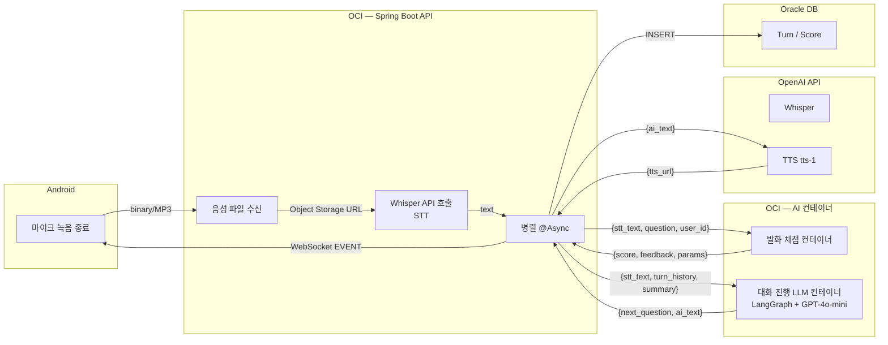
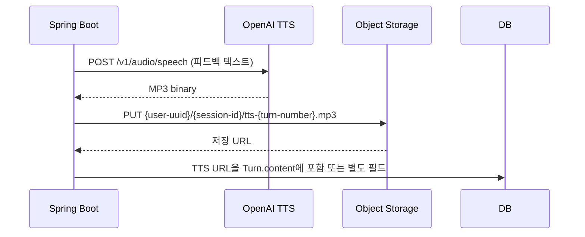
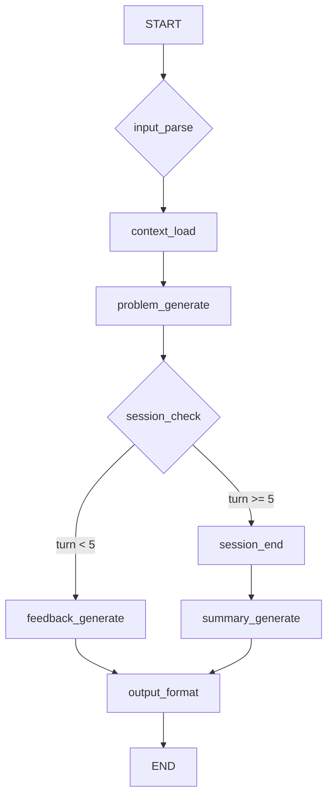
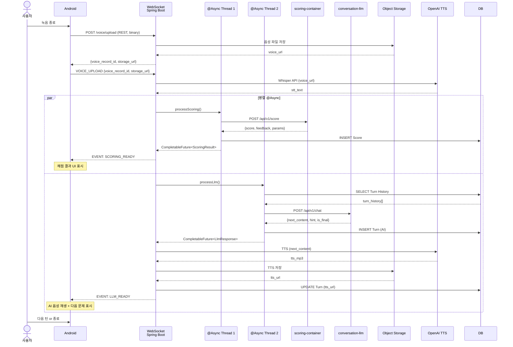

# AI 파이프라인 설계서 (AI Pipeline Design Document)

## 1. 목적 및 범위

본 문서는 SRS 및 시스템 설계서에 기술된 AI 음성 대화 흐름의 **상세 파이프라인**을 정의한다.

- **STT**: OpenAI Whisper API (클라우드)
- **발화 채점**: OCI 내 **발화 채점 컨테이너** (내부 구현 TBD)
- **대화 진행**: OCI 내 **대화 진행 LLM 컨테이너** (Python FastAPI + LangGraph + GPT-4o-mini API)
- **TTS**: OpenAI TTS (tts-1)
- **실행 방식**: Spring Boot가 `@Async` 병렬 호출 + WebSocket으로 결과 푸시

---

## 2. 전체 파이프라인 흐름



---

## 3. 각 단계 상세 규격

### 3.1 STT — OpenAI Whisper API

| 항목 | 내용 |
|------|------|
| **엔드포인트** | `POST https://api.openai.com/v1/audio/transcriptions` |
| **인증** | `Authorization: Bearer {OPENAI_API_KEY}` |
| **입력** | `multipart/form-data` — `file` (MP3/WAV, ≤25MB), `model` = `whisper-1`, `language` = `ko` |
| **출력** | `{ "text": "사용자가 말한 내용..." }` |
| **타임아웃** | 15초 |
| **재시도** | 1회 (connection error 시), exponential backoff 2s |
| **비용** | $0.006/분 |

#### 요청 예시 (Spring Boot — RestTemplate/WebClient)

```kotlin
val file = MultipartFileResource(voiceFile)
val body = LinkedMultiValueMap<String, Any>().apply {
    add("file", file)
    add("model", "whisper-1")
    add("language", "ko")
}
val response = webClient.post()
    .uri("https://api.openai.com/v1/audio/transcriptions")
    .header(HttpHeaders.AUTHORIZATION, "Bearer $apiKey")
    .contentType(MediaType.MULTIPART_FORM_DATA)
    .bodyValue(body)
    .retrieve()
    .bodyToMono(WhisperResponse::class.java)
    .timeout(Duration.ofSeconds(15))
    .retryWhen(Retry.backoff(1, Duration.ofSeconds(2)))
```

---

### 3.2 발화 채점 컨테이너 (추상 인터페이스)

> **⚠️ 내부 구현 TBD.** 아래는 Spring Boot ↔ 컨테이너 간 **HTTP 인터페이스 규격**만 정의.

| 항목 | 내용 |
|------|------|
| **엔드포인트** | `POST http://scoring-container:8001/api/v1/score` (Docker 내부 네트워크) |
| **입력 JSON** | 아래 스키마 참조 |
| **출력 JSON** | 아래 스키마 참조 |
| **타임아웃** | 10초 |
| **재시도** | 0회 (실패 시 점수 없이 피드백만 전달하는 폴백) |

#### 입력 스키마

```json
{
  "stt_text": "사용자가 말한 내용",
  "original_question": "오늘의 문제 텍스트 또는 주제",
  "user_id": "user-uuid",
  "turn_number": 3,
  "conversation_id": "conv-uuid",
  "content_type": "PROBLEM"
}
```

#### 출력 스키마

```json
{
  "score": 72,
  "feedback_text": "문장 구성은 좋았으나 '그리고'라는 접속사가 3번 반복되었어요. 다양한 표현을 시도해보세요.",
  "parameters": {
    "fluency": 75,
    "vocabulary": 65,
    "sentence_structure": 80,
    "repetition_penalty": -10
  }
}
```

> **⚠️ `parameters` 구조는 채점 기준 확정 후 조정됨.** 현재는 유연한 JSON으로 처리.

---

### 3.3 대화 진행 LLM 컨테이너 (LangGraph + GPT-4o-mini)

| 항목 | 내용 |
|------|------|
| **엔드포인트** | `POST http://conversation-llm:8000/api/v1/chat` (Docker 내부 네트워크) |
| **인증** | 내부 네트워크이므로 API Key 불필요 (Spring Boot IP 화이트리스트) |
| **입력 JSON** | 아래 스키마 참조 |
| **출력 JSON** | 아래 스키마 참조 |
| **타임아웃** | 15초 |
| **재시도** | 1회 (GPT-4o-mini 타임아웃 시) |
| **비용** | GPT-4o-mini: 약 $0.0003/1K input token, $0.0012/1K output token |

#### 입력 스키마

```json
{
  "conversation_id": "conv-uuid",
  "user_id": "user-uuid",
  "content_type": "PROBLEM",
  "turn_history": [
    {"speaker": "AI", "content": "오늘은 '주말에 뭐 했어요?'라는 주제로 대화해볼까요?"},
    {"speaker": "USER", "content": "주말에 친구랑 공원에 갔어요"},
    {"speaker": "AI", "content": "좋아요! 공원에서 무엇을 했나요?"},
    {"speaker": "USER", "content": "그리고 그리고 산책했어요"}
  ],
  "previous_summary": "사용자는 주말 활동에 대해 간단히 답변할 수 있음. 접속사 반복이 관찰됨.",
  "current_stt": "그리고 그리고 산책했어요",
  "turn_number": 4
}
```

#### 출력 스키마

```json
{
  "next_content": "산책하니까 기분이 어땠어요? 한 문장으로 말해보세요.",
  "content_type": "TOPIC",
  "hint": "기분, 날씨, 친구 중 하나를 포함해보세요",
  "is_final": false,
  "session_end_reason": null
}
```

#### 세션 종료 조건

| 조건 | 설명 |
|------|------|
| `turn_number >= 5` | 5턴 완료 시 자동 종료 제안 |
| `is_final = true` | LLM이 대화 자연스럽게 마무리 판단 |
| 사용자 "오늘은 여기까지" | 명시적 종료 요청 |

---

### 3.4 TTS — OpenAI TTS (tts-1)

| 항목 | 내용 |
|------|------|
| **엔드포인트** | `POST https://api.openai.com/v1/audio/speech` |
| **인증** | `Authorization: Bearer {OPENAI_API_KEY}` |
| **입력** | `application/json` — `{ "model": "tts-1", "input": "피드백 텍스트", "voice": "alloy", "speed": 1.0 }` |
| **출력** | `audio/mpeg` 바이너리 (MP3, 24kbps) |
| **타임아웃** | 10초 |
| **재시도** | 1회 |
| **비용** | $0.015/1K자 |
| **한국어 음성** | `voice`: `alloy`, `echo`, `fable`, `onyx`, `nova`, `shimmer` 중 선택 |

> **⚠️ 한국어 품질 리스크 (P0 필수 확인):** `tts-1`의 voice는 영어 최적화 음성으로, 한국어 발화 품질이 기대 이하일 수 있다. **8/22까지 한국어 샘플 A/B 테스트로 확정**한다. 품질 미달 시 대안: **Azure Neural TTS**(ko-KR-SunHi 등) 또는 **네이버 Clova Voice**.

#### TTS 음성 저장 흐름



---

## 4. LangGraph 구조 상세

### 4.1 상태 그래프 (State Graph)



### 4.2 노드 정의

| 노드명 | 역할 | GPT-4o-mini 프롬프트 개요 |
|--------|------|---------------------------|
| `input_parse` | 사용자 STT 텍스트 정제 | "사용자의 발화를 정제하여 문법 오류를 최소한으로 수정하되, 원래 의도를 유지" |
| `context_load` | DB에서 이전 턴 + 요약 로드 | Conversation 테이블의 전체 Turn을 system message로 구성 |
| `problem_generate` | 다음 문제/대화 생성 | "사용자의 수준과 이전 대화를 고려하여 다음 발화 연습 문제를 생성. content_type에 맞춰서." |
| `feedback_generate` | 사용자 발화 피드백 | "사용자의 발화를 평가하고 격려 및 구체적인 개선 방향 제시" |
| `session_check` | 세션 종료 여부 판단 | "5턴 이상이면 종료 제안. 아니면 계속." |
| `session_end` | 세션 종료 처리 | 종료 인사 + 보고서 생성 트리거 |
| `summary_generate` | 세션 요약 생성 | "이번 세션의 사용자 발화 특징을 2~3문장으로 요약" |
| `output_format` | 출력 JSON 포맷팅 | {"next_content", "content_type", "hint", "is_final"} |

### 4.3 엣지 조건

```python
# pseudo-code (LangGraph)
def session_check(state: ConversationState):
    if state.turn_number >= 5:
        return "session_end"
    if state.user_explicit_end:
        return "session_end"
    return "feedback_generate"

graph.add_conditional_edges("session_check", session_check, {
    "session_end": "session_end",
    "feedback_generate": "feedback_generate"
})
```

---

## 5. 병렬 처리 및 WebSocket 흐름

### 5.1 Spring Boot 병렬 호출 시퀀스



### 5.2 WebSocket 이벤트 최종 명세

| 방향 | 이벤트명 | 페이로드 | 설명 |
|------|---------|---------|------|
| C → S | `SESSION_START` | `{content_type_id}` | 세션 시작 |
| C → S | `VOICE_UPLOAD` | `{voice_record_id, storage_url}` | 음성 업로드 완료 통지 (REST 업로드 후) |
| S → C | `SCORING_READY` | `{score, feedback_text, parameters}` | 채점 완료 |
| S → C | `LLM_READY` | `{next_content, hint, tts_url, is_final}` | AI 응답 완료 |
| S → C | `ERROR` | `{code, message}` | 처리 실패 |
| C → S | `USER_TEXT` | `{text}` | 사용자가 텍스트로 입력 (폴백) |
| C → S | `SESSION_END` | `{}` | 사용자 종료 요청 |
| S → C | `REPORT_READY` | `{report_id, overall_score, parameters}` | 보고서 생성 완료 |

---

## 6. 에러 처리 및 폴백 전략

| 에러 시나리오 | 폴백 동작 | 사용자 노출 |
|--------------|-----------|------------|
| **Whisper API 실패** (타임아웃/500) | 재시도 1회 → 실패 시 "음성을 다시 녹음해주세요" 안내 | "음성 인식에 실패했어요. 다시 말씀해주세요." |
| **채점 컨테이너 타임아웃** | 점수 null, feedback = "채점 중이에요. 계속 연습해보세요." | 점수 영역 숨김, 피드백만 표시 |
| **LLM 컨테이너 타임아웃** | 재시도 1회 → 실패 시 "잠시만 기다려주세요" + 고정 안내 문구 | "AI가 생각 중이에요..." → 5초 후 고정 메시지 |
| **TTS 실패** | 텍스트만 표시, 음성 재생 버튼 숨김 | 텍스트 피드백은 정상 표시 |
| **WebSocket 끊김** | 자동 재연결 (Exponential Backoff: 1s, 2s, 4s) | 재연결 중 "연결 중..." 표시 |
| **세션 중복 시작** | 기존 세션 자동 종료 + 새 세션 시작 | "이전 연습을 종료하고 새로 시작합니다." |

---

## 7. 보안 및 비용

### 7.1 API 키 관리

| 키 | 위치 | 주입 방식 |
|----|------|----------|
| `OPENAI_API_KEY` | Spring Boot 환경변수 | `.env` 파일 → Docker Compose `environment` |
| `OPENAI_ORG_ID` | Spring Boot 환경변수 | 동일 |

> `.env` 파일은 `.gitignore`에 포함. OCI VM에 직접 배포 시 `scp` 또는 GitHub Secrets로 전달.

### 7.2 예상 비용 산정 (MVP 기준)

| 항목 | 단위 비용 | 월간 예상 사용량 | 월간 비용 |
|------|----------|----------------|----------|
| Whisper API | $0.006/분 | 300분 (100회 × 3분) | **$1.8** |
| GPT-4o-mini | $0.0003/1K tok (in) | 500K input + 200K output | **$0.39** |
| TTS (tts-1) | $0.015/1K자 | 50K자 (100회 × 500자) | **$0.75** |
| **OpenAI 합계** | | | **약 $3/월** |
| OCI VM (4 OCPU/16GB) | 약 20만원/월 | 개발 중에는 껐다 켰다 | **실제 과금 ↓** |
| OCI Object Storage | 약 2만원/월 | 50GB 내외 | **2만원** |
| **총합** | | | **OpenAI 무시할 수준. OCI가 대부분.** |

> **결론**: OpenAI API 비용은 거의 무시 가능. OCI VM 과금이 대부분.

---

## 8. 변경 이력

| 버전 | 날짜 | 작성자 | 변경 내용 |
|------|------|--------|-----------|
| v0.1 | 2026-08-18 | 김윤혁 | 초안 작성 |
| v0.2 | 2026-08-18 | 김윤혁 | scoring-container 포트 8001로 통일. 음성 업로드 REST-first로 통일. TTS 한국어 품질 리스크 P0 승격 + 대안(Azure/Clova) 명시. VM 비용 20만원으로 통일. |
