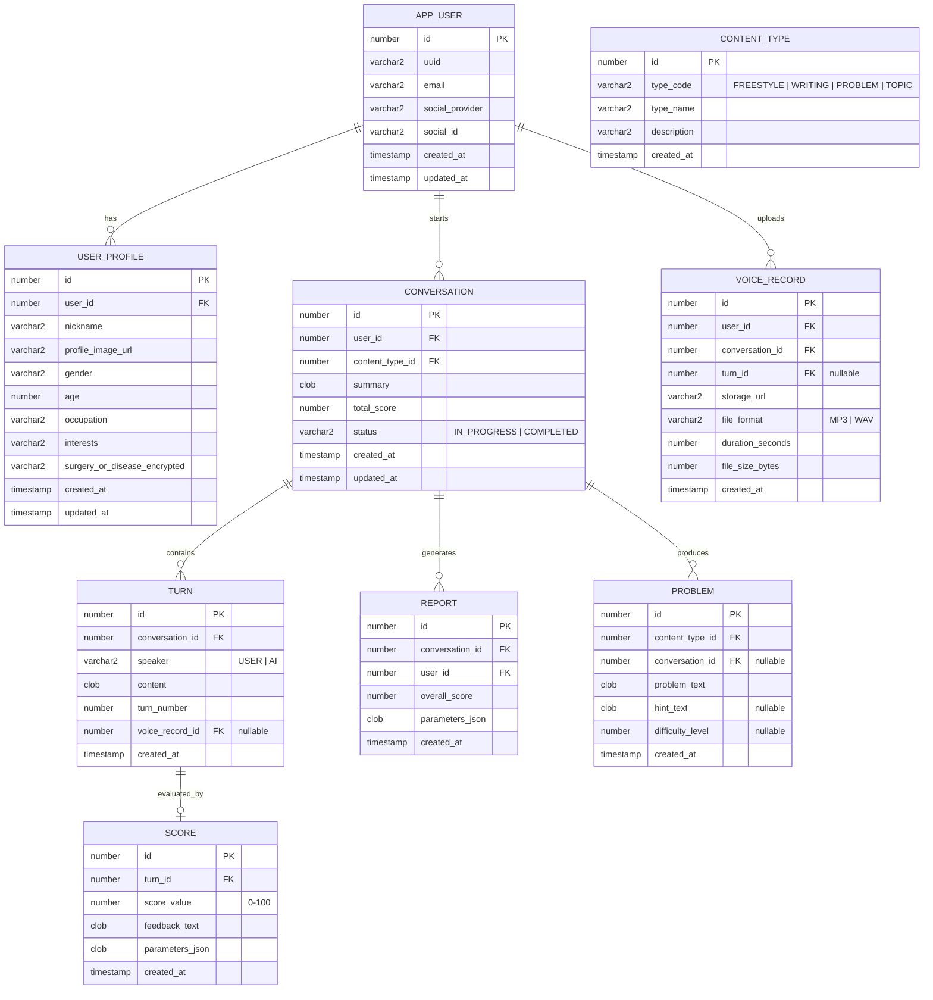
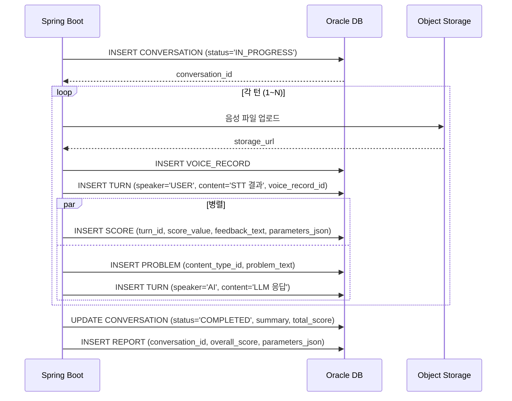

# 데이터베이스 설계서 (Database Design Document)

| 항목 | 내용 |
|------|------|
| **프로젝트명** | AI 기반 발화 연습·대화형 에이전트 앱 |
| **버전** | v0.2-draft |
| **작성일** | 2026-08-18 |
| **작성자** | 팀장 (개발 총괄) |
| **의존 문서** | SRS v0.1, 시스템 설계서 v0.1 |

---

## 1. 목적 및 범위

본 문서는 시스템 설계서에 기술된 컴포넌트를 지원하는 **관계형 데이터베이스 스키마**를 정의한다.

- **DBMS**: Oracle Database 21c XE (컨테이너)
- **데이터 접근**: Spring Data JPA (Entity ↔ 테이블 매핑)
- **주요 고려사항**: 개인정보 보호(민감데이터 암호화), 음성 파일 메타데이터 관리, AI 대화 이력 추적

> **⚠️ Oracle 문법 주의:** 본 문서의 모든 DDL은 **Oracle 21c 표준 문법**으로 작성한다.
> - 자동 증가: `GENERATED BY DEFAULT AS IDENTITY`
> - 문자열: `VARCHAR2` (VARCHAR 아님)
> - 정수: `NUMBER(19)` (BIGINT/INT 아님)
> - 페이징: `FETCH FIRST n ROWS ONLY` (LIMIT 아님)
> - `ON UPDATE CURRENT_TIMESTAMP` 미지원 → 애플리케이션에서 `updated_at` 직접 갱신

---

## 2. ERD (Entity-Relationship Diagram)



> **참고:** `FRIENDSHIP`(친구 관계) 테이블은 사람 간 대화 기능(P3)에 필요한 엔티티로, MVP 단계에서는 **제외**한다. P3 구현 시점에 추가.

---

## 3. 엔티티 상세 정의

### 3.1 APP_USER (사용자)

> **⚠️ 테이블명 주의:** `USER`는 Oracle 예약어이므로 `APP_USER`로 명명한다. JPA에서는 `@Table(name = "APP_USER")`로 매핑.

| 필드명 | 타입 | 제약 | 설명 |
|--------|------|------|------|
| `id` | `NUMBER(19)` | PK, IDENTITY | 내부 식별자 |
| `uuid` | `VARCHAR2(36)` | UNIQUE, NOT NULL | 서버단 유저 개인 식별정보 (UI 노출용) |
| `email` | `VARCHAR2(255)` | UNIQUE, NOT NULL | 소셜 로그인 이메일 |
| `social_provider` | `VARCHAR2(20)` | NOT NULL | `GOOGLE`, `KAKAO`, `NAVER` |
| `social_id` | `VARCHAR2(255)` | NOT NULL | 소셜 플랫폼 제공 식별자 |
| `created_at` | `TIMESTAMP` | DEFAULT CURRENT_TIMESTAMP | |
| `updated_at` | `TIMESTAMP` | | 애플리케이션에서 갱신 |

**인덱스:** `idx_user_uuid`, `idx_user_social` (social_provider + social_id)

**DDL 예시:**

```sql
CREATE TABLE APP_USER (
    id              NUMBER(19) GENERATED BY DEFAULT AS IDENTITY PRIMARY KEY,
    uuid            VARCHAR2(36)  NOT NULL UNIQUE,
    email           VARCHAR2(255) NOT NULL UNIQUE,
    social_provider VARCHAR2(20)  NOT NULL,
    social_id       VARCHAR2(255) NOT NULL,
    created_at      TIMESTAMP DEFAULT CURRENT_TIMESTAMP,
    updated_at      TIMESTAMP
);
```

---

### 3.2 USER_PROFILE (사용자 프로필)

| 필드명 | 타입 | 제약 | 설명 |
|--------|------|------|------|
| `id` | `NUMBER(19)` | PK, IDENTITY | |
| `user_id` | `NUMBER(19)` | FK → APP_USER.id, UNIQUE | 1:1 관계 |
| `nickname` | `VARCHAR2(50)` | | |
| `profile_image_url` | `VARCHAR2(500)` | | Object Storage URL |
| `gender` | `VARCHAR2(10)` | | `MALE`, `FEMALE`, `OTHER` |
| `age` | `NUMBER(3)` | | |
| `occupation` | `VARCHAR2(100)` | | 직업 / 관심사 |
| `interests` | `VARCHAR2(255)` | | |
| `surgery_or_disease_encrypted` | `VARCHAR2(255)` | | **민감정보**: AES-256 암호화 저장 |
| `created_at` | `TIMESTAMP` | DEFAULT CURRENT_TIMESTAMP | |
| `updated_at` | `TIMESTAMP` | | 애플리케이션에서 갱신 |

---

### 3.3 CONVERSATION (오늘의 대화 / 세션)

| 필드명 | 타입 | 제약 | 설명 |
|--------|------|------|------|
| `id` | `NUMBER(19)` | PK, IDENTITY | |
| `user_id` | `NUMBER(19)` | FK → APP_USER.id, NOT NULL | |
| `content_type_id` | `NUMBER(19)` | FK → CONTENT_TYPE.id | 컨텐츠 유형 (nullable = 자유 모드) |
| `summary` | `CLOB` | | 세션 종료 후 AI 생성 요약 |
| `total_score` | `NUMBER(3)` | | 세션 종료 후 평균/종합 점수 |
| `status` | `VARCHAR2(20)` | DEFAULT 'IN_PROGRESS' | `IN_PROGRESS`, `COMPLETED` |
| `created_at` | `TIMESTAMP` | DEFAULT CURRENT_TIMESTAMP | |
| `updated_at` | `TIMESTAMP` | | 애플리케이션에서 갱신 |

**인덱스:** `idx_conversation_user` (user_id), `idx_conversation_status` (status)

---

### 3.4 TURN (턴 / 문답 기록)

| 필드명 | 타입 | 제약 | 설명 |
|--------|------|------|------|
| `id` | `NUMBER(19)` | PK, IDENTITY | |
| `conversation_id` | `NUMBER(19)` | FK → CONVERSATION.id, NOT NULL | |
| `speaker` | `VARCHAR2(10)` | NOT NULL | `USER`, `AI` |
| `content` | `CLOB` | NOT NULL | 텍스트 내용 (STT 결과 또는 AI 메시지) |
| `turn_number` | `NUMBER(5)` | NOT NULL | 세션 내 순번 (1, 2, 3...) |
| `voice_record_id` | `NUMBER(19)` | FK → VOICE_RECORD.id, nullable | 사용자 음성 녹음 메타데이터 (AI 응답은 nullable) |
| `created_at` | `TIMESTAMP` | DEFAULT CURRENT_TIMESTAMP | |

**인덱스:** `idx_turn_conversation` (conversation_id, turn_number)

---

### 3.5 SCORE (발화 채점 결과)

| 필드명 | 타입 | 제약 | 설명 |
|--------|------|------|------|
| `id` | `NUMBER(19)` | PK, IDENTITY | |
| `turn_id` | `NUMBER(19)` | FK → TURN.id, UNIQUE | 1:1 관계 (USER speaker인 턴만) |
| `score_value` | `NUMBER(3)` | CHECK (0-100) | 종합 점수 |
| `feedback_text` | `CLOB` | | AI 생성 피드백 텍스트 |
| `parameters_json` | `CLOB` | | **JSON 형태**: `{fluency: 80, vocabulary: 70, ...}` |
| `created_at` | `TIMESTAMP` | DEFAULT CURRENT_TIMESTAMP | |

> **⚠️ 비고 (TBD):** `parameters_json`의 구체적인 키는 발화 채점 기준이 확정된 후 정의됨. 현재는 유연한 JSON 컬럼으로 처리.

---

### 3.6 VOICE_RECORD (음성 녹음 메타데이터)

| 필드명 | 타입 | 제약 | 설명 |
|--------|------|------|------|
| `id` | `NUMBER(19)` | PK, IDENTITY | |
| `user_id` | `NUMBER(19)` | FK → APP_USER.id, NOT NULL | |
| `conversation_id` | `NUMBER(19)` | FK → CONVERSATION.id, NOT NULL | |
| `turn_id` | `NUMBER(19)` | FK → TURN.id, nullable | Turn 생성 전에 먼저 저장될 수 있음 |
| `storage_url` | `VARCHAR2(500)` | NOT NULL | OCI Object Storage 경로 |
| `file_format` | `VARCHAR2(10)` | NOT NULL | `MP3`, `WAV` |
| `duration_seconds` | `NUMBER(5)` | | 녹음 길이 (초) |
| `file_size_bytes` | `NUMBER(19)` | | 파일 크기 |
| `created_at` | `TIMESTAMP` | DEFAULT CURRENT_TIMESTAMP | |

**인덱스:** `idx_voice_conversation` (conversation_id)

---

### 3.7 REPORT (최종 보고서)

| 필드명 | 타입 | 제약 | 설명 |
|--------|------|------|------|
| `id` | `NUMBER(19)` | PK, IDENTITY | |
| `conversation_id` | `NUMBER(19)` | FK → CONVERSATION.id, UNIQUE | 1:1 관계 |
| `user_id` | `NUMBER(19)` | FK → APP_USER.id, NOT NULL | |
| `overall_score` | `NUMBER(3)` | CHECK (0-100) | 종합 점수 |
| `parameters_json` | `CLOB` | | **JSON 형태**: 방사형 그래프 파라미터 |
| `created_at` | `TIMESTAMP` | DEFAULT CURRENT_TIMESTAMP | |

> **⚠️ 비고 (TBD):** `parameters_json`의 구체적인 키와 구조는 발화 채점 기준 확정 후 정의됨.

---

### 3.8 CONTENT_TYPE (컨텐츠 유형)

| 필드명 | 타입 | 제약 | 설명 |
|--------|------|------|------|
| `id` | `NUMBER(19)` | PK, IDENTITY | |
| `type_code` | `VARCHAR2(20)` | UNIQUE, NOT NULL | `FREESTYLE`, `WRITING`, `PROBLEM`, `TOPIC` |
| `type_name` | `VARCHAR2(50)` | NOT NULL | 한글명 (ex. "프리스타일 토킹쇼") |
| `description` | `VARCHAR2(255)` | | 설명 |
| `created_at` | `TIMESTAMP` | DEFAULT CURRENT_TIMESTAMP | |

**초기 데이터 (seed):**

| type_code | type_name | description |
|-----------|-----------|-------------|
| `FREESTYLE` | 프리스타일 AI 토킹쇼 | 자유 주제로 AI와 대화 |
| `WRITING` | 작문 보조 | 다음 단어 후보를 제시하고 문장 완성 유도 |
| `PROBLEM` | 문제 풀이 | 빈칸 채우기 형식의 문제 |
| `TOPIC` | 주제 발화 | 주제에 대해 한 문장으로 대답 |

---

### 3.9 PROBLEM (AI 생성 문제)

| 필드명 | 타입 | 제약 | 설명 |
|--------|------|------|------|
| `id` | `NUMBER(19)` | PK, IDENTITY | |
| `content_type_id` | `NUMBER(19)` | FK → CONTENT_TYPE.id, NOT NULL | |
| `conversation_id` | `NUMBER(19)` | FK → CONVERSATION.id, nullable | 특정 세션에서 생성된 경우 |
| `problem_text` | `CLOB` | NOT NULL | 문제 내용 |
| `hint_text` | `CLOB` | nullable | 힌트 또는 다음 단어 후보 |
| `difficulty_level` | `NUMBER(1)` | nullable | 난이도 (1~5) |
| `created_at` | `TIMESTAMP` | DEFAULT CURRENT_TIMESTAMP | |

**인덱스:** `idx_problem_content_type` (content_type_id), `idx_problem_conversation` (conversation_id)

---

## 4. 데이터 흐름 및 연동

### 4.1 AI 대화 세션 흐름 (DB 관점)



### 4.2 LLM 컨텍스트 전달 쿼리

대화 진행 LLM 컨테이너에 전달할 컨텍스트를 위한 쿼리:

```sql
-- 특정 Conversation의 전체 Turn을 순서대로 조회
SELECT t.speaker, t.content, t.turn_number
FROM TURN t
WHERE t.conversation_id = ?
ORDER BY t.turn_number;

-- Conversation 요약 (이미 완료된 이전 세션)
SELECT c.summary
FROM CONVERSATION c
WHERE c.user_id = ?
  AND c.status = 'COMPLETED'
ORDER BY c.created_at DESC
FETCH FIRST 5 ROWS ONLY;
```

---

## 5. 보안 및 민감데이터 처리

| 항목 | 테이블/필드 | 처리 방식 |
|------|------------|-----------|
| **건강 정보** | USER_PROFILE.surgery_or_disease_encrypted | AES-256 암호화 (애플리케이션 레벨) |
| **음성 파일** | VOICE_RECORD.storage_url | Object Storage 접근 제어 + Pre-Authenticated URL (TTL 5분) |
| **OAuth 토큰** | (Spring Boot EncryptedSharedPreferences) | Android Keystore 사용 |
| **DB 접근** | 전체 테이블 | Oracle XE 컨테이너는 Docker 내부 네트워크만 노출, 외부 직접 접근 차단 |

---

## 6. 성능 고려사항

| 항목 | 전략 |
|------|------|
| **Turn 조회** | `conversation_id + turn_number` 복합 인덱스로 세션 내 빠른 순회 |
| **대용량 텍스트** | `content`, `problem_text`는 `CLOB` 타입 사용 |
| **JSON 컬럼** | `parameters_json`은 Oracle 21c의 Native JSON 지원 활용 (JSON 검색/인덱스 가능) |
| **파티셔닝** | MVP 단계에서는 불필요. 사용자 수 증가 시 CONVERSATION/VOICE_RECORD 월별 파티션 고려 |

---

## 7. 변경 이력

| 버전 | 날짜 | 작성자 | 변경 내용 |
|------|------|--------|-----------|
| v0.1 | 2026-08-18 | 김윤혁 | 초안 작성 |
| v0.2 | 2026-08-18 | 김윤혁 | Oracle 표준 문법으로 전면 수정 (AUTO_INCREMENT→IDENTITY, VARCHAR→VARCHAR2, LIMIT→FETCH FIRST, ON UPDATE 제거). USER→APP_USER(예약어 회피). FRIENDSHIP 테이블 제거(P3로 이연). |
