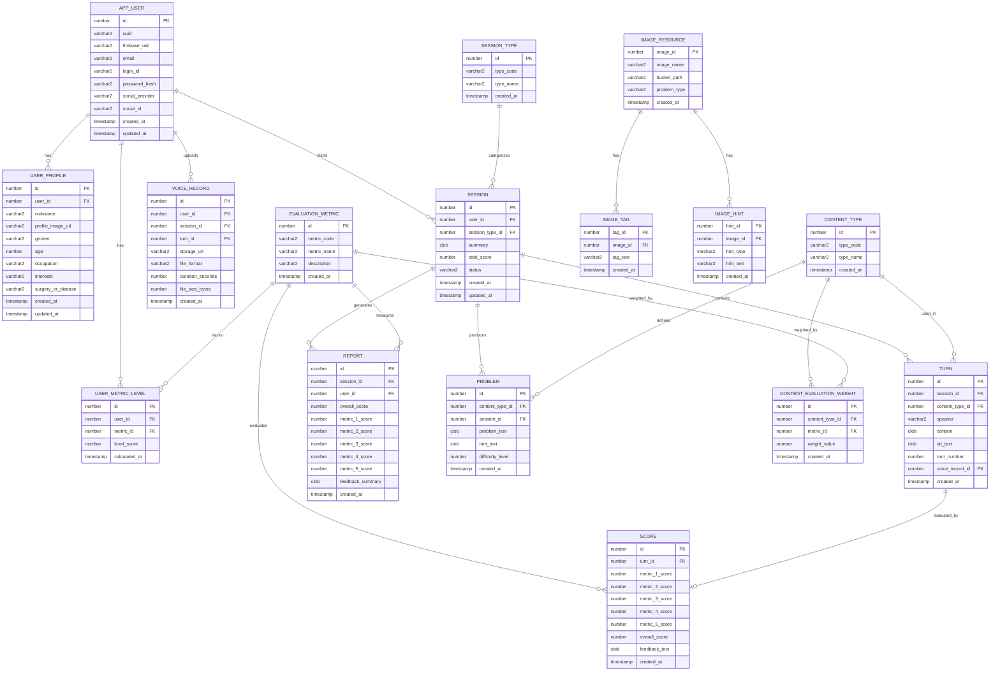
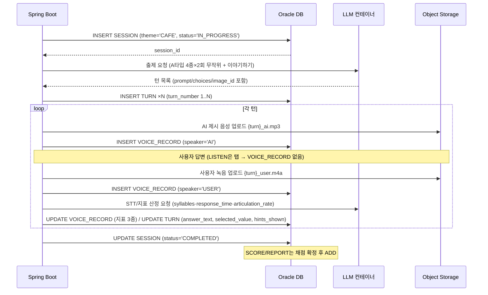
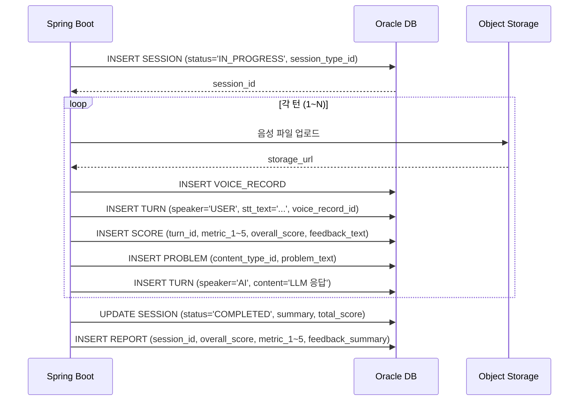

# 데이터베이스 설계서 (Database Design Document)

---

## 1. 목적 및 범위

본 문서는 시스템 설계서에 기술된 컴포넌트를 지원하는 **관계형 데이터베이스 스키마**를 정의한다.

- **DBMS**: Oracle Database 21c XE (컨테이너)
- **데이터 접근**: Spring Data JPA (Entity ↔ 테이블 매핑)
- **주요 고려사항**: 개인정보 보호(민감데이터 nullable), 음성 파일 메타데이터 관리, 학습 세션 기록 저장, 5개 평가지표 스키마 설계(보류)
- **스키마 분리**: 사용자 데이터와 콘텐츠 데이터를 별도 스키마로 분리하여 관리

> ⚠️ **v0.5 전면 재설계 (2026-08-31, BREAKING):** 앱 성격이 "AI 대화형 에이전트"에서 **"문제풀이 앱"**(마이크로 답안 제출, AI TTS 진행 유지)으로 재정의됨에 따라 세션/턴/녹음 도메인을 새로 설계했다.
> - **폐지(정의 철회):** SESSION_TYPE, EVALUATION_METRIC, USER_METRIC_LEVEL, CONTENT_EVALUATION_WEIGHT, PROBLEM, CONTENT_TYPE(구 A/B/C), IMAGE_TAG, IMAGE_HINT, REPORT, SCORE(보류)
> - **신규 확정:** CONTENT_TYPE(룩업 5종), SESSION(테마 기반), TURN("AI 제시 1회 + 사용자 반응 1세트" 통합형), TURN_IMAGE(0..N), VOICE_RECORD(speaker 분리 + 사용자 발화 지표 3종)
> - ERD 원본: `SeSAC_TeamProject/ERD_session_redesign_draft.md` (mermaid + 매핑표 + 제약 요약)
> - 구 정의(§3.3~3.13, §3.15~3.16)는 이력 보존을 위해 남겨두되 **현행 설계는 §1.3 / ERD / §3.3~3.10이 우선**

### 1.1 스키마 분리 구조

| 스키마 | 용도 | 주요 테이블 |
|--------|------|------------|
| `SPEECHAPP_USER` | 사용자/학습 이력 데이터 | APP_USER, USER_PROFILE, **CONTENT_TYPE, SESSION, TURN, TURN_IMAGE, VOICE_RECORD** (v0.5 신규 5종) |
| `SPEECHAPP_CONTENT` | 콘텐츠 리소스 데이터 (v0.5: IMAGE_RESOURCE 단일) | IMAGE_RESOURCE (태그/힌트는 OCI JSON 파일화로 테이블 폐지) |

### 1.3 v0.5 세션/턴/녹음 재설계 요약 (현행)

> **앱 개념:** 한 SESSION = "오늘의 학습" 1회 (테마 CAFE·HOSPITAL 등 안에서, A타입 4종×각 2회 무작위 → 이야기하기 N턴). TURN = **"AI 제시 1회 + 사용자 반응 1세트"**.

| 테이블 | 정의 | 핵심 컬럼 |
|--------|------|----------|
| `CONTENT_TYPE` | 룩업, seed 5종 | type_code **(자연키 PK)**, type_name, category(A 일반채점 / B 대화무채점) |
| `SESSION` | 학습 세션 1회 | user_id FK, theme(코드형), status — summary/total_score는 채점 확정 후 ADD |
| `TURN` | Q&A 1세트 | session_id FK, turn_number, content_type FK, [제시] prompt_text·choices_json·correct_value, [답안] selected_value·answer_text·hints_shown |
| `TURN_IMAGE` | 턴-이미지 0..N | turn_id+image_id 복합 PK, image_order (cross-schema FK) |
| `VOICE_RECORD` | 턴 내 개별 음성 1행 | user_id·session_id·turn_id FK, **speaker(USER/AI)**, voice_file_path, duration_seconds, syllables, response_time, articulation_rate |

**핵심 제약:**
- `TURN.content_type` CHECK IN ('LISTEN','NAMING','SHADOWING','SELF_TALK','STORYTELLING') — CONTENT_TYPE이 자연키 룩업이라 CHECK 유지 가능
- `LISTEN` → choices_json·correct_value NOT NULL / `NAMING` → correct_value NOT NULL (컬럼 수준 CHECK)
- `VOICE_RECORD` UNIQUE(turn_id, speaker) — 턴당 USER 0..1 + AI 0..1 (LISTEN은 탭 답안이라 USER 음성 없음)
- **AI 행은 syllables·response_time·articulation_rate NULL 강제** (CHECK) — 지표는 USER 음성에만 기록, STORYTELLING 포함(최근 n회 평균 산정 재료)
- `response_time` = "첫 단어 완성 시점"까지. 컨테이너 측정→백엔드 저장만, 단위는 API 명세 확정 대기
- NAMING 단서(의미→음운 고정, 각 1개)는 IMAGE_RESOURCE의 hint JSON에서 조회 — TURN 미저장

**컨텐츠 타입 매핑표:**

| code | 한글 | 카테고리 | TURN_IMAGE | prompt_text | choices | correct | 사용자 음성 | 채점 |
|---|---|---|---|---|---|---|---|---|
| `LISTEN` | 알아듣기 | A | ○ 0..N (이미지=선택지) | 지문 | ○ | ○ | ✗(탭) | ○ |
| `NAMING` | 이름대기 | A | ● 필수 | NULL | ✗ | ○ | ○ 말로 | ○ |
| `SHADOWING` | 따라말하기 | A | ✗ | 따라말할 문장(=문제) | ✗ | (prompt 비교) | ○ | ○ |
| `SELF_TALK` | 스스로말하기 | A | ● 필수 | 질문 | ✗ | ✗ | ○ | ○ |
| `STORYTELLING` | 이야기하기 | B | ✗ | AI 질문 | ✗ | ✗ | ○ | ✗ 무채점 |

**OCI 저장 규약 (확정):** `containers/llm/{userUUID}/{sessionID}/{turnID}_user.m4a` | `{turnID}_ai.mp3` @ `bucket-team545-userfiles` (유저UUID=APP_USER.uuid, 세션/턴=DB NUMBER id). AI 음성은 5종 모두 존재, 세션마다 TTS 생성.

### 1.2 DB 사용자 계정

| 계정 | 권한 | 설명 |
|------|------|------|
| **app user** | SPEECHAPP_USER (RW), SPEECHAPP_CONTENT (RO) | 애플리케이션 서버(Spring Boot)에서 사용. 사용자 데이터는 읽기/쓰기, 콘텐츠 데이터는 읽기 전용 |
| **admin user** | SPEECHAPP_USER (RW), SPEECHAPP_CONTENT (RW) | 관리자용. 양쪽 스키마 모두 읽기/쓰기 가능. 콘텐츠 등록/수정 시 사용 |

> **📌 보안 원칙:** 애플리케이션은 기본적으로 `app user` 계정으로 접속하며, 콘텐츠 데이터는 읽기 전용(RO)으로만 접근한다. 콘텐츠 데이터의 등록/수정/삭제는 `admin user` 계정을 통해서만 수행한다.

> **⚠️ Oracle 문법 주의:** 본 문서의 모든 DDL은 **Oracle 21c 표준 문법**으로 작성한다.
> - 자동 증가: `GENERATED BY DEFAULT AS IDENTITY`
> - 문자열: `VARCHAR2` (VARCHAR 아님)
> - 정수: `NUMBER(19)` (BIGINT/INT 아님)
> - 페이징: `FETCH FIRST n ROWS ONLY` (LIMIT 아님)
> - `ON UPDATE CURRENT_TIMESTAMP` 미지원 → 애플리케이션에서 `updated_at` 직접 갱신

---

## 2. ERD (Entity-Relationship Diagram)



> **참고:** `FRIENDSHIP`(친구 관계) 테이블은 사람 간 대화 기능(P3)에 필요한 엔티티로, MVP 단계에서는 **제외**한다. P3 구현 시점에 추가.

---

## 3. 엔티티 상세 정의

### 3.1 APP_USER (사용자)

> **⚠️ 테이블명 주의:** `USER`는 Oracle 예약어이므로 `APP_USER`로 명명한다. JPA에서는 `@Table(name = "APP_USER")`로 매핑.

| 필드명 | 타입 | 제약 | 설명 |
|--------|------|------|------|
| `id` | `NUMBER(19)` | PK, IDENTITY | 내부 식별자 |
| `uuid` | `VARCHAR2(36)` | UNIQUE, NOT NULL | 서버단 유저 개인 식별정보 (UI 노출용) |
| `firebase_uid` | `VARCHAR2(255)` | UNIQUE, nullable | Firebase Auth UID (Google 로그인 시) |
| `email` | `VARCHAR2(255)` | UNIQUE, nullable | 소셜 로그인 이메일 또는 일반 로그인 이메일 |
| `login_id` | `VARCHAR2(50)` | UNIQUE, nullable | 일반 로그인 ID (P3 구현 시 사용) |
| `password_hash` | `VARCHAR2(255)` | nullable | 일반 로그인 비밀번호 해시 (P3 구현 시 사용) |
| `social_provider` | `VARCHAR2(20)` | nullable | `GOOGLE`, `KAKAO`, `NAVER` |
| `social_id` | `VARCHAR2(255)` | nullable | 소셜 플랫폼 제공 식별자 |
| `created_at` | `TIMESTAMP` | DEFAULT CURRENT_TIMESTAMP | |
| `updated_at` | `TIMESTAMP` | | 애플리케이션에서 갱신 |

**인덱스:** `idx_user_uuid`, `idx_user_firebase_uid`, `idx_user_social` (social_provider + social_id)

**DDL 예시:**

```sql
CREATE TABLE APP_USER (
    id              NUMBER(19) GENERATED BY DEFAULT AS IDENTITY PRIMARY KEY,
    uuid            VARCHAR2(36)  NOT NULL UNIQUE,
    firebase_uid    VARCHAR2(255) UNIQUE,
    email           VARCHAR2(255) UNIQUE,
    login_id        VARCHAR2(50)  UNIQUE,
    password_hash   VARCHAR2(255),
    social_provider VARCHAR2(20),
    social_id       VARCHAR2(255),
    created_at      TIMESTAMP DEFAULT CURRENT_TIMESTAMP,
    updated_at      TIMESTAMP,
    CONSTRAINT chk_social_or_login CHECK (
        (firebase_uid IS NOT NULL) OR (login_id IS NOT NULL)
    )
);
```

---

### 3.2 USER_PROFILE (사용자 프로필)

> **필수정보 (P1):** 닉네임, 프로필 사진 URL — 프로토타입에서 사용  
> **민감정보 (P4):** 성별, 나이, 직업, 관심사, 수술/질병 — 모두 nullable, 프로토타입 미사용

| 필드명 | 타입 | 제약 | 설명 |
|--------|------|------|------|
| `id` | `NUMBER(19)` | PK, IDENTITY | |
| `user_id` | `NUMBER(19)` | FK → APP_USER.id, UNIQUE | 1:1 관계 |
| `nickname` | `VARCHAR2(50)` | nullable | 필수정보 (P1) |
| `profile_image_url` | `VARCHAR2(500)` | nullable | OCI Object Storage URL. 필수정보 (P1) |
| `gender` | `VARCHAR2(10)` | nullable | `MALE`, `FEMALE`, `OTHER`. 민감정보 (P4) |
| `age` | `NUMBER(3)` | nullable | 민감정보 (P4) |
| `occupation` | `VARCHAR2(100)` | nullable | 직업. 민감정보 (P4) |
| `interests` | `VARCHAR2(255)` | nullable | 관심사. 민감정보 (P4) |
| `surgery_or_disease` | `VARCHAR2(255)` | nullable | **민감정보 (P4)**: AES-256 암호화 고려. 프로토타입에서는 nullable로만 처리 |
| `created_at` | `TIMESTAMP` | DEFAULT CURRENT_TIMESTAMP | |
| `updated_at` | `TIMESTAMP` | | 애플리케이션에서 갱신 |

**DDL 예시:**

```sql
CREATE TABLE USER_PROFILE (
    id                      NUMBER(19) GENERATED BY DEFAULT AS IDENTITY PRIMARY KEY,
    user_id                 NUMBER(19) NOT NULL UNIQUE REFERENCES APP_USER(id),
    nickname                VARCHAR2(50),
    profile_image_url       VARCHAR2(500),
    gender                  VARCHAR2(10),
    age                     NUMBER(3),
    occupation              VARCHAR2(100),
    interests               VARCHAR2(255),
    surgery_or_disease      VARCHAR2(255),
    created_at              TIMESTAMP DEFAULT CURRENT_TIMESTAMP,
    updated_at              TIMESTAMP
);
```

---

> ⚠️ **구 정의 (v0.3 기록, 현행 아님):** 아래 §3.3~§3.13은 2026-08-19 시점 정의. v0.5 재설계로 SESSION_TYPE/SESSION/TURN/SCORE/VOICE_RECORD/REPORT/CONTENT_TYPE/EVALUATION_METRIC/USER_METRIC_LEVEL/CONTENT_EVALUATION_WEIGHT/PROBLEM은 **폐지 또는 재설계**됨 — 현행은 §1.3과 ERD 원본 참고. 이력 보존용으로만 남김.

### 3.3 SESSION_TYPE (세션 유형) — [폐지 v0.5]

| 필드명 | 타입 | 제약 | 설명 |
|--------|------|------|------|
| `id` | `NUMBER(19)` | PK, IDENTITY | |
| `type_code` | `VARCHAR2(20)` | UNIQUE, NOT NULL | `DAILY`, `TYPE_PRACTICE`, `COMPREHENSIVE` |
| `type_name` | `VARCHAR2(50)` | NOT NULL | 한글명 (ex. "오늘의 학습", "유형별 연습", "종합 연습") |
| `created_at` | `TIMESTAMP` | DEFAULT CURRENT_TIMESTAMP | |

**초기 데이터 (seed):**

| type_code | type_name | description |
|-----------|-----------|-------------|
| `DAILY` | 오늘의 학습 | 턴마다 다른 컨텐츠 순회. 종합 보고서 생성. |
| `TYPE_PRACTICE` | 유형별 연습 | 특정 컨텐츠 유형을 집중 연습 |
| `COMPREHENSIVE` | 종합 연습 | 오늘의 학습과 동일한 형태의 종합 연습 |

---

### 3.4 SESSION (학습 세션) — [재설계 v0.5]

> **기존 CONVERSATION → SESSION으로 명칭 변경** (Conversation은 대화 내용에 더 적합)

| 필드명 | 타입 | 제약 | 설명 |
|--------|------|------|------|
| `id` | `NUMBER(19)` | PK, IDENTITY | |
| `user_id` | `NUMBER(19)` | FK → APP_USER.id, NOT NULL | |
| `session_type_id` | `NUMBER(19)` | FK → SESSION_TYPE.id, NOT NULL | |
| `summary` | `CLOB` | | 세션 종료 후 AI 생성 요약 |
| `total_score` | `NUMBER(3)` | | 세션 종료 후 평균/종합 점수 |
| `status` | `VARCHAR2(20)` | DEFAULT 'IN_PROGRESS' | `IN_PROGRESS`, `COMPLETED` |
| `created_at` | `TIMESTAMP` | DEFAULT CURRENT_TIMESTAMP | |
| `updated_at` | `TIMESTAMP` | | 애플리케이션에서 갱신 |

**인덱스:** `idx_session_user` (user_id), `idx_session_status` (status), `idx_session_type` (session_type_id)

---

### 3.5 TURN (턴 / 문답 기록) — [재설계 v0.5]

| 필드명 | 타입 | 제약 | 설명 |
|--------|------|------|------|
| `id` | `NUMBER(19)` | PK, IDENTITY | |
| `session_id` | `NUMBER(19)` | FK → SESSION.id, NOT NULL | |
| `content_type_id` | `NUMBER(19)` | FK → CONTENT_TYPE.id | 해당 턴의 컨텐츠 유형 |
| `speaker` | `VARCHAR2(10)` | NOT NULL | `USER`, `AI` |
| `content` | `CLOB` | NOT NULL | 텍스트 내용 (AI 메시지 또는 사용자 텍스트 입력) |
| `stt_text` | `CLOB` | nullable | USER speaker인 경우 STT 결과 텍스트 |
| `turn_number` | `NUMBER(5)` | NOT NULL | 세션 내 순번 (1, 2, 3...) |
| `voice_record_id` | `NUMBER(19)` | FK → VOICE_RECORD.id, nullable | 사용자 음성 녹음 메타데이터 (AI 응답은 nullable) |
| `created_at` | `TIMESTAMP` | DEFAULT CURRENT_TIMESTAMP | |

**인덱스:** `idx_turn_session` (session_id, turn_number)

---

### 3.6 SCORE (발화 채점 결과) — [재설계 v0.5]

> **5개 평가지표별 점수 + 종합 점수**를 별도 컬럼으로 저장

| 필드명 | 타입 | 제약 | 설명 |
|--------|------|------|------|
| `id` | `NUMBER(19)` | PK, IDENTITY | |
| `turn_id` | `NUMBER(19)` | FK → TURN.id, UNIQUE | 1:1 관계 (USER speaker인 턴만) |
| `metric_1_score` | `NUMBER(3)` | CHECK (0-100), nullable | 평가지표 1 점수 |
| `metric_2_score` | `NUMBER(3)` | CHECK (0-100), nullable | 평가지표 2 점수 |
| `metric_3_score` | `NUMBER(3)` | CHECK (0-100), nullable | 평가지표 3 점수 |
| `metric_4_score` | `NUMBER(3)` | CHECK (0-100), nullable | 평가지표 4 점수 |
| `metric_5_score` | `NUMBER(3)` | CHECK (0-100), nullable | 평가지표 5 점수 |
| `overall_score` | `NUMBER(5,2)` | CHECK (0-100), nullable | 종합 점수 (5개 평균) |
| `feedback_text` | `CLOB` | | AI 생성 피드백 텍스트 |
| `created_at` | `TIMESTAMP` | DEFAULT CURRENT_TIMESTAMP | |

> **⚠️ 비고 (TBD):** `metric_1_score` ~ `metric_5_score`의 구체적인 명칭은 발화 채점 기준이 확정된 후 EVALUATION_METRIC 테이블과 연동하여 정의됨. 현재는 임시 컬럼명으로 처리.

---

### 3.7 VOICE_RECORD (음성 녹음 메타데이터) — [재설계 v0.5]

| 필드명 | 타입 | 제약 | 설명 |
|--------|------|------|------|
| `id` | `NUMBER(19)` | PK, IDENTITY | |
| `user_id` | `NUMBER(19)` | FK → APP_USER.id, NOT NULL | |
| `session_id` | `NUMBER(19)` | FK → SESSION.id, NOT NULL | |
| `turn_id` | `NUMBER(19)` | FK → TURN.id, nullable | Turn 생성 전에 먼저 저장될 수 있음 |
| `storage_url` | `VARCHAR2(500)` | NOT NULL | OCI Object Storage 경로 |
| `file_format` | `VARCHAR2(10)` | NOT NULL | `MP3`, `WAV` |
| `duration_seconds` | `NUMBER(5)` | | 녹음 길이 (초). **최대 30초** |
| `file_size_bytes` | `NUMBER(19)` | | 파일 크기 |
| `created_at` | `TIMESTAMP` | DEFAULT CURRENT_TIMESTAMP | |

**인덱스:** `idx_voice_session` (session_id)

---

### 3.8 REPORT (최종 보고서) — [재설계 v0.5]

> **세션 종합 보고서:** 5개 평가지표별 점수 + 종합 점수(평균)

| 필드명 | 타입 | 제약 | 설명 |
|--------|------|------|------|
| `id` | `NUMBER(19)` | PK, IDENTITY | |
| `session_id` | `NUMBER(19)` | FK → SESSION.id, UNIQUE | 1:1 관계 |
| `user_id` | `NUMBER(19)` | FK → APP_USER.id, NOT NULL | |
| `overall_score` | `NUMBER(5,2)` | CHECK (0-100) | 종합 점수 (5개 평가지표 평균) |
| `metric_1_score` | `NUMBER(5,2)` | CHECK (0-100), nullable | 평가지표 1 점수 |
| `metric_2_score` | `NUMBER(5,2)` | CHECK (0-100), nullable | 평가지표 2 점수 |
| `metric_3_score` | `NUMBER(5,2)` | CHECK (0-100), nullable | 평가지표 3 점수 |
| `metric_4_score` | `NUMBER(5,2)` | CHECK (0-100), nullable | 평가지표 4 점수 |
| `metric_5_score` | `NUMBER(5,2)` | CHECK (0-100), nullable | 평가지표 5 점수 |
| `feedback_summary` | `CLOB` | | AI 생성 종합 피드백 요약 |
| `created_at` | `TIMESTAMP` | DEFAULT CURRENT_TIMESTAMP | |

---

### 3.9 CONTENT_TYPE (컨텐츠 유형) — [폐지 v0.5]

| 필드명 | 타입 | 제약 | 설명 |
|--------|------|------|------|
| `id` | `NUMBER(19)` | PK, IDENTITY | |
| `type_code` | `VARCHAR2(20)` | UNIQUE, NOT NULL | `A`, `B`, `C` (임시 명칭) |
| `type_name` | `VARCHAR2(50)` | NOT NULL | 한글명 (ex. "컨텐츠 A") |
| `description` | `VARCHAR2(255)` | | 설명 |
| `created_at` | `TIMESTAMP` | DEFAULT CURRENT_TIMESTAMP | |

**초기 데이터 (seed):**

| type_code | type_name | description |
|-----------|-----------|-------------|
| `A` | 컨텐츠 A | 발화 역량 평가를 위한 컨텐츠 유형 A |
| `B` | 컨텐츠 B | 발화 역량 평가를 위한 컨텐츠 유형 B |
| `C` | 컨텐츠 C | 발화 역량 평가를 위한 컨텐츠 유형 C |

---

### 3.10 EVALUATION_METRIC (평가 지표) — [폐지 v0.5]

| 필드명 | 타입 | 제약 | 설명 |
|--------|------|------|------|
| `id` | `NUMBER(19)` | PK, IDENTITY | |
| `metric_code` | `VARCHAR2(20)` | UNIQUE, NOT NULL | `METRIC_1` ~ `METRIC_5` (임시 명칭) |
| `metric_name` | `VARCHAR2(50)` | NOT NULL | 지표명 (기획 확정 후 입력) |
| `description` | `VARCHAR2(255)` | | 설명 |
| `created_at` | `TIMESTAMP` | DEFAULT CURRENT_TIMESTAMP | |

**초기 데이터 (seed):**

| metric_code | metric_name | description |
|-------------|-------------|-------------|
| `METRIC_1` | 지표 1 | 발화 역량 평가 지표 1 (기획 중) |
| `METRIC_2` | 지표 2 | 발화 역량 평가 지표 2 (기획 중) |
| `METRIC_3` | 지표 3 | 발화 역량 평가 지표 3 (기획 중) |
| `METRIC_4` | 지표 4 | 발화 역량 평가 지표 4 (기획 중) |
| `METRIC_5` | 지표 5 | 발화 역량 평가 지표 5 (기획 중) |

---

### 3.11 USER_METRIC_LEVEL (유저 수준) — [폐지 v0.5]

> **유저의 각 평가지표별 수준 점수 + 대표 점수**

| 필드명 | 타입 | 제약 | 설명 |
|--------|------|------|------|
| `id` | `NUMBER(19)` | PK, IDENTITY | |
| `user_id` | `NUMBER(19)` | FK → APP_USER.id, NOT NULL | |
| `metric_id` | `NUMBER(19)` | FK → EVALUATION_METRIC.id, NOT NULL | |
| `level_score` | `NUMBER(5,2)` | CHECK (0-100) | 해당 지표의 수준 점수 |
| `calculated_at` | `TIMESTAMP` | DEFAULT CURRENT_TIMESTAMP | 계산 시점 |

**인덱스:** `idx_user_metric_user` (user_id), `idx_user_metric_user_metric` (user_id, metric_id)

**대표 점수 조회:**

```sql
-- 유저의 대표 점수 (5개 지표 평균)
SELECT user_id, AVG(level_score) as representative_score
FROM USER_METRIC_LEVEL
WHERE user_id = ?
GROUP BY user_id;
```

---

### 3.12 CONTENT_EVALUATION_WEIGHT (컨텐츠별 평가지표 가중치) — [폐지 v0.5]

> **컨텐츠 타입별로 각 평가지표에 얼마나 가중치를 부여하는지 정의**

| 필드명 | 타입 | 제약 | 설명 |
|--------|------|------|------|
| `id` | `NUMBER(19)` | PK, IDENTITY | |
| `content_type_id` | `NUMBER(19)` | FK → CONTENT_TYPE.id, NOT NULL | |
| `metric_id` | `NUMBER(19)` | FK → EVALUATION_METRIC.id, NOT NULL | |
| `weight_value` | `NUMBER(3,2)` | CHECK (0-1) | 가중치 (0.0 ~ 1.0) |
| `created_at` | `TIMESTAMP` | DEFAULT CURRENT_TIMESTAMP | |

**인덱스:** `idx_weight_content_metric` (content_type_id, metric_id), UNIQUE

---

### 3.13 PROBLEM (AI 생성 문제) — [폐지 v0.5]

| 필드명 | 타입 | 제약 | 설명 |
|--------|------|------|------|
| `id` | `NUMBER(19)` | PK, IDENTITY | |
| `content_type_id` | `NUMBER(19)` | FK → CONTENT_TYPE.id, NOT NULL | |
| `session_id` | `NUMBER(19)` | FK → SESSION.id, nullable | 특정 세션에서 생성된 경우 |
| `problem_text` | `CLOB` | NOT NULL | 문제 내용 |
| `hint_text` | `CLOB` | nullable | 힌트 또는 다음 단어 후보 |
| `difficulty_level` | `NUMBER(1)` | nullable | 난이도 (1~5). 유저 수준에 따라 조절 |
| `created_at` | `TIMESTAMP` | DEFAULT CURRENT_TIMESTAMP | |

**인덱스:** `idx_problem_content_type` (content_type_id), `idx_problem_session` (session_id)

---

### 3.14 IMAGE_RESOURCE (이미지 리소스) — `SPEECHAPP_CONTENT` 스키마 — [v0.5 현행: 단일 테이블, TAG/HINT 테이블 폐지]

> **이미지 기반 문제 출제를 위한 리소스 테이블.** Object Storage에 저장된 이미지 파일의 메타데이터를 관리한다. 실제 파일은 Object Storage에 저장되며, DB에는 `bucket_path` 문자열만 보관한다.

| 필드명 | 타입 | 제약 | 설명 |
|--------|------|------|------|
| `image_id` | `NUMBER(19)` | PK, IDENTITY | 이미지 식별자 |
| `image_name` | `VARCHAR2(200)` | NOT NULL | 이미지 파일명 (표시용) |
| `bucket_path` | `VARCHAR2(500)` | NOT NULL | OCI Object Storage 경로 (메타데이터) |
| `problem_type` | `VARCHAR2(20)` | NOT NULL, CHECK | 문제 유형: `DESCRIBE` (묘사하기), `GUESS` (알아맞추기) |
| `created_at` | `TIMESTAMP` | DEFAULT CURRENT_TIMESTAMP | |

**CHECK 제약:** `problem_type IN ('DESCRIBE', 'GUESS')`

**인덱스:** `idx_image_resource_type` (problem_type)

**DDL 예시:**

```sql
-- SPEECHAPP_CONTENT 스키마
CREATE TABLE SPEECHAPP_CONTENT.IMAGE_RESOURCE (
    image_id        NUMBER(19) GENERATED BY DEFAULT AS IDENTITY PRIMARY KEY,
    image_name      VARCHAR2(200) NOT NULL,
    bucket_path     VARCHAR2(500) NOT NULL,
    problem_type    VARCHAR2(20)  NOT NULL,
    created_at      TIMESTAMP DEFAULT CURRENT_TIMESTAMP,
    CONSTRAINT chk_problem_type CHECK (problem_type IN ('DESCRIBE', 'GUESS'))
);
```

---

### 3.15 IMAGE_TAG (이미지 태그) — `SPEECHAPP_CONTENT` 스키마 — [폐지 v0.5: OCI JSON 파일화 (images/{id}/{id}.tags.json)]

> **각 이미지에 대한 태그(정답 후보 / 묘사 키워드).** GUESS 문제에서 정답으로 사용되거나, DESCRIBE 문제에서 묘사에 참고할 키워드로 활용된다. 하나의 이미지에 여러 태그가 매핑될 수 있다 (1:N).

| 필드명 | 타입 | 제약 | 설명 |
|--------|------|------|------|
| `tag_id` | `NUMBER(19)` | PK, IDENTITY | 태그 식별자 |
| `image_id` | `NUMBER(19)` | FK → IMAGE_RESOURCE.image_id, NOT NULL | 연결된 이미지 |
| `tag_text` | `VARCHAR2(100)` | NOT NULL | 태그 텍스트 (예: "고양이", "공원") |
| `created_at` | `TIMESTAMP` | DEFAULT CURRENT_TIMESTAMP | |

**인덱스:** `idx_image_tag_image` (image_id)

**DDL 예시:**

```sql
CREATE TABLE SPEECHAPP_CONTENT.IMAGE_TAG (
    tag_id          NUMBER(19) GENERATED BY DEFAULT AS IDENTITY PRIMARY KEY,
    image_id        NUMBER(19) NOT NULL REFERENCES SPEECHAPP_CONTENT.IMAGE_RESOURCE(image_id),
    tag_text        VARCHAR2(100) NOT NULL,
    created_at      TIMESTAMP DEFAULT CURRENT_TIMESTAMP
);
```

---

### 3.16 IMAGE_HINT (이미지 힌트) — `SPEECHAPP_CONTENT` 스키마 — [폐지 v0.5: OCI JSON 파일화 (images/{id}/{id}.hint.json)]

> **각 이미지에 대한 힌트.** 사용자가 발화에 어려움을 겪을 때 제공되는 도움말. 하나의 이미지에 여러 힌트가 매핑될 수 있다 (1:N).

| 필드명 | 타입 | 제약 | 설명 |
|--------|------|------|------|
| `hint_id` | `NUMBER(19)` | PK, IDENTITY | 힌트 식별자 |
| `image_id` | `NUMBER(19)` | FK → IMAGE_RESOURCE.image_id, NOT NULL | 연결된 이미지 |
| `hint_type` | `VARCHAR2(20)` | NOT NULL, CHECK | 힌트 유형: `CHOSUNG` (초성 힌트), `ASSOCIATION` (연상 힌트) |
| `hint_text` | `VARCHAR2(500)` | NOT NULL | 힌트 내용 (예: "ㄱ-ㅇ-ㅇ", "털이 있고 야옹하는 동물") |
| `created_at` | `TIMESTAMP` | DEFAULT CURRENT_TIMESTAMP | |

**CHECK 제약:** `hint_type IN ('CHOSUNG', 'ASSOCIATION')`

**인덱스:** `idx_image_hint_image` (image_id), `idx_image_hint_type` (hint_type)

**DDL 예시:**

```sql
CREATE TABLE SPEECHAPP_CONTENT.IMAGE_HINT (
    hint_id         NUMBER(19) GENERATED BY DEFAULT AS IDENTITY PRIMARY KEY,
    image_id        NUMBER(19) NOT NULL REFERENCES SPEECHAPP_CONTENT.IMAGE_RESOURCE(image_id),
    hint_type       VARCHAR2(20)  NOT NULL,
    hint_text       VARCHAR2(500) NOT NULL,
    created_at      TIMESTAMP DEFAULT CURRENT_TIMESTAMP,
    CONSTRAINT chk_hint_type CHECK (hint_type IN ('CHOSUNG', 'ASSOCIATION'))
);
```

---

### 3.18 세션/턴/녹음 신규 테이블 상세 (v0.5 현행) — `SPEECHAPP_USER` 스키마

> ERD 원본: `SeSAC_TeamProject/ERD_session_redesign_draft.md`. DDL init 스크립트 위치: `baseworks/Project/containers/SeSAC_SpeechApp_Container_DB/init/` (05_session_schema_ddl.sql 예정, LIVE DB는 마이그레이션 스크립트로 적용 — 기존 데이터 보존)

#### 3.18.1 CONTENT_TYPE (컨텐츠 타입 룩업)

| 필드명 | 타입 | 제약 | 설명 |
|--------|------|------|------|
| `type_code` | `VARCHAR2(20)` | PK (자연키) | `LISTEN`, `NAMING`, `SHADOWING`, `SELF_TALK`, `STORYTELLING` |
| `type_name` | `VARCHAR2(50)` | NOT NULL | 한글명 (알아듣기 등) |
| `category` | `VARCHAR2(10)` | NOT NULL, CHECK | `A`(일반/채점), `B`(대화/무채점) |
| `created_at` | `TIMESTAMP` | DEFAULT CURRENT_TIMESTAMP | |

> **자연키 채택 이유:** surrogate id를 두면 TURN의 `CHECK (content_type IN (...))` 제약이 유지 불가(서브쿼리 불가). type_code=PK로 FK를 걸어도 CHECK 병행 가능 → 타입별 컬럼 필수성을 DB가 강제.

**seed:**

| type_code | type_name | category |
|-----------|-----------|----------|
| `LISTEN` | 알아듣기 | A |
| `NAMING` | 이름대기 | A |
| `SHADOWING` | 따라말하기 | A |
| `SELF_TALK` | 스스로말하기 | A |
| `STORYTELLING` | 이야기하기 | B |

#### 3.18.2 SESSION (학습 세션)

| 필드명 | 타입 | 제약 | 설명 |
|--------|------|------|------|
| `id` | `NUMBER(19)` | PK, IDENTITY | |
| `user_id` | `NUMBER(19)` | FK → APP_USER.id, NOT NULL | |
| `theme` | `VARCHAR2(30)` | NOT NULL | 학습 테마 코드 (`CAFE`, `HOSPITAL`...) |
| `status` | `VARCHAR2(20)` | DEFAULT 'IN_PROGRESS', CHECK | `IN_PROGRESS`, `COMPLETED` |
| `created_at` | `TIMESTAMP` | DEFAULT CURRENT_TIMESTAMP | |
| `updated_at` | `TIMESTAMP` | | 애플리케이션에서 갱신 |

- 세션 관리(진행 중 상태 등)는 추후 redis — Oracle은 "기록" 저장 전용
- `summary`, `total_score`는 채점 파이프라인 확정 후 `ALTER TABLE ... ADD`로 추가 (v0.5 제외 확정)

**인덱스:** `idx_session_user` (user_id), `idx_session_status` (status)

#### 3.18.3 TURN (턴 / Q&A 1세트)

| 필드명 | 타입 | 제약 | 설명 |
|--------|------|------|------|
| `id` | `NUMBER(19)` | PK, IDENTITY | |
| `session_id` | `NUMBER(19)` | FK → SESSION.id, NOT NULL | |
| `turn_number` | `NUMBER(5)` | NOT NULL | 세션 내 순번 (1..N) |
| `content_type` | `VARCHAR2(20)` | FK → CONTENT_TYPE.type_code, NOT NULL, CHECK IN(5종) | |
| `prompt_text` | `CLOB` | nullable | AI 제시 텍스트(=TTS 원문). LISTEN=지문, SHADOWING=따라말할 문장(문제 자체), SELF_TALK/STORYTELLING=질문, NAMING=NULL. 정적 UI 카피는 DB 미저장(클라 렌더링) |
| `choices_json` | `CLOB` | nullable | LISTEN 보기 (JSON 배열) |
| `correct_value` | `VARCHAR2(255)` | nullable | 정답. LISTEN/NAMING. 이미지 선택형 표현 규칙은 컨테이너 API 명세 확정 시 고정 |
| `selected_value` | `VARCHAR2(255)` | nullable | 사용자 탭 선택값 (LISTEN) |
| `answer_text` | `CLOB` | nullable | 사용자 발화 STT 결과 (파이프라인이 채움) |
| `hints_shown` | `NUMBER(1)` | nullable, CHECK 0~2 | NAMING 단서 노출 수 (의미단서→음운단서 순 고정, 각 1개) |
| `created_at` | `TIMESTAMP` | DEFAULT CURRENT_TIMESTAMP | |

**CHECK 제약 (컬럼 수준):**
- `content_type='LISTEN'` → `choices_json IS NOT NULL AND correct_value IS NOT NULL`
- `content_type='NAMING'` → `correct_value IS NOT NULL`

**인덱스:** `idx_turn_session` (session_id, turn_number) — 세션 스트림 순차 조회(트래픽의 핵심 경로)

#### 3.18.4 TURN_IMAGE (턴-이미지) [번호 연속성 유지 위해 3.18.4로]

| 필드명 | 타입 | 제약 | 설명 |
|--------|------|------|------|
| `turn_id` | `NUMBER(19)` | PK(복합), FK → TURN.id | |
| `image_id` | `NUMBER(19)` | PK(복합), FK → SPEECHAPP_CONTENT.IMAGE_RESOURCE(image_id) | cross-schema FK |
| `image_order` | `NUMBER(2)` | NOT NULL, UNIQUE(turn_id, image_order) | 복수 이미지 순서 (LISTEN 보기 이미지 등) |

#### 3.18.5 VOICE_RECORD (음성 녹음 메타데이터)

| 필드명 | 타입 | 제약 | 설명 |
|--------|------|------|------|
| `id` | `NUMBER(19)` | PK, IDENTITY | |
| `user_id` | `NUMBER(19)` | FK → APP_USER.id, NOT NULL | 최근 n회 평균 산정용 |
| `session_id` | `NUMBER(19)` | FK → SESSION.id, NOT NULL | 파생 가능하지만 유지 — llm 컨테이너·celery/redis 연계, OCI 경로 조립 편의 |
| `turn_id` | `NUMBER(19)` | FK → TURN.id, NOT NULL | |
| `speaker` | `VARCHAR2(10)` | NOT NULL, CHECK IN ('USER','AI') | |
| `voice_file_path` | `VARCHAR2(500)` | NOT NULL | `containers/llm/{uuid}/{session}/{turn}_user.m4a` \| `_ai.mp3` |
| `duration_seconds` | `NUMBER(5)` | nullable | USER 녹음 or AI TTS 길이 |
| `syllables` | `NUMBER` | nullable | 음절 수 — 컨테이너 측정 |
| `response_time` | `NUMBER` | nullable | 첫 단어 완성 시점까지 — 컨테이너 측정, 단위 API 명세 대기 |
| `articulation_rate` | `NUMBER` | nullable | 조음속도 — 컨테이너 측정 |
| `created_at` | `TIMESTAMP` | DEFAULT CURRENT_TIMESTAMP | |

**핵심 제약:**
- `UNIQUE (turn_id, speaker)` — 턴당 USER 0..1 + AI 0..1
- **AI행 지표 NULL 강제:** `CHECK (speaker <> 'AI' OR (syllables IS NULL AND response_time IS NULL AND articulation_rate IS NULL))`
- 구 `storage_url` 개명 → `voice_file_path` (FILE_PATH 규약 통일), `file_format`·`file_size_bytes` 폐지(경로 확장자·OCI 메타로 파생)
- 구 `TURN.voice_record_id`(양방향 순환 FK)는 폐지 — RECORD→TURN 단방향만

**인덱스:** `idx_voice_session` (session_id), `idx_voice_user` (user_id — 평균 산정 쿼리 전용)

### 3.17 스키마 권한 부여 (DDL)

> **app user**는 콘텐츠 스키마를 읽기 전용으로, **admin user**는 양쪽 모두 읽기/쓰기 권한을 갖는다.

```sql
-- 스키마 생성
CREATE USER speechapp_user IDENTIFIED BY <REDACTED>;
CREATE USER speechapp_content IDENTIFIED BY <REDACTED>;

-- app user: USER 스키마 RW, CONTENT 스키마 RO
GRANT CONNECT TO speechapp_user;
GRANT CONNECT TO speechapp_content;

-- admin user: 양쪽 RW
-- (admin 계정은 별도 생성, 권한 부여)
```

---

## 4. 데이터 흐름 및 연동

### 4.0 "오늘의 학습" 세션 흐름 — v0.5 현행 (DB 관점)



> 구 §4.1 시퀀스 (VOICE_RECORD→TURN(speaker)→SCORE 흐름)은 v0.3 이력 보존. 현행은 TURN=Q&A세트 + speaker=VOICE_RECORD 소속.

### 4.1 AI 대화 세션 흐름 (DB 관점) — [구 정의 v0.3 기록]



### 4.2 유저 수준 산정 쿼리

```sql
-- 최근 10개 종합보고서(오늘의 학습 또는 종합 연습)에서 각 지표별 상위 5개 평균
SELECT 
    r.metric_1_score,
    r.metric_2_score,
    r.metric_3_score,
    r.metric_4_score,
    r.metric_5_score
FROM REPORT r
JOIN SESSION s ON r.session_id = s.id
JOIN SESSION_TYPE st ON s.session_type_id = st.id
WHERE r.user_id = ?
  AND st.type_code IN ('DAILY', 'COMPREHENSIVE')
ORDER BY r.created_at DESC
FETCH FIRST 10 ROWS ONLY;

-- 각 지표별 상위 5개 평균을 USER_METRIC_LEVEL에 저장
-- (애플리케이션에서 계산 후 INSERT/UPDATE)
```

### 4.3 LLM 컨테이너 컨텍스트 전달 쿼리

```sql
-- 특정 Session의 전체 Turn을 순서대로 조회
SELECT t.speaker, t.content, t.stt_text, t.turn_number, ct.type_code
FROM TURN t
LEFT JOIN CONTENT_TYPE ct ON t.content_type_id = ct.id
WHERE t.session_id = ?
ORDER BY t.turn_number;

-- Session 요약 (이미 완료된 이전 세션)
SELECT s.summary
FROM SESSION s
WHERE s.user_id = ?
  AND s.status = 'COMPLETED'
ORDER BY s.created_at DESC
FETCH FIRST 5 ROWS ONLY;
```

---

## 5. 보안 및 민감데이터 처리

| 항목 | 테이블/필드 | 처리 방식 |
|------|------------|-----------|
| **건강 정보** | USER_PROFILE.surgery_or_disease | nullable. P4 구현 시 AES-256 암호화 고려. 프로토타입에서는 미사용 |
| **음성 파일** | VOICE_RECORD.storage_url | Object Storage 접근 제어 + Pre-Authenticated URL (TTL 5분) |
| **Firebase 토큰** | (Spring Boot 내부) | Firebase Admin SDK로 검증 후 메모리에서 처리, DB 저장 안 함 |
| **DB 접근** | 전체 테이블 | Oracle XE 컨테이너는 Docker 내부 네트워크만 노출, 외부 직접 접근 차단 |
| **일반 로그인** | APP_USER.login_id, password_hash | nullable. P3 구현 시 bcrypt 해시, salt 적용 |

---

## 6. 성능 고려사항

| 항목 | 전략 |
|------|------|
| **Turn 조회** | `session_id + turn_number` 복합 인덱스로 세션 내 빠른 순회 |
| **대용량 텍스트** | `content`, `problem_text`는 `CLOB` 타입 사용 |
| **JSON 컬럼** | 기존 `parameters_json` 제거 → 정규화된 컬럼(metric_1_score ~ metric_5_score)로 대체. Native JSON 필요 시 Oracle 21c JSON 기능 활용 |
| **파티셔닝** | MVP 단계에서는 불필요. 사용자 수 증가 시 SESSION/VOICE_RECORD 월별 파티션 고려 |
| **유저 수준 조회** | `USER_METRIC_LEVEL.user_id` 인덱스로 빠른 대시보드 로딩 |

---

## 7. 변경 이력

| 버전 | 날짜 | 작성자 | 변경 내용 |
|------|------|--------|-----------|
| v0.1 | 2026-08-18 | 김윤혁 | 초안 작성 |
| v0.2 | 2026-08-18 | 김윤혁 | Oracle 표준 문법으로 전면 수정. USER→APP_USER(예약어 회피). FRIENDSHIP 테이블 제거(P3로 이연). |
| v0.3 | 2026-08-19 | 김윤혁 | CONVERSATION→SESSION 명칭 변경. SESSION_TYPE 테이블 추가(오늘의학습/유형별연습/종합연습). EVALUATION_METRIC(5개 지표), USER_METRIC_LEVEL(유저 수준), CONTENT_EVALUATION_WEIGHT(가중치) 테이블 신규 추가. CONTENT_TYPE 4개→3개(A/B/C). SCORE/REPORT에 metric_1~5 컬럼 추가. VOICE_RECORD에 stt_text 추가. APP_USER에 firebase_uid, login_id, password_hash 추가. USER_PROFILE에 필수/민감 구분 명시. |
| v0.4 | 2026-08-26 | - | 스키마 분리 도입: SPEECHAPP_USER(사용자), SPEECHAPP_CONTENT(콘텐츠) 스키마 분리. DB 사용자 계정 정의(app user: USER RW/CONTENT RO, admin user: 양쪽 RW). IMAGE_RESOURCE, IMAGE_TAG, IMAGE_HINT 테이블 신규 추가(SPEECHAPP_CONTENT 스키마). Object Storage 메타데이터(bucket_path) 저장 방식 반영. |
| v0.5 | 2026-08-31 | Hermes (Agent) | **세션/턴/녹음 전면 재설계 (BREAKING):** (1) 앱 성격 재정의 — 대화형 에이전트 → 문제풀이 앱(마이크로 답안 제출, AI TTS 유지). (2) TURN 재정의 — "AI 제시 1회+사용자 반응 1세트" 통합형(Q&A 세트), speaker 개념은 VOICE_RECORD로 이동. (3) 폐지: SESSION_TYPE, EVALUATION_METRIC, USER_METRIC_LEVEL, CONTENT_EVALUATION_WEIGHT, PROBLEM, 구 CONTENT_TYPE(A/B/C), IMAGE_TAG, IMAGE_HINT, REPORT, SCORE(보류 — 채점 확정 후 ADD). (4) 신규: CONTENT_TYPE(자연키 룩업 5종: LISTEN/NAMING/SHADOWING/SELF_TALK/STORYTELLING, category A/B), SESSION(theme 코드형, session_type_id/summary/total_score 제외), TURN(제시블록 prompt_text·choices_json·correct_value + 답안블록 selected_value·answer_text·hints_shown, 타입별 NOT NULL CHECK), TURN_IMAGE(턴당 0..N, cross-schema FK — GRANT REFERENCES 필요), VOICE_RECORD(speaker USER/AI 분리, UNIQUE(turn_id,speaker), AI행 지표 3종 NULL 강제 CHECK, 신규 지표 syllables/response_time/articulation_rate, storage_url→voice_file_path 개명, file_format·file_size_bytes 폐지). (5) NAMING: 이미지 보고 말로 답변, 단서 의미→음운 고정 각 1개 — hint JSON에서 조회(TURN 미저장, LLM 부하 회피). (6) OCI 규약 확정: containers/llm/{userUUID}/{sessionID}/{turnID}_user.m4a|_ai.mp3 @ bucket-team545-userfiles. (7) §1.3 재설계 요약 + §3.18 상세 신설, §3.3~3.13/§3.15~3.16에 폐지 마커, §4.0 현행 시퀀스 신설. ERD 원본: SeSAC_TeamProject/ERD_session_redesign_draft.md (draft-2 검증 통과) |
