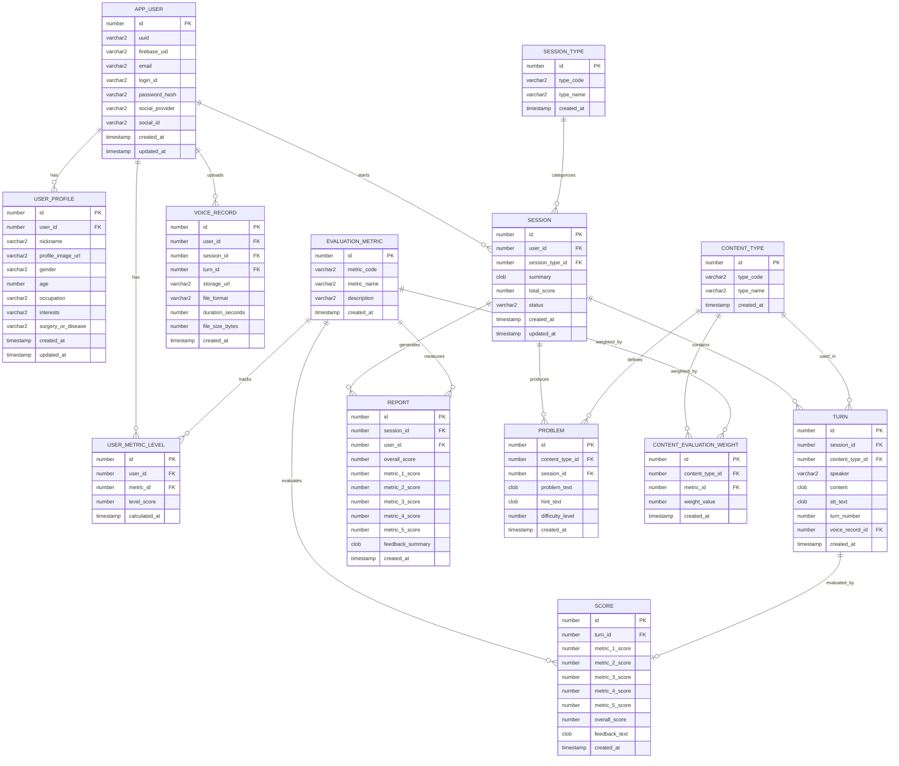
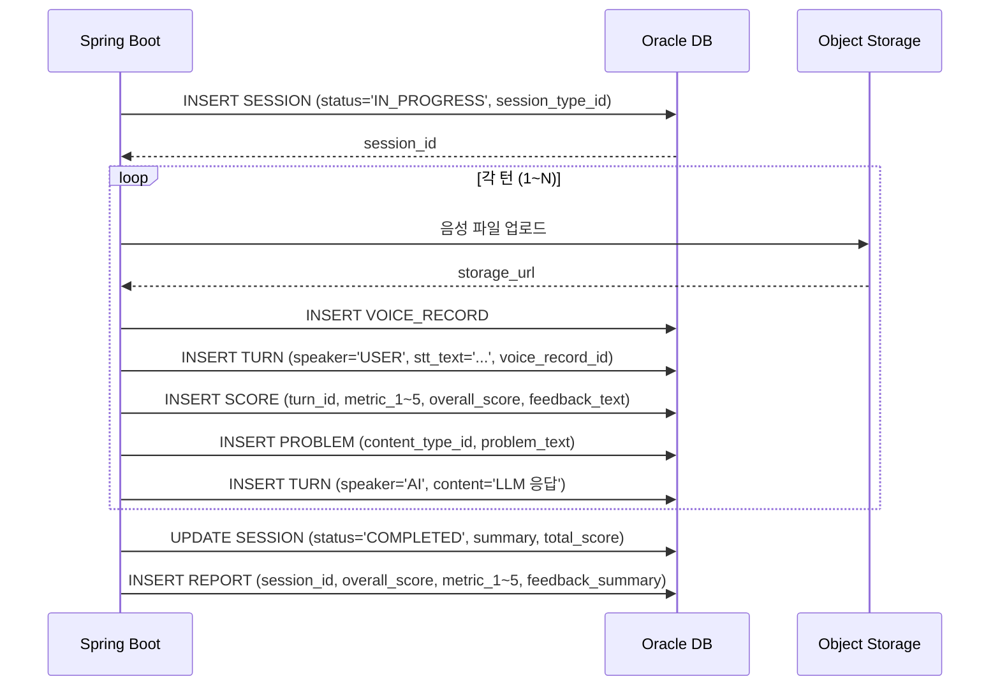

# 데이터베이스 설계서 (Database Design Document)

---

## 1. 목적 및 범위

본 문서는 시스템 설계서에 기술된 컴포넌트를 지원하는 **관계형 데이터베이스 스키마**를 정의한다.

- **DBMS**: Oracle Database 21c XE (컨테이너)
- **데이터 접근**: Spring Data JPA (Entity ↔ 테이블 매핑)
- **주요 고려사항**: 개인정보 보호(민감데이터 nullable), 음성 파일 메타데이터 관리, AI 대화 이력 추적, 5개 평가지표 스키마 설계

> **⚠️ Oracle 문법 주의:** 본 문서의 모든 DDL은 **Oracle 21c 표준 문법**으로 작성한다.
> - 자동 증가: `GENERATED BY DEFAULT AS IDENTITY`
> - 문자열: `VARCHAR2` (VARCHAR 아님)
> - 정수: `NUMBER(19)` (BIGINT/INT 아님)
> - 페이징: `FETCH FIRST n ROWS ONLY` (LIMIT 아님)
> - `ON UPDATE CURRENT_TIMESTAMP` 미지원 → 애플리케이션에서 `updated_at` 직접 갱신

---

## 2. ERD (Entity-Relationship Diagram)



> **참고:** `FRIENDSHIP`(친구 관계) 테이블은 사람 간 대화 기능(P3)에 필요한 엔티티로, MVP 단계에서는 **제외**한다. P3 구현 시점에 추가.

---

## 3. 엔티티 상세 정의

### 3.1 APP_USER (사용자)

> **⚠️ 테이블명 주의:** `USER`는 Oracle 예약어이므로 `APP_USER`로 명명한다. JPA에서는 `@Table(name = "APP_USER")`로 매핑.

| 필드명 | 타입 | 제약 | 설명 |
|--------|------|------|------|
| `id` | `NUMBER(19)` | PK, IDENTITY | 내부 식별자 |
| `uuid` | `VARCHAR2(36)` | UNIQUE, NOT NULL | 서버단 유저 개인 식별정보 (UI 노출용) |
| `firebase_uid` | `VARCHAR2(255)` | UNIQUE, nullable | Firebase Auth UID (Google 로그인 시) |
| `email` | `VARCHAR2(255)` | UNIQUE, nullable | 소셜 로그인 이메일 또는 일반 로그인 이메일 |
| `login_id` | `VARCHAR2(50)` | UNIQUE, nullable | 일반 로그인 ID (P3 구현 시 사용) |
| `password_hash` | `VARCHAR2(255)` | nullable | 일반 로그인 비밀번호 해시 (P3 구현 시 사용) |
| `social_provider` | `VARCHAR2(20)` | nullable | `GOOGLE`, `KAKAO`, `NAVER` |
| `social_id` | `VARCHAR2(255)` | nullable | 소셜 플랫폼 제공 식별자 |
| `created_at` | `TIMESTAMP` | DEFAULT CURRENT_TIMESTAMP | |
| `updated_at` | `TIMESTAMP` | | 애플리케이션에서 갱신 |

**인덱스:** `idx_user_uuid`, `idx_user_firebase_uid`, `idx_user_social` (social_provider + social_id)

**DDL 예시:**

```sql
CREATE TABLE APP_USER (
    id              NUMBER(19) GENERATED BY DEFAULT AS IDENTITY PRIMARY KEY,
    uuid            VARCHAR2(36)  NOT NULL UNIQUE,
    firebase_uid    VARCHAR2(255) UNIQUE,
    email           VARCHAR2(255) UNIQUE,
    login_id        VARCHAR2(50)  UNIQUE,
    password_hash   VARCHAR2(255),
    social_provider VARCHAR2(20),
    social_id       VARCHAR2(255),
    created_at      TIMESTAMP DEFAULT CURRENT_TIMESTAMP,
    updated_at      TIMESTAMP,
    CONSTRAINT chk_social_or_login CHECK (
        (firebase_uid IS NOT NULL) OR (login_id IS NOT NULL)
    )
);
```

---

### 3.2 USER_PROFILE (사용자 프로필)

> **필수정보 (P1):** 닉네임, 프로필 사진 URL — 프로토타입에서 사용  
> **민감정보 (P4):** 성별, 나이, 직업, 관심사, 수술/질병 — 모두 nullable, 프로토타입 미사용

| 필드명 | 타입 | 제약 | 설명 |
|--------|------|------|------|
| `id` | `NUMBER(19)` | PK, IDENTITY | |
| `user_id` | `NUMBER(19)` | FK → APP_USER.id, UNIQUE | 1:1 관계 |
| `nickname` | `VARCHAR2(50)` | nullable | 필수정보 (P1) |
| `profile_image_url` | `VARCHAR2(500)` | nullable | OCI Object Storage URL. 필수정보 (P1) |
| `gender` | `VARCHAR2(10)` | nullable | `MALE`, `FEMALE`, `OTHER`. 민감정보 (P4) |
| `age` | `NUMBER(3)` | nullable | 민감정보 (P4) |
| `occupation` | `VARCHAR2(100)` | nullable | 직업. 민감정보 (P4) |
| `interests` | `VARCHAR2(255)` | nullable | 관심사. 민감정보 (P4) |
| `surgery_or_disease` | `VARCHAR2(255)` | nullable | **민감정보 (P4)**: AES-256 암호화 고려. 프로토타입에서는 nullable로만 처리 |
| `created_at` | `TIMESTAMP` | DEFAULT CURRENT_TIMESTAMP | |
| `updated_at` | `TIMESTAMP` | | 애플리케이션에서 갱신 |

**DDL 예시:**

```sql
CREATE TABLE USER_PROFILE (
    id                      NUMBER(19) GENERATED BY DEFAULT AS IDENTITY PRIMARY KEY,
    user_id                 NUMBER(19) NOT NULL UNIQUE REFERENCES APP_USER(id),
    nickname                VARCHAR2(50),
    profile_image_url       VARCHAR2(500),
    gender                  VARCHAR2(10),
    age                     NUMBER(3),
    occupation              VARCHAR2(100),
    interests               VARCHAR2(255),
    surgery_or_disease      VARCHAR2(255),
    created_at              TIMESTAMP DEFAULT CURRENT_TIMESTAMP,
    updated_at              TIMESTAMP
);
```

---

### 3.3 SESSION_TYPE (세션 유형)

| 필드명 | 타입 | 제약 | 설명 |
|--------|------|------|------|
| `id` | `NUMBER(19)` | PK, IDENTITY | |
| `type_code` | `VARCHAR2(20)` | UNIQUE, NOT NULL | `DAILY`, `TYPE_PRACTICE`, `COMPREHENSIVE` |
| `type_name` | `VARCHAR2(50)` | NOT NULL | 한글명 (ex. "오늘의 학습", "유형별 연습", "종합 연습") |
| `created_at` | `TIMESTAMP` | DEFAULT CURRENT_TIMESTAMP | |

**초기 데이터 (seed):**

| type_code | type_name | description |
|-----------|-----------|-------------|
| `DAILY` | 오늘의 학습 | 턴마다 다른 컨텐츠 순회. 종합 보고서 생성. |
| `TYPE_PRACTICE` | 유형별 연습 | 특정 컨텐츠 유형을 집중 연습 |
| `COMPREHENSIVE` | 종합 연습 | 오늘의 학습과 동일한 형태의 종합 연습 |

---

### 3.4 SESSION (학습 세션)

> **기존 CONVERSATION → SESSION으로 명칭 변경** (Conversation은 대화 내용에 더 적합)

| 필드명 | 타입 | 제약 | 설명 |
|--------|------|------|------|
| `id` | `NUMBER(19)` | PK, IDENTITY | |
| `user_id` | `NUMBER(19)` | FK → APP_USER.id, NOT NULL | |
| `session_type_id` | `NUMBER(19)` | FK → SESSION_TYPE.id, NOT NULL | |
| `summary` | `CLOB` | | 세션 종료 후 AI 생성 요약 |
| `total_score` | `NUMBER(3)` | | 세션 종료 후 평균/종합 점수 |
| `status` | `VARCHAR2(20)` | DEFAULT 'IN_PROGRESS' | `IN_PROGRESS`, `COMPLETED` |
| `created_at` | `TIMESTAMP` | DEFAULT CURRENT_TIMESTAMP | |
| `updated_at` | `TIMESTAMP` | | 애플리케이션에서 갱신 |

**인덱스:** `idx_session_user` (user_id), `idx_session_status` (status), `idx_session_type` (session_type_id)

---

### 3.5 TURN (턴 / 문답 기록)

| 필드명 | 타입 | 제약 | 설명 |
|--------|------|------|------|
| `id` | `NUMBER(19)` | PK, IDENTITY | |
| `session_id` | `NUMBER(19)` | FK → SESSION.id, NOT NULL | |
| `content_type_id` | `NUMBER(19)` | FK → CONTENT_TYPE.id | 해당 턴의 컨텐츠 유형 |
| `speaker` | `VARCHAR2(10)` | NOT NULL | `USER`, `AI` |
| `content` | `CLOB` | NOT NULL | 텍스트 내용 (AI 메시지 또는 사용자 텍스트 입력) |
| `stt_text` | `CLOB` | nullable | USER speaker인 경우 STT 결과 텍스트 |
| `turn_number` | `NUMBER(5)` | NOT NULL | 세션 내 순번 (1, 2, 3...) |
| `voice_record_id` | `NUMBER(19)` | FK → VOICE_RECORD.id, nullable | 사용자 음성 녹음 메타데이터 (AI 응답은 nullable) |
| `created_at` | `TIMESTAMP` | DEFAULT CURRENT_TIMESTAMP | |

**인덱스:** `idx_turn_session` (session_id, turn_number)

---

### 3.6 SCORE (발화 채점 결과)

> **5개 평가지표별 점수 + 종합 점수**를 별도 컬럼으로 저장

| 필드명 | 타입 | 제약 | 설명 |
|--------|------|------|------|
| `id` | `NUMBER(19)` | PK, IDENTITY | |
| `turn_id` | `NUMBER(19)` | FK → TURN.id, UNIQUE | 1:1 관계 (USER speaker인 턴만) |
| `metric_1_score` | `NUMBER(3)` | CHECK (0-100), nullable | 평가지표 1 점수 |
| `metric_2_score` | `NUMBER(3)` | CHECK (0-100), nullable | 평가지표 2 점수 |
| `metric_3_score` | `NUMBER(3)` | CHECK (0-100), nullable | 평가지표 3 점수 |
| `metric_4_score` | `NUMBER(3)` | CHECK (0-100), nullable | 평가지표 4 점수 |
| `metric_5_score` | `NUMBER(3)` | CHECK (0-100), nullable | 평가지표 5 점수 |
| `overall_score` | `NUMBER(5,2)` | CHECK (0-100), nullable | 종합 점수 (5개 평균) |
| `feedback_text` | `CLOB` | | AI 생성 피드백 텍스트 |
| `created_at` | `TIMESTAMP` | DEFAULT CURRENT_TIMESTAMP | |

> **⚠️ 비고 (TBD):** `metric_1_score` ~ `metric_5_score`의 구체적인 명칭은 발화 채점 기준이 확정된 후 EVALUATION_METRIC 테이블과 연동하여 정의됨. 현재는 임시 컬럼명으로 처리.

---

### 3.7 VOICE_RECORD (음성 녹음 메타데이터)

| 필드명 | 타입 | 제약 | 설명 |
|--------|------|------|------|
| `id` | `NUMBER(19)` | PK, IDENTITY | |
| `user_id` | `NUMBER(19)` | FK → APP_USER.id, NOT NULL | |
| `session_id` | `NUMBER(19)` | FK → SESSION.id, NOT NULL | |
| `turn_id` | `NUMBER(19)` | FK → TURN.id, nullable | Turn 생성 전에 먼저 저장될 수 있음 |
| `storage_url` | `VARCHAR2(500)` | NOT NULL | OCI Object Storage 경로 |
| `file_format` | `VARCHAR2(10)` | NOT NULL | `MP3`, `WAV` |
| `duration_seconds` | `NUMBER(5)` | | 녹음 길이 (초). **최대 30초** |
| `file_size_bytes` | `NUMBER(19)` | | 파일 크기 |
| `created_at` | `TIMESTAMP` | DEFAULT CURRENT_TIMESTAMP | |

**인덱스:** `idx_voice_session` (session_id)

---

### 3.8 REPORT (최종 보고서)

> **세션 종합 보고서:** 5개 평가지표별 점수 + 종합 점수(평균)

| 필드명 | 타입 | 제약 | 설명 |
|--------|------|------|------|
| `id` | `NUMBER(19)` | PK, IDENTITY | |
| `session_id` | `NUMBER(19)` | FK → SESSION.id, UNIQUE | 1:1 관계 |
| `user_id` | `NUMBER(19)` | FK → APP_USER.id, NOT NULL | |
| `overall_score` | `NUMBER(5,2)` | CHECK (0-100) | 종합 점수 (5개 평가지표 평균) |
| `metric_1_score` | `NUMBER(5,2)` | CHECK (0-100), nullable | 평가지표 1 점수 |
| `metric_2_score` | `NUMBER(5,2)` | CHECK (0-100), nullable | 평가지표 2 점수 |
| `metric_3_score` | `NUMBER(5,2)` | CHECK (0-100), nullable | 평가지표 3 점수 |
| `metric_4_score` | `NUMBER(5,2)` | CHECK (0-100), nullable | 평가지표 4 점수 |
| `metric_5_score` | `NUMBER(5,2)` | CHECK (0-100), nullable | 평가지표 5 점수 |
| `feedback_summary` | `CLOB` | | AI 생성 종합 피드백 요약 |
| `created_at` | `TIMESTAMP` | DEFAULT CURRENT_TIMESTAMP | |

---

### 3.9 CONTENT_TYPE (컨텐츠 유형)

| 필드명 | 타입 | 제약 | 설명 |
|--------|------|------|------|
| `id` | `NUMBER(19)` | PK, IDENTITY | |
| `type_code` | `VARCHAR2(20)` | UNIQUE, NOT NULL | `A`, `B`, `C` (임시 명칭) |
| `type_name` | `VARCHAR2(50)` | NOT NULL | 한글명 (ex. "컨텐츠 A") |
| `description` | `VARCHAR2(255)` | | 설명 |
| `created_at` | `TIMESTAMP` | DEFAULT CURRENT_TIMESTAMP | |

**초기 데이터 (seed):**

| type_code | type_name | description |
|-----------|-----------|-------------|
| `A` | 컨텐츠 A | 발화 역량 평가를 위한 컨텐츠 유형 A |
| `B` | 컨텐츠 B | 발화 역량 평가를 위한 컨텐츠 유형 B |
| `C` | 컨텐츠 C | 발화 역량 평가를 위한 컨텐츠 유형 C |

---

### 3.10 EVALUATION_METRIC (평가 지표)

| 필드명 | 타입 | 제약 | 설명 |
|--------|------|------|------|
| `id` | `NUMBER(19)` | PK, IDENTITY | |
| `metric_code` | `VARCHAR2(20)` | UNIQUE, NOT NULL | `METRIC_1` ~ `METRIC_5` (임시 명칭) |
| `metric_name` | `VARCHAR2(50)` | NOT NULL | 지표명 (기획 확정 후 입력) |
| `description` | `VARCHAR2(255)` | | 설명 |
| `created_at` | `TIMESTAMP` | DEFAULT CURRENT_TIMESTAMP | |

**초기 데이터 (seed):**

| metric_code | metric_name | description |
|-------------|-------------|-------------|
| `METRIC_1` | 지표 1 | 발화 역량 평가 지표 1 (기획 중) |
| `METRIC_2` | 지표 2 | 발화 역량 평가 지표 2 (기획 중) |
| `METRIC_3` | 지표 3 | 발화 역량 평가 지표 3 (기획 중) |
| `METRIC_4` | 지표 4 | 발화 역량 평가 지표 4 (기획 중) |
| `METRIC_5` | 지표 5 | 발화 역량 평가 지표 5 (기획 중) |

---

### 3.11 USER_METRIC_LEVEL (유저 수준)

> **유저의 각 평가지표별 수준 점수 + 대표 점수**

| 필드명 | 타입 | 제약 | 설명 |
|--------|------|------|------|
| `id` | `NUMBER(19)` | PK, IDENTITY | |
| `user_id` | `NUMBER(19)` | FK → APP_USER.id, NOT NULL | |
| `metric_id` | `NUMBER(19)` | FK → EVALUATION_METRIC.id, NOT NULL | |
| `level_score` | `NUMBER(5,2)` | CHECK (0-100) | 해당 지표의 수준 점수 |
| `calculated_at` | `TIMESTAMP` | DEFAULT CURRENT_TIMESTAMP | 계산 시점 |

**인덱스:** `idx_user_metric_user` (user_id), `idx_user_metric_user_metric` (user_id, metric_id)

**대표 점수 조회:**

```sql
-- 유저의 대표 점수 (5개 지표 평균)
SELECT user_id, AVG(level_score) as representative_score
FROM USER_METRIC_LEVEL
WHERE user_id = ?
GROUP BY user_id;
```

---

### 3.12 CONTENT_EVALUATION_WEIGHT (컨텐츠별 평가지표 가중치)

> **컨텐츠 타입별로 각 평가지표에 얼마나 가중치를 부여하는지 정의**

| 필드명 | 타입 | 제약 | 설명 |
|--------|------|------|------|
| `id` | `NUMBER(19)` | PK, IDENTITY | |
| `content_type_id` | `NUMBER(19)` | FK → CONTENT_TYPE.id, NOT NULL | |
| `metric_id` | `NUMBER(19)` | FK → EVALUATION_METRIC.id, NOT NULL | |
| `weight_value` | `NUMBER(3,2)` | CHECK (0-1) | 가중치 (0.0 ~ 1.0) |
| `created_at` | `TIMESTAMP` | DEFAULT CURRENT_TIMESTAMP | |

**인덱스:** `idx_weight_content_metric` (content_type_id, metric_id), UNIQUE

---

### 3.13 PROBLEM (AI 생성 문제)

| 필드명 | 타입 | 제약 | 설명 |
|--------|------|------|------|
| `id` | `NUMBER(19)` | PK, IDENTITY | |
| `content_type_id` | `NUMBER(19)` | FK → CONTENT_TYPE.id, NOT NULL | |
| `session_id` | `NUMBER(19)` | FK → SESSION.id, nullable | 특정 세션에서 생성된 경우 |
| `problem_text` | `CLOB` | NOT NULL | 문제 내용 |
| `hint_text` | `CLOB` | nullable | 힌트 또는 다음 단어 후보 |
| `difficulty_level` | `NUMBER(1)` | nullable | 난이도 (1~5). 유저 수준에 따라 조절 |
| `created_at` | `TIMESTAMP` | DEFAULT CURRENT_TIMESTAMP | |

**인덱스:** `idx_problem_content_type` (content_type_id), `idx_problem_session` (session_id)

---

## 4. 데이터 흐름 및 연동

### 4.1 AI 대화 세션 흐름 (DB 관점)



### 4.2 유저 수준 산정 쿼리

```sql
-- 최근 10개 종합보고서(오늘의 학습 또는 종합 연습)에서 각 지표별 상위 5개 평균
SELECT 
    r.metric_1_score,
    r.metric_2_score,
    r.metric_3_score,
    r.metric_4_score,
    r.metric_5_score
FROM REPORT r
JOIN SESSION s ON r.session_id = s.id
JOIN SESSION_TYPE st ON s.session_type_id = st.id
WHERE r.user_id = ?
  AND st.type_code IN ('DAILY', 'COMPREHENSIVE')
ORDER BY r.created_at DESC
FETCH FIRST 10 ROWS ONLY;

-- 각 지표별 상위 5개 평균을 USER_METRIC_LEVEL에 저장
-- (애플리케이션에서 계산 후 INSERT/UPDATE)
```

### 4.3 LLM 컨테이너 컨텍스트 전달 쿼리

```sql
-- 특정 Session의 전체 Turn을 순서대로 조회
SELECT t.speaker, t.content, t.stt_text, t.turn_number, ct.type_code
FROM TURN t
LEFT JOIN CONTENT_TYPE ct ON t.content_type_id = ct.id
WHERE t.session_id = ?
ORDER BY t.turn_number;

-- Session 요약 (이미 완료된 이전 세션)
SELECT s.summary
FROM SESSION s
WHERE s.user_id = ?
  AND s.status = 'COMPLETED'
ORDER BY s.created_at DESC
FETCH FIRST 5 ROWS ONLY;
```

---

## 5. 보안 및 민감데이터 처리

| 항목 | 테이블/필드 | 처리 방식 |
|------|------------|-----------|
| **건강 정보** | USER_PROFILE.surgery_or_disease | nullable. P4 구현 시 AES-256 암호화 고려. 프로토타입에서는 미사용 |
| **음성 파일** | VOICE_RECORD.storage_url | Object Storage 접근 제어 + Pre-Authenticated URL (TTL 5분) |
| **Firebase 토큰** | (Spring Boot 내부) | Firebase Admin SDK로 검증 후 메모리에서 처리, DB 저장 안 함 |
| **DB 접근** | 전체 테이블 | Oracle XE 컨테이너는 Docker 내부 네트워크만 노출, 외부 직접 접근 차단 |
| **일반 로그인** | APP_USER.login_id, password_hash | nullable. P3 구현 시 bcrypt 해시, salt 적용 |

---

## 6. 성능 고려사항

| 항목 | 전략 |
|------|------|
| **Turn 조회** | `session_id + turn_number` 복합 인덱스로 세션 내 빠른 순회 |
| **대용량 텍스트** | `content`, `problem_text`는 `CLOB` 타입 사용 |
| **JSON 컬럼** | 기존 `parameters_json` 제거 → 정규화된 컬럼(metric_1_score ~ metric_5_score)로 대체. Native JSON 필요 시 Oracle 21c JSON 기능 활용 |
| **파티셔닝** | MVP 단계에서는 불필요. 사용자 수 증가 시 SESSION/VOICE_RECORD 월별 파티션 고려 |
| **유저 수준 조회** | `USER_METRIC_LEVEL.user_id` 인덱스로 빠른 대시보드 로딩 |

---

## 7. 변경 이력

| 버전 | 날짜 | 작성자 | 변경 내용 |
|------|------|--------|-----------|
| v0.1 | 2026-08-18 | 김윤혁 | 초안 작성 |
| v0.2 | 2026-08-18 | 김윤혁 | Oracle 표준 문법으로 전면 수정. USER→APP_USER(예약어 회피). FRIENDSHIP 테이블 제거(P3로 이연). |
| v0.3 | 2026-08-19 | 김윤혁 | CONVERSATION→SESSION 명칭 변경. SESSION_TYPE 테이블 추가(오늘의학습/유형별연습/종합연습). EVALUATION_METRIC(5개 지표), USER_METRIC_LEVEL(유저 수준), CONTENT_EVALUATION_WEIGHT(가중치) 테이블 신규 추가. CONTENT_TYPE 4개→3개(A/B/C). SCORE/REPORT에 metric_1~5 컬럼 추가. VOICE_RECORD에 stt_text 추가. APP_USER에 firebase_uid, login_id, password_hash 추가. USER_PROFILE에 필수/민감 구분 명시. |
