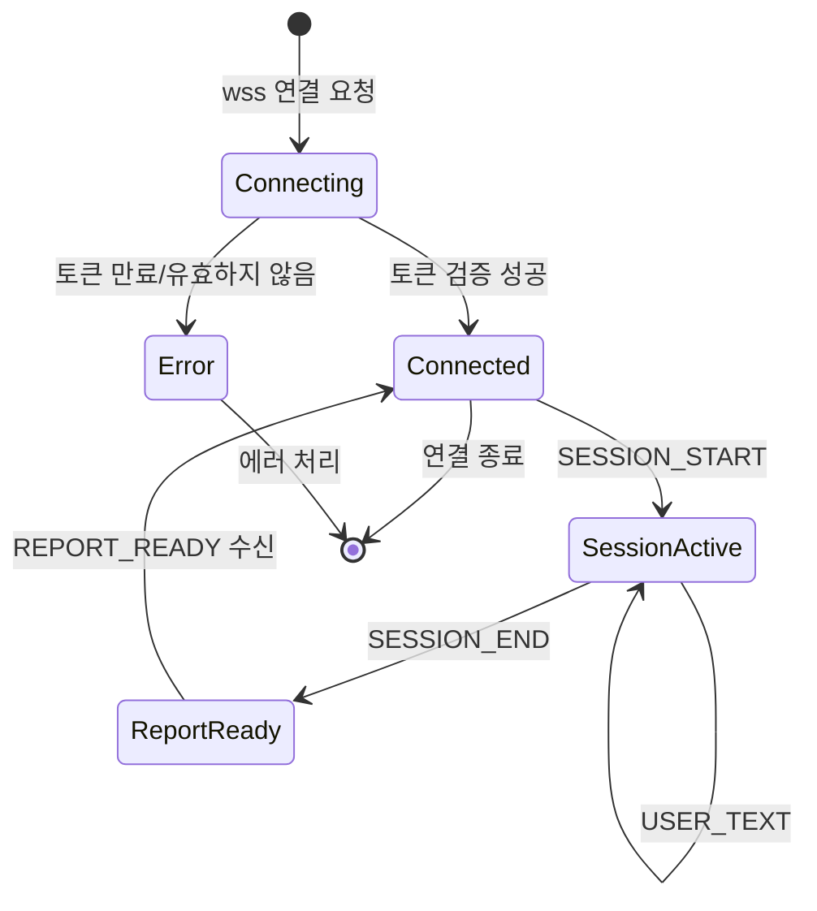

# API 인터페이스 설계서 (API Interface Design Document)

## 1. 목적 및 범위

본 문서는 클라이언트(Android) ↔ 백엔드(Spring Boot) 간의 **모든 API 규격**을 정의한다.

- **REST API**: 파일 업로드, 대시보드, 설정, 보고서 등 요청/응답 기반 기능
- **WebSocket API**: AI 대화 세션의 실시간 양방향 통신
- **인증**: JWT (Access/Refresh Token)
- **데이터 형식**: JSON (UTF-8)
- **문서 형식**: md + mermaid (OpenAPI 3.0 마이그레이션은 추후)

---

## 2. 기본 규격

### 2.1 Base URL

| 환경 | URL |
|------|-----|
| **개발** | `https://dev.api.speech-app.example.com` |
| **운영** | `https://api.speech-app.example.com` |

### 2.2 응답 형식 (성공)

```json
{
  "success": true,
  "data": { ... },
  "timestamp": "2026-08-18T12:34:56.789Z"
}
```

### 2.3 응답 형식 (에러)

```json
{
  "success": false,
  "error": {
    "code": "E0101",
    "message": "유효하지 않은 요청입니다.",
    "detail": "conversation_id는 필수입니다.",
    "timestamp": "2026-08-18T12:34:56.789Z"
  }
}
```

| 필드 | 설명 |
|------|------|
| `code` | `E{HTTP상태코드}{시퀀스}` — 예: E0101 = 400 Bad Request 첫 번째 |
| `message` | 사용자에게 노출할 한국어 메시지 |
| `detail` | 디버깅용 상세 정보 |
| `timestamp` | ISO 8601 형식 (UTC) |

### 2.4 HTTP 상태 코드

| 코드 | 사용 상황 |
|------|----------|
| 200 | 성공 (GET, PUT, PATCH) |
| 201 | 생성 성공 (POST) |
| 204 | 삭제 성공 (DELETE) |
| 400 | 잘못된 요청 (파라미터 오류, 유효성 실패) |
| 401 | 인증 실패 (토큰 없음/만료) |
| 403 | 권한 없음 (접근 불가 자원) |
| 404 | 리소스 없음 |
| 409 | 충돌 (중복, 이미 존재) |
| 500 | 서버 내부 오류 |
| 502/504 | AI 서비스 타임아웃 |

---

## 3. 인증 API (REST)

### 3.1 구글 로그인 (소셜)

| 항목 | 내용 |
|------|------|
| **Method** | `POST` |
| **Path** | `/api/v1/auth/google` |
| **인증** | 불필요 |

#### 요청

```json
{
  "id_token": "구글에서 받은 ID Token"
}
```

#### 응답 (성공)

```json
{
  "success": true,
  "data": {
    "access_token": "eyJhbGciOiJIUzI1NiIs...",
    "refresh_token": "eyJhbGciOiJIUzI1NiIs...",
    "expires_in": 900,
    "user": {
      "uuid": "550e8400-e29b-41d4-a716-446655440000",
      "email": "user@example.com",
      "nickname": "사용자닉네임",
      "is_new_user": false
    }
  }
}
```

### 3.2 토큰 갱신

| 항목 | 내용 |
|------|------|
| **Method** | `POST` |
| **Path** | `/api/v1/auth/refresh` |
| **인증** | Refresh Token (Header: `X-Refresh-Token`) |

#### 요청

```json
{
  "refresh_token": "eyJhbGciOiJIUzI1NiIs..."
}
```

#### 응답

```json
{
  "success": true,
  "data": {
    "access_token": "eyJhbGciOiJIUzI1NiIs...",
    "expires_in": 900
  }
}
```

### 3.3 로그아웃

| 항목 | 내용 |
|------|------|
| **Method** | `POST` |
| **Path** | `/api/v1/auth/logout` |
| **인증** | Access Token (Bearer) |

---

## 4. 사용자 API (REST)

### 4.1 내 프로필 조회

| 항목 | 내용 |
|------|------|
| **Method** | `GET` |
| **Path** | `/api/v1/users/me` |
| **인증** | Bearer JWT |

#### 응답

```json
{
  "success": true,
  "data": {
    "uuid": "550e8400-e29b-41d4-a716-446655440000",
    "email": "user@example.com",
    "nickname": "사용자닉네임",
    "profile_image_url": "https://...",
    "gender": "MALE",
    "age": 35,
    "occupation": "회사원",
    "interests": "독서, 등산",
    "created_at": "2026-08-10T09:00:00Z"
  }
}
```

### 4.2 프로필 수정

| 항목 | 내용 |
|------|------|
| **Method** | `PATCH` |
| **Path** | `/api/v1/users/me` |
| **인증** | Bearer JWT |

#### 요청

```json
{
  "nickname": "새닉네임",
  "age": 36,
  "occupation": "개발자"
}
```

### 4.3 프로필 이미지 업로드

| 항목 | 내용 |
|------|------|
| **Method** | `POST` |
| **Path** | `/api/v1/users/me/profile-image` |
| **인증** | Bearer JWT |
| **Content-Type** | `multipart/form-data` |

#### 요청

| 필드 | 타입 | 설명 |
|------|------|------|
| `image` | File | PNG/JPG, 최대 5MB |

#### 응답

```json
{
  "success": true,
  "data": {
    "profile_image_url": "https://objectstorage.oraclecloud.com/n/.../profile-images/550e8400-.../image.png"
  }
}
```

---

## 5. 학습 API (REST + WebSocket)

### 5.1 컨텐츠 유형 조회

| 항목 | 내용 |
|------|------|
| **Method** | `GET` |
| **Path** | `/api/v1/content-types` |
| **인증** | Bearer JWT |

#### 응답

```json
{
  "success": true,
  "data": [
    {
      "id": 1,
      "type_code": "FREESTYLE",
      "type_name": "프리스타일 AI 토킹쇼",
      "description": "자유 주제로 AI와 대화"
    },
    {
      "id": 2,
      "type_code": "WRITING",
      "type_name": "작문 보조",
      "description": "다음 단어 후보를 제시하고 문장 완성 유도"
    }
  ]
}
```

### 5.2 학습 이력 조회 (대시보드)

| 항목 | 내용 |
|------|------|
| **Method** | `GET` |
| **Path** | `/api/v1/conversations` |
| **인증** | Bearer JWT |
| **Query Params** | `page`, `size`, `status` |

#### 응답

```json
{
  "success": true,
  "data": {
    "content": [
      {
        "id": 100,
        "content_type": "FREESTYLE",
        "summary": "주말 활동에 대해 대화. 접속사 반복이 관찰됨.",
        "total_score": 72,
        "status": "COMPLETED",
        "created_at": "2026-08-17T14:30:00Z"
      }
    ],
    "total_elements": 15,
    "total_pages": 2,
    "current_page": 0
  }
}
```

### 5.3 보고서 조회

| 항목 | 내용 |
|------|------|
| **Method** | `GET` |
| **Path** | `/api/v1/conversations/{conversation_id}/report` |
| **인증** | Bearer JWT |

#### 응답

```json
{
  "success": true,
  "data": {
    "id": 50,
    "conversation_id": 100,
    "overall_score": 72,
    "parameters": {
      "fluency": 75,
      "vocabulary": 65,
      "sentence_structure": 80,
      "repetition_penalty": -10
    },
    "created_at": "2026-08-17T14:35:00Z"
  }
}
```

---

## 6. 음성 파일 업로드 API (REST)

### 6.1 음성 파일 업로드

| 항목 | 내용 |
|------|------|
| **Method** | `POST` |
| **Path** | `/api/v1/voice/upload` |
| **인증** | Bearer JWT |
| **Content-Type** | `multipart/form-data` |

#### 요청

| 필드 | 타입 | 설명 |
|------|------|------|
| `file` | File | MP3/WAV, 최대 10MB, 60초 이하 |
| `conversation_id` | String (optional) | 기존 세션에 추가 업로드 시 |

#### 응답

```json
{
  "success": true,
  "data": {
    "voice_record_id": 123,
    "storage_url": "https://objectstorage.oraclecloud.com/.../voice/550e8400-.../conv-100/turn-3.mp3",
    "duration_seconds": 15,
    "file_size_bytes": 245760
  }
}
```

### 6.2 TTS 음성 다운로드 URL

| 항목 | 내용 |
|------|------|
| **Method** | `GET` |
| **Path** | `/api/v1/voice/tts/{voice_record_id}` |
| **인증** | Bearer JWT |

#### 응답

```json
{
  "success": true,
  "data": {
    "tts_url": "https://objectstorage.oraclecloud.com/.../tts/550e8400-.../conv-100/tts-3.mp3",
    "expires_at": "2026-08-18T12:39:56Z"
  }
}
```

> `tts_url`은 Pre-Authenticated URL로, 5분 후 만료.

---

## 7. WebSocket API — AI 대화 세션

### 7.1 연결

| 항목 | 내용 |
|------|------|
| **URL** | `wss://api.speech-app.example.com/ws/v1/chat` |
| **인증** | Query Param: `?token={access_token}` |
| **HeartBeat** | 30초 (Ping/Pong) |

```kotlin
// Android (OkHttp)
val request = Request.Builder()
    .url("wss://api.speech-app.example.com/ws/v1/chat?token=$jwtToken")
    .build()
val webSocket = okHttpClient.newWebSocket(request, listener)
```

### 7.2 이벤트 명세

#### C → S: 세션 시작

```json
{
  "type": "SESSION_START",
  "payload": {
    "content_type_id": 1,
    "content_type_code": "FREESTYLE"
  }
}
```

#### S → C: 세션 시작 확인

```json
{
  "type": "SESSION_STARTED",
  "payload": {
    "conversation_id": 100,
    "content_type": "FREESTYLE",
    "ai_first_message": "안녕하세요! 오늘은 자유롭게 대화해볼까요?",
    "tts_url": "https://.../tts-0.mp3"
  }
}
```

#### C → S: 음성 업로드 (URL 전달)

```json
{
  "type": "VOICE_UPLOAD",
  "payload": {
    "voice_record_id": 123,
    "storage_url": "https://objectstorage.oraclecloud.com/.../turn-3.mp3",
    "duration_seconds": 15
  }
}
```

> 음성 파일 자체는 REST `/api/v1/voice/upload`로 먼저 업로드 후, 획득한 `voice_record_id`와 `storage_url`을 WebSocket으로 전달.

#### S → C: STT 처리 중 (선택적 진행 표시)

```json
{
  "type": "PROCESSING",
  "payload": {
    "step": "STT",
    "message": "음성을 인식하고 있어요..."
  }
}
```

#### S → C: 채점 결과 (병렬 처리)

```json
{
  "type": "SCORING_READY",
  "payload": {
    "turn_id": 50,
    "turn_number": 3,
    "score": 72,
    "feedback_text": "문장 구성은 좋았으나 '그리고'라는 접속사가 3번 반복되었어요.",
    "parameters": {
      "fluency": 75,
      "vocabulary": 65,
      "sentence_structure": 80
    }
  }
}
```

#### S → C: LLM 응답 완료 (병렬 처리)

```json
{
  "type": "LLM_READY",
  "payload": {
    "turn_id": 51,
    "turn_number": 4,
    "next_content": "산책하니까 기분이 어땠어요? 한 문장으로 말해보세요.",
    "content_type": "TOPIC",
    "hint": "기분, 날씨, 친구 중 하나를 포함해보세요",
    "tts_url": "https://.../tts-4.mp3",
    "is_final": false
  }
}
```

#### S → C: 에러

```json
{
  "type": "ERROR",
  "payload": {
    "code": "E0501",
    "message": "음성 인식에 실패했어요. 다시 말씀해주세요.",
    "recoverable": true
  }
}
```

#### C → S: 사용자 텍스트 입력 (폴백)

```json
{
  "type": "USER_TEXT",
  "payload": {
    "text": "산책하니까 기분이 좋았어요"
  }
}
```

> 마이크가 불가능한 환경에서 텍스트로 입력하는 폴백 기능.

#### C → S: 세션 종료

```json
{
  "type": "SESSION_END",
  "payload": {}
}
```

#### S → C: 보고서 생성 완료

```json
{
  "type": "REPORT_READY",
  "payload": {
    "report_id": 50,
    "conversation_id": 100,
    "overall_score": 72,
    "parameters": {
      "fluency": 75,
      "vocabulary": 65,
      "sentence_structure": 80,
      "repetition_penalty": -10
    },
    "summary": "주말 활동에 대해 대화. 접속사 반복이 관찰됨."
  }
}
```

### 7.3 WebSocket 상태 흐름도



---

## 8. 설정 API (REST)

### 8.1 알림 설정 조회

| 항목 | 내용 |
|------|------|
| **Method** | `GET` |
| **Path** | `/api/v1/settings/notifications` |
| **인증** | Bearer JWT |

#### 응답

```json
{
  "success": true,
  "data": {
    "push_enabled": true,
    "daily_reminder_time": "09:00",
    "streak_reminder_enabled": true
  }
}
```

### 8.2 알림 설정 수정

| 항목 | 내용 |
|------|------|
| **Method** | `PATCH` |
| **Path** | `/api/v1/settings/notifications` |
| **인증** | Bearer JWT |

#### 요청

```json
{
  "push_enabled": false,
  "daily_reminder_time": "20:00"
}
```

---

## 9. 에러 코드 목록

| 코드 | HTTP | 메시지 | 발생 상황 |
|------|------|--------|----------|
| E0101 | 400 | 유효하지 않은 요청입니다. | 필수 파라미터 누락, 형식 오류 |
| E0102 | 400 | 지원하지 않는 파일 형식입니다. | 음성 파일이 MP3/WAV 아님 |
| E0103 | 400 | 파일 크기가 너무 큽니다. | 10MB 초과 |
| E0201 | 401 | 인증이 필요합니다. | 토큰 없음 |
| E0202 | 401 | 토큰이 만료되었습니다. | Access Token 만료 |
| E0203 | 401 | 토큰이 유효하지 않습니다. | 위조/변조된 토큰 |
| E0301 | 403 | 접근 권한이 없습니다. | 다른 사용자의 리소스 접근 |
| E0401 | 404 | 사용자를 찾을 수 없습니다. | 존재하지 않는 UUID |
| E0402 | 404 | 세션을 찾을 수 없습니다. | 존재하지 않는 conversation_id |
| E0501 | 500 | 음성 인식에 실패했어요. | Whisper API 실패 |
| E0502 | 500 | AI 응답 생성 중 오류가 발생했어요. | LLM 컨테이너 실패 |
| E0503 | 504 | AI 서비스 응답 시간이 초과되었어요. | 채점/LLM/TTS 타임아웃 |

---

## 10. 전체 API 엔드포인트 요약

```mermaid
graph LR
    subgraph REST
        R1[POST /auth/google]
        R2[POST /auth/refresh]
        R3[POST /auth/logout]
        R4[GET /users/me]
        R5[PATCH /users/me]
        R6[POST /users/me/profile-image]
        R7[GET /content-types]
        R8[GET /conversations]
        R9[GET /conversations/{id}/report]
        R10[POST /voice/upload]
        R11[GET /voice/tts/{id}]
        R12[GET /settings/notifications]
        R13[PATCH /settings/notifications]
    end

    subgraph WebSocket
        W1[wss://.../ws/v1/chat?token=xxx]
    end

    subgraph Events
        E1[SESSION_START]
        E2[VOICE_UPLOAD]
        E3[SCORING_READY]
        E4[LLM_READY]
        E5[SESSION_END]
        E6[REPORT_READY]
        E7[ERROR]
    end
```

| 카테고리 | 엔드포인트 수 | 설명 |
|----------|-------------|------|
| 인증 | 3 | 로그인, 토큰 갱신, 로그아웃 |
| 사용자 | 3 | 프로필 조회/수정, 이미지 업로드 |
| 학습/대시보드 | 3 | 컨텐츠 유형, 학습 이력, 보고서 |
| 음성 | 2 | 업로드, TTS URL |
| 설정 | 2 | 알림 조회/수정 |
| **WebSocket** | **1 연결 + 7 이벤트** | AI 대화 실시간 통신 |

---

## 11. 변경 이력

| 버전 | 날짜 | 작성자 | 변경 내용 |
|------|------|--------|-----------|
| v0.1 | 2026-08-18 | 김윤혁 | 초안 작성 |
