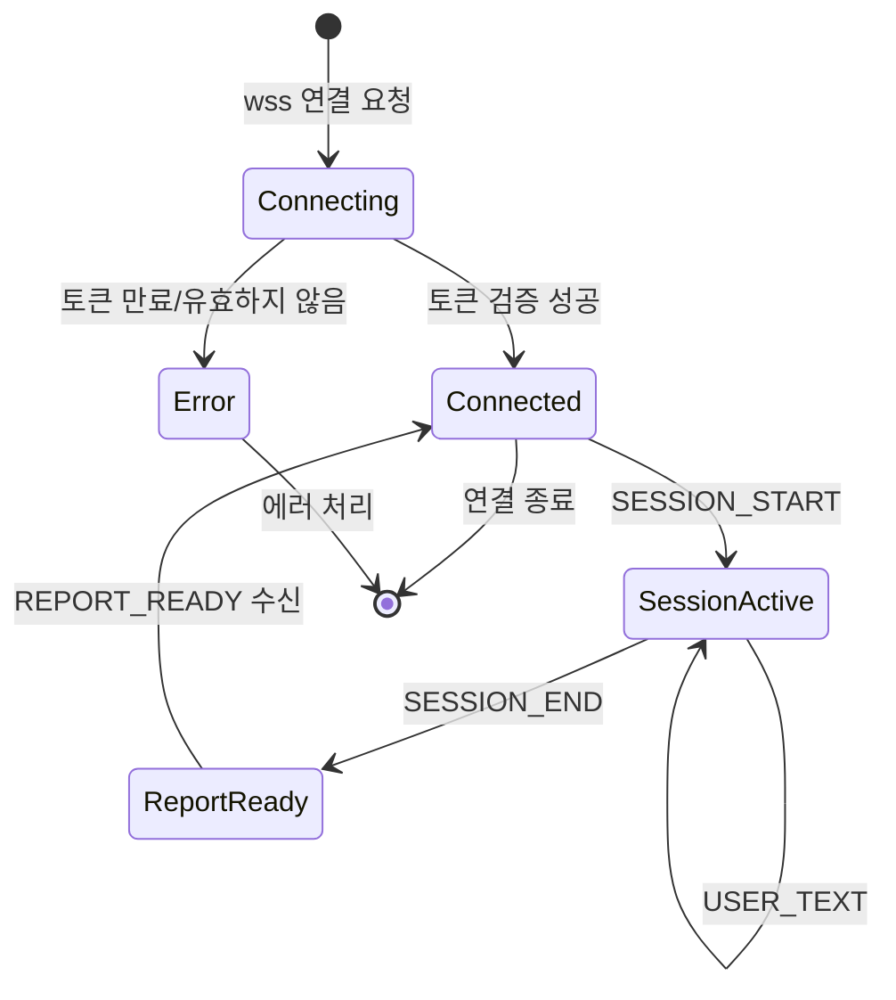

# API 인터페이스 설계서 (API Interface Design Document)

## 1. 목적 및 범위

본 문서는 클라이언트(Android) ↔ 백엔드(Spring Boot) 간의 **모든 API 규격**을 정의한다.

- **REST API**: 파일 업로드, 대시보드, 설정, 보고서 등 요청/응답 기반 기능
- **WebSocket API**: AI 대화 세션의 실시간 양방향 통신
- **인증**: **Firebase Authentication (Google OAuth2)**. Spring Boot에서 Firebase Admin SDK로 ID Token 검증
- **데이터 형식**: JSON (UTF-8)
- **JSON 네이밍 컨벤션**: 응답은 **camelCase** (Jackson 기본 동작). 요청 DTO는 예외적으로 snake_case 일부 유지 (예: `FirebaseAuthRequest.id_token`). 상세는 `API_SPEC.md v1.1` 참고.
- **문서 형식**: md + mermaid (OpenAPI 3.0 마이그레이션은 추후)

---

## 2. 기본 규격

### 2.1 Base URL

| 환경 | URL |
|------|-----|
| **개발** | `https://dev.api.speech-app.example.com` |
| **운영** | `https://api.speech-app.example.com` |

### 2.2 응답 형식 (성공)

```json
{
  "success": true,
  "data": { ... },
  "timestamp": "2026-08-18T12:34:56.789Z"
}
```

### 2.3 응답 형식 (에러)

```json
{
  "success": false,
  "error": {
    "code": "E0101",
    "message": "유효하지 않은 요청입니다.",
    "detail": "session_id는 필수입니다.",
    "timestamp": "2026-08-18T12:34:56.789Z"
  }
}
```

| 필드 | 설명 |
|------|------|
| `code` | `E{HTTP상태코드}{시퀀스}` — 예: E0101 = 400 Bad Request 첫 번째 |
| `message` | 사용자에게 노출할 한국어 메시지 |
| `detail` | 디버깅용 상세 정보 |
| `timestamp` | ISO 8601 형식 (UTC) |

### 2.4 HTTP 상태 코드

| 코드 | 사용 상황 |
|------|----------|
| 200 | 성공 (GET, PUT, PATCH) |
| 201 | 생성 성공 (POST) |
| 204 | 삭제 성공 (DELETE) |
| 400 | 잘못된 요청 (파라미터 오류, 유효성 실패) |
| 401 | 인증 실패 (토큰 없음/만료) |
| 403 | 권한 없음 (접근 불가 자원) |
| 404 | 리소스 없음 |
| 409 | 충돌 (중복, 이미 존재) |
| 429 | 요청 횟수 초과 (종합보고서 일일 제한 등) |
| 500 | 서버 내부 오류 |
| 502/504 | AI 서비스 타임아웃 |

---

## 3. 인증 API (REST) — ✅ 구현 완료

> **📌 구현 상태:** Firebase Auth + JWT 인증 시스템 구현 완료. POST /auth/firebase, POST /auth/refresh, POST /auth/logout 3개 엔드포인트 모두 구현됨.

### 3.1 Firebase 로그인 (Google OAuth2)

| 항목 | 내용 |
|------|------|
| **Method** | `POST` |
| **Path** | `/api/v1/auth/firebase` |
| **인증** | 불필요 |

#### 요청

```json
{
  "id_token": "Firebase에서 받은 ID Token"
}
```

#### 응답 (성공)

```json
{
  "success": true,
  "data": {
    "access_token": "eyJhbG...NiIs...",
    "refresh_token": "eyJhbG...NiIs...",
    "expires_in": 900,
    "user": {
      "uuid": "550e8400-e29b-41d4-a716-446655440000",
      "email": "user@example.com",
      "nickname": null,
      "is_new_user": true
    }
  }
}
```

> **설명:** Spring Boot가 Firebase Admin SDK로 ID Token을 검증하고, 서버 자체 JWT(Access/Refresh Token)를 발급한다. 일반 로그인(P3) 추가 시 `/api/v1/auth/login` 엔드포인트가 추가될 예정.

### 3.2 토큰 갱신

| 항목 | 내용 |
|------|------|
| **Method** | `POST` |
| **Path** | `/api/v1/auth/refresh` |
| **인증** | Refresh Token (Header: `X-Refresh-Token`) |

#### 요청

```json
{
  "refresh_token": "eyJhbG...NiIs..."
}
```

#### 응답

```json
{
  "success": true,
  "data": {
    "access_token": "eyJhbG...NiIs...",
    "expires_in": 900
  }
}
```

### 3.3 로그아웃

| 항목 | 내용 |
|------|------|
| **Method** | `POST` |
| **Path** | `/api/v1/auth/logout` |
| **인증** | Access Token (Bearer) |

---

## 4. 사용자 API (REST) — ✅ 구현 완료

> **📌 구현 상태:** GET /users/me, PATCH /users/me, DELETE /users/me, POST /users/me/profile-image, GET /users/me/profile-image 모두 구현 완료. 유저 수준 조회(GET /users/me/level)는 미구현.
>
> ℹ️ **회원탈퇴 (2026-08-30 신규 구현):** `DELETE /api/v1/users/me` — DB hard delete + 서버에서 Admin SDK로 Firebase Auth 유저 삭제 (afterCommit). 클라이언트는 Firebase `.delete()` + 로컬 토큰 삭제.
>
> ℹ️ **프로필 사진 (2026-08-30 신규 구현):** POST/GET `/api/v1/users/me/profile-image` — OCI Object Storage 연동. 백엔드 프록시 스트리밍(GET, JWT 인증). 버킷 비공개 유지.

### 4.1 내 프로필 조회

| 항목 | 내용 |
|------|------|
| **Method** | `GET` |
| **Path** | `/api/v1/users/me` |
| **인증** | Bearer JWT |

#### 응답

```json
{
  "success": true,
  "data": {
    "uuid": "550e8400-e29b-41d4-a716-446655440000",
    "email": "user@example.com",
    "nickname": "사용자닉네임",
    "profile_image_url": "https://...",
    "level": 5,
    "created_at": "2026-08-10T09:00:00Z"
  }
}
```

### 4.2 프로필 수정

| 항목 | 내용 |
|------|------|
| **Method** | `PATCH` |
| **Path** | `/api/v1/users/me` |
| **인증** | Bearer JWT |

#### 요청

```json
{
  "nickname": "새닉네임"
}
```

> **⚠️ 민감정보(성별, 나이, 직업, 관심사, 수술/질병)**는 P4 기능이므로 프로토타입에서는 수정 API에서 제외하거나 무시. 프론트에서도 입력 폼 미노출.

### 4.2.1 회원탈퇴 — ✅ 구현 완료 (2026-08-30)

| 항목 | 내용 |
|------|------|
| **Method** | `DELETE` |
| **Path** | `/api/v1/users/me` |
| **인증** | Bearer JWT |

#### 응답

```
HTTP 204 No Content
```

> **구현 상세:** 서버에서 DB hard delete (AppUser, UserProfile 삭제) 후 `afterCommit`으로 Firebase Auth 유저도 삭제 (firebase_uid 기준, Admin SDK). 클라이언트는 Firebase `.delete()` + 로컬 토큰 삭제 후 로그인 화면으로 이동.

### 4.3 프로필 이미지 업로드 — ✅ 구현 완료 (2026-08-30)

| 항목 | 내용 |
|------|------|
| **Method** | `POST` |
| **Path** | `/api/v1/users/me/profile-image` |
| **인증** | Bearer JWT |
| **Content-Type** | `multipart/form-data` |

#### 요청

| 필드 | 타입 | 설명 |
|------|------|------|
| `image` | File | PNG/JPG, 최대 5MB |

#### 응답

```json
{
  "success": true,
  "data": {
    "profile_image_url": "https://objectstorage.oraclecloud.com/n/.../profile-images/550e8400-.../image.png"
  }
}
```

### 4.3.1 프로필 이미지 조회 — ✅ 구현 완료 (2026-08-30)

| 항목 | 내용 |
|------|------|
| **Method** | `GET` |
| **Path** | `/api/v1/users/me/profile-image` |
| **인증** | Bearer JWT |

#### 응답

```
HTTP 200 OK
Content-Type: image/* (원본 파일의 Content-Type)
Body: <이미지 바이너리 스트림>
```

> **구현 상세:** 백엔드 프록시 스트리밍 방식. OCI Object Storage 버킷은 비공개 유지, JWT 인증 후 서버가 버킷에서 스트림. 클라이언트는 Coil 등 이미지 로딩 라이브러리로 표시. 캐시 무효화는 URL에 `?v=` 쿼리 파라미터 사용.

### 4.4 유저 수준 조회 (대시보드)

| 항목 | 내용 |
|------|------|
| **Method** | `GET` |
| **Path** | `/api/v1/users/me/level` |
| **인증** | Bearer JWT |

#### 응답

```json
{
  "success": true,
  "data": {
    "representative_score": 73.5,
    "level": 8,
    "metric_scores": {
      "metric_1": 72.0,
      "metric_2": 77.5,
      "metric_3": 70.0,
      "metric_4": 68.0,
      "metric_5": 80.0
    }
  }
}
```

---

## 5. 학습 API (REST + WebSocket)

### 5.1 컨텐츠 유형 조회

| 항목 | 내용 |
|------|------|
| **Method** | `GET` |
| **Path** | `/api/v1/content-types` |
| **인증** | Bearer JWT |

#### 응답

```json
{
  "success": true,
  "data": [
    {
      "id": 1,
      "type_code": "A",
      "type_name": "컨텐츠 A",
      "description": "발화 역량 평가를 위한 컨텐츠 유형 A"
    },
    {
      "id": 2,
      "type_code": "B",
      "type_name": "컨텐츠 B",
      "description": "발화 역량 평가를 위한 컨텐츠 유형 B"
    },
    {
      "id": 3,
      "type_code": "C",
      "type_name": "컨텐츠 C",
      "description": "발화 역량 평가를 위한 컨텐츠 유형 C"
    }
  ]
}
```

### 5.2 세션 목록 조회 (이전 학습 내역)

| 항목 | 내용 |
|------|------|
| **Method** | `GET` |
| **Path** | `/api/v1/sessions` |
| **인증** | Bearer JWT |
| **Query Params** | `page`, `size`, `status`, `session_type` |

#### 응답

```json
{
  "success": true,
  "data": {
    "content": [
      {
        "id": 100,
        "session_type": "DAILY",
        "session_type_name": "오늘의 학습",
        "total_score": 72,
        "status": "COMPLETED",
        "created_at": "2026-08-17T14:30:00Z"
      },
      {
        "id": 99,
        "session_type": "TYPE_PRACTICE",
        "session_type_name": "유형별 연습",
        "total_score": 68,
        "status": "COMPLETED",
        "created_at": "2026-08-16T10:00:00Z"
      }
    ],
    "total_elements": 15,
    "total_pages": 2,
    "current_page": 0
  }
}
```

### 5.3 세션 상세 조회 (턴별)

| 항목 | 내용 |
|------|------|
| **Method** | `GET` |
| **Path** | `/api/v1/sessions/{session_id}` |
| **인증** | Bearer JWT |

#### 응답

```json
{
  "success": true,
  "data": {
    "id": 100,
    "session_type": "DAILY",
    "status": "COMPLETED",
    "total_score": 72,
    "summary": "주말 활동에 대해 대화. 접속사 반복이 관찰됨.",
    "turns": [
      {
        "turn_number": 1,
        "speaker": "AI",
        "content": "안녕하세요! 오늘은 '주말에 뭐 했어요?'라는 주제로 대화해볼까요?"
      },
      {
        "turn_number": 2,
        "speaker": "USER",
        "stt_text": "주말에 친구랑 공원에 갔어요",
        "voice_record_url": "https://.../turn-2.mp3",
        "scores": {
          "metric_1": 75,
          "metric_2": 80,
          "metric_3": 65,
          "metric_4": 70,
          "metric_5": 72
        },
        "overall_score": 72.4,
        "feedback_text": "문장 구성은 좋았어요!"
      },
      {
        "turn_number": 3,
        "speaker": "AI",
        "content": "공원에서 무엇을 했나요?"
      }
    ],
    "created_at": "2026-08-17T14:30:00Z",
    "completed_at": "2026-08-17T14:45:00Z"
  }
}
```

### 5.4 종합 보고서 조회

| 항목 | 내용 |
|------|------|
| **Method** | `GET` |
| **Path** | `/api/v1/sessions/{session_id}/report` |
| **인증** | Bearer JWT |

#### 응답

```json
{
  "success": true,
  "data": {
    "id": 50,
    "session_id": 100,
    "overall_score": 73.0,
    "metric_scores": {
      "metric_1": 72.5,
      "metric_2": 77.5,
      "metric_3": 72.5,
      "metric_4": 67.5,
      "metric_5": 75.0
    },
    "feedback_summary": "전반적으로 문장 구성이 안정적입니다. 다양한 접속사 사용과 구체적 표현을 연습해보세요.",
    "created_at": "2026-08-17T14:35:00Z"
  }
}
```

### 5.5 대시보드 데이터 조회

| 항목 | 내용 |
|------|------|
| **Method** | `GET` |
| **Path** | `/api/v1/dashboard` |
| **인증** | Bearer JWT |
| **Query Params** | `period` (7d, 30d, 90d) |

#### 응답

```json
{
  "success": true,
  "data": {
    "streak_days": 5,
    "total_sessions": 15,
    "score_history": [
      {"date": "2026-08-17", "overall_score": 73.0},
      {"date": "2026-08-16", "overall_score": 68.5},
      {"date": "2026-08-15", "overall_score": 71.0}
    ],
    "radar_chart": {
      "metric_1": 72.0,
      "metric_2": 77.5,
      "metric_3": 70.0,
      "metric_4": 68.0,
      "metric_5": 80.0
    },
    "current_level": 8,
    "representative_score": 73.5
  }
}
```

---

## 5.6 컨텐츠 리소스 API (REST) — 🆕 신규 추가

> **📌 신규 엔드포인트:** IMAGE_RESOURCE, IMAGE_TAG, IMAGE_HINT 테이블 기반 이미지 리소스 관리 API. 관리자(admin) 권한이 필요한 등록/수정/삭제 API와 일반 사용자를 위한 조회 API로 분리된다.

### 5.6.1 이미지 리소스 목록 조회

| 항목 | 내용 |
|------|------|
| **Method** | `GET` |
| **Path** | `/api/v1/content/images` |
| **인증** | Bearer JWT |
| **Query Params** | `problem_type` (DESCRIBE/GUESS, optional), `page`, `size` |

#### 응답

```json
{
  "success": true,
  "data": {
    "content": [
      {
        "image_id": 1,
        "image_name": "park_scene_01.jpg",
        "bucket_path": "content/park_scene_01.jpg",
        "image_url": "https://objectstorage.oraclecloud.com/.../content/park_scene_01.jpg",
        "problem_type": "DESCRIBE",
        "tags": ["공원", "나무", "벤치"],
        "hints": [
          {"hint_type": "CHOSUNG", "hint_text": "ㄱ-ㅇ"},
          {"hint_type": "ASSOCIATION", "hint_text": "사람들이 쉬는 곳"}
        ]
      }
    ],
    "total_elements": 50,
    "total_pages": 5,
    "current_page": 0
  }
}
```

### 5.6.2 이미지 리소스 상세 조회

| 항목 | 내용 |
|------|------|
| **Method** | `GET` |
| **Path** | `/api/v1/content/images/{image_id}` |
| **인증** | Bearer JWT |

#### 응답

```json
{
  "success": true,
  "data": {
    "image_id": 1,
    "image_name": "park_scene_01.jpg",
    "bucket_path": "content/park_scene_01.jpg",
    "image_url": "https://objectstorage.oraclecloud.com/.../content/park_scene_01.jpg",
    "problem_type": "DESCRIBE",
    "tags": [
      {"tag_id": 1, "tag_text": "공원"},
      {"tag_id": 2, "tag_text": "나무"},
      {"tag_id": 3, "tag_text": "벤치"}
    ],
    "hints": [
      {"hint_id": 1, "hint_type": "CHOSUNG", "hint_text": "ㄱ-ㅇ"},
      {"hint_id": 2, "hint_type": "ASSOCIATION", "hint_text": "사람들이 쉬는 곳"}
    ],
    "created_at": "2026-08-25T10:00:00Z"
  }
}
```

### 5.6.3 이미지 리소스 등록 (관리자 전용)

| 항목 | 내용 |
|------|------|
| **Method** | `POST` |
| **Path** | `/api/v1/admin/content/images` |
| **인증** | Bearer JWT (admin 권한) |
| **Content-Type** | `multipart/form-data` |

#### 요청

| 필드 | 타입 | 설명 |
|------|------|------|
| `image` | File | 이미지 파일 (JPG/PNG, 최대 10MB) |
| `image_name` | String | 이미지 명칭 |
| `problem_type` | String | `DESCRIBE` 또는 `GUESS` |
| `tags` | String (JSON) | 태그 배열 (예: `["공원", "나무"]`) |
| `hints` | String (JSON) | 힌트 배열 (예: `[{"hint_type":"CHOSUNG","hint_text":"ㄱ-ㅇ"}]`) |

#### 응답

```json
{
  "success": true,
  "data": {
    "image_id": 51,
    "image_name": "new_image.jpg",
    "bucket_path": "content/new_image.jpg",
    "problem_type": "GUESS"
  }
}
```

### 5.6.4 이미지 리소스 수정 (관리자 전용)

| 항목 | 내용 |
|------|------|
| **Method** | `PATCH` |
| **Path** | `/api/v1/admin/content/images/{image_id}` |
| **인증** | Bearer JWT (admin 권한) |

#### 요청

```json
{
  "image_name": "수정된_이미지명.jpg",
  "problem_type": "DESCRIBE"
}
```

### 5.6.5 이미지 리소스 삭제 (관리자 전용)

| 항목 | 내용 |
|------|------|
| **Method** | `DELETE` |
| **Path** | `/api/v1/admin/content/images/{image_id}` |
| **인증** | Bearer JWT (admin 권한) |

> 이미지 삭제 시 연결된 IMAGE_TAG, IMAGE_HINT 레코드도 함께 삭제된다 (CASCADE). Object Storage의 실제 파일은 별도 lifecycle 정책에 따라 관리된다.

### 5.6.6 태그/힌트 개별 관리 (관리자 전용)

| 항목 | 내용 |
|------|------|
| **Method** | `POST` / `PATCH` / `DELETE` |
| **Path** | `/api/v1/admin/content/images/{image_id}/tags` |
| **Path** | `/api/v1/admin/content/images/{image_id}/hints` |
| **인증** | Bearer JWT (admin 권한) |

> 기존 이미지 리소스에 태그나 힌트를 추가/수정/삭제할 수 있는 엔드포인트.

---

## 6. 음성 파일 업로드 API (REST)

### 6.1 음성 파일 업로드

| 항목 | 내용 |
|------|------|
| **Method** | `POST` |
| **Path** | `/api/v1/voice/upload` |
| **인증** | Bearer JWT |
| **Content-Type** | `multipart/form-data` |

#### 요청

| 필드 | 타입 | 설명 |
|------|------|------|
| `file` | File | MP3/WAV, 최대 10MB, **30초 이하** |
| `session_id` | String (optional) | 기존 세션에 추가 업로드 시 |

#### 응답

```json
{
  "success": true,
  "data": {
    "voice_record_id": 123,
    "storage_url": "https://objectstorage.oraclecloud.com/.../voice/550e8400-.../session-100/turn-3.mp3",
    "duration_seconds": 15,
    "file_size_bytes": 245760
  }
}
```

### 6.2 녹음 파일 다운로드 URL (이전 학습 기록 재생)

| 항목 | 내용 |
|------|------|
| **Method** | `GET` |
| **Path** | `/api/v1/voice/{voice_record_id}` |
| **인증** | Bearer JWT |

#### 응답

```json
{
  "success": true,
  "data": {
    "voice_url": "https://objectstorage.oraclecloud.com/.../voice/550e8400-.../session-100/turn-3.mp3",
    "expires_at": "2026-08-18T12:39:56Z"
  }
}
```

> `voice_url`은 Pre-Authenticated URL로, 5분 후 만료.

---

## 7. WebSocket API — AI 대화 세션

### 7.1 연결

| 항목 | 내용 |
|------|------|
| **URL** | `wss://api.speech-app.example.com/ws/v1/chat` |
| **인증** | Query Param: `?token={access_token}` |
| **HeartBeat** | 30초 (Ping/Pong) |

```kotlin
// Android (OkHttp)
val request = Request.Builder()
    .url("wss://api.speech-app.example.com/ws/v1/chat?token=$accessToken")
    .build()
val webSocket = okHttpClient.newWebSocket(request, listener)
```

### 7.2 이벤트 명세

#### C → S: 세션 시작

```json
{
  "type": "SESSION_START",
  "payload": {
    "session_type_id": 1,
    "session_type_code": "DAILY"
  }
}
```

#### S → C: 세션 시작 확인

```json
{
  "type": "SESSION_STARTED",
  "payload": {
    "session_id": 100,
    "session_type": "DAILY",
    "ai_first_message": "안녕하세요! 오늘은 자유롭게 대화해볼까요?",
    "tts_url": "https://.../tts-0.mp3"
  }
}
```

#### C → S: 음성 업로드 (URL 전달)

```json
{
  "type": "VOICE_UPLOAD",
  "payload": {
    "voice_record_id": 123,
    "storage_url": "https://objectstorage.oraclecloud.com/.../turn-3.mp3",
    "duration_seconds": 15
  }
}
```

> 음성 파일 자체는 REST `/api/v1/voice/upload`로 먼저 업로드 후, 획득한 `voice_record_id`와 `storage_url`을 WebSocket으로 전달.

#### S → C: 처리 중 (선택적 진행 표시)

```json
{
  "type": "PROCESSING",
  "payload": {
    "step": "STT",
    "message": "음성을 인식하고 있어요..."
  }
}
```

#### S → C: 턴 처리 결과 (통합)

```json
{
  "type": "TURN_RESULT",
  "payload": {
    "turn_id": 50,
    "turn_number": 3,
    "stt_text": "주말에 친구랑 공원에 갔어요",
    "scores": {
      "metric_1": 75,
      "metric_2": 80,
      "metric_3": 65,
      "metric_4": 70,
      "metric_5": 72
    },
    "overall_score": 72.4,
    "feedback_text": "문장 구성은 좋았어요! '친구랑'이라는 표현을 사용한 점이 자연스럽습니다.",
    "next_question": "공원에서 무엇을 했나요? 한 문장으로 말해보세요.",
    "tts_url": "https://.../tts-3.mp3",
    "is_final": false
  }
}
```

#### S → C: 에러

```json
{
  "type": "ERROR",
  "payload": {
    "code": "E0501",
    "message": "음성 인식에 실패했어요. 다시 말씀해주세요.",
    "recoverable": true
  }
}
```

#### C → S: 사용자 텍스트 입력 (폴백)

```json
{
  "type": "USER_TEXT",
  "payload": {
    "text": "산책하니까 기분이 좋았어요"
  }
}
```

> 마이크가 불가능한 환경에서 텍스트로 입력하는 폴백 기능.

#### C → S: 세션 종료

```json
{
  "type": "SESSION_END",
  "payload": {}
}
```

#### S → C: 보고서 생성 완료

```json
{
  "type": "REPORT_READY",
  "payload": {
    "report_id": 50,
    "session_id": 100,
    "overall_score": 73.0,
    "metric_scores": {
      "metric_1": 72.5,
      "metric_2": 77.5,
      "metric_3": 72.5,
      "metric_4": 67.5,
      "metric_5": 75.0
    },
    "feedback_summary": "전반적으로 문장 구성이 안정적입니다. 다양한 접속사 사용과 구체적 표현을 연습해보세요."
  }
}
```

### 7.3 WebSocket 상태 흐름도



---

## 8. 설정 API (REST)

### 8.1 알림 설정 조회

| 항목 | 내용 |
|------|------|
| **Method** | `GET` |
| **Path** | `/api/v1/settings/notifications` |
| **인증** | Bearer JWT |

#### 응답

```json
{
  "success": true,
  "data": {
    "push_enabled": true,
    "daily_reminder_time": "09:00",
    "streak_reminder_enabled": true
  }
}
```

### 8.2 알림 설정 수정

| 항목 | 내용 |
|------|------|
| **Method** | `PATCH` |
| **Path** | `/api/v1/settings/notifications` |
| **인증** | Bearer JWT |

#### 요청

```json
{
  "push_enabled": false,
  "daily_reminder_time": "20:00"
}
```

---

## 9. 에러 코드 목록

| 코드 | HTTP | 메시지 | 발생 상황 |
|------|------|--------|----------|
| E0101 | 400 | 유효하지 않은 요청입니다. | 필수 파라미터 누락, 형식 오류 |
| E0102 | 400 | 지원하지 않는 파일 형식입니다. | 음성 파일이 MP3/WAV 아님 |
| E0103 | 400 | 파일 크기가 너무 큽니다. | 10MB 초과 |
| E0104 | 400 | 녹음 시간이 너무 깁니다. | 30초 초과 |
| E0201 | 401 | 인증이 필요합니다. | 토큰 없음 |
| E0202 | 401 | 토큰이 만료되었습니다. | Access Token 만료 |
| E0203 | 401 | 토큰이 유효하지 않습니다. | 위조/변조된 토큰 |
| E0204 | 401 | Firebase 인증에 실패했습니다. | Firebase ID Token 검증 실패 |
| E0301 | 403 | 접근 권한이 없습니다. | 다른 사용자의 리소스 접근 |
| E0401 | 404 | 사용자를 찾을 수 없습니다. | 존재하지 않는 UUID |
| E0402 | 404 | 세션을 찾을 수 없습니다. | 존재하지 않는 session_id |
| E0403 | 404 | 보고서를 찾을 수 없습니다. | 종합보고서 미생성 |
| E0501 | 500 | 음성 인식에 실패했어요. | Whisper API 실패 |
| E0502 | 500 | AI 응답 생성 중 오류가 발생했어요. | LLM 컨테이너 실패 |
| E0503 | 504 | AI 서비스 응답 시간이 초과되었어요. | LLM/채점/TTS 타임아웃 |
| E0601 | 429 | 오늘의 보고서 생성 횟수를 초과했어요. | 하루 2회 초과 |

---

## 10. 전체 API 엔드포인트 요약

```mermaid
graph LR
    subgraph REST
        R1[POST /auth/firebase ✅]
        R2[POST /auth/refresh ✅]
        R3[POST /auth/logout ✅]
        R4[GET /users/me ✅]
        R5[PATCH /users/me ✅]
        R5b["DELETE /users/me ✅ 🆕"]
        R6["POST /users/me/profile-image ✅ 🆕"]
        R6b["GET /users/me/profile-image ✅ 🆕"]
        R7[GET /users/me/level]
        R8[GET /content-types]
        R9[GET /sessions]
        R10["GET /sessions/{id}"]
        R11["GET /sessions/{id}/report"]
        R12[POST /voice/upload]
        R13["GET /voice/{id}"]
        R14[GET /dashboard]
        R15[GET /settings/notifications]
        R16[PATCH /settings/notifications]
        R17["GET /content/images 🆕"]
        R18["GET /content/images/{id} 🆕"]
        R19["POST /admin/content/images 🆕"]
        R20["PATCH /admin/content/images/{id} 🆕"]
        R21["DELETE /admin/content/images/{id} 🆕"]
    end

    subgraph WebSocket
        W1[wss://.../ws/v1/chat?token=xxx]
    end

    subgraph Events
        E1[SESSION_START]
        E2[VOICE_UPLOAD]
        E3[TURN_RESULT]
        E4[USER_TEXT]
        E5[SESSION_END]
        E6[REPORT_READY]
        E7[ERROR]
    end
```



> ✅ = 구현 완료, 🆕 = 신규 추가

| 카테고리 | 엔드포인트 수 | 설명 |
|----------|-------------|------|
| 인증 | 3 | Firebase 로그인, 토큰 갱신, 로그아웃 — ✅ 구현 완료 |
| 사용자 | 6 | 프로필 조회/수정/삭제 ✅, 프로필 이미지 업로드/조회 ✅, 수준 조회 |
| 학습/대시보드 | 5 | 컨텐츠 유형, 세션 목록/상세, 보고서, 대시보드 |
| 컨텐츠 리소스 | 5 | 이미지 리소스 조회/등록/수정/삭제, 태그/힌트 관리 — 🆕 신규 |
| 음성 | 2 | 업로드, 녹음 URL |
| 설정 | 2 | 알림 조회/수정 |
| **WebSocket** | **1 연결 + 7 이벤트** | AI 대화 실시간 통신 |

---

## 11. 변경 이력

| 버전 | 날짜 | 작성자 | 변경 내용 |
|------|------|--------|-----------|
| v0.1 | 2026-08-18 | 김윤혁 | 초안 작성 |
| v0.2 | 2026-08-19 | 김윤혁 | 인증: JWT → Firebase Auth. `/conversations` → `/sessions` URL 변경. 컨텐츠 유형 4개→3개(A/B/C). WebSocket 이벤트: SCORING_READY+LLM_READY → TURN_RESULT 통합. 5개 평가지표 반영. 세션 상세(턴별), 대시보드, 유저 수준 API 신규 추가. 음성 녹음 30초 제한. 종합보고서 일일 제한 에러 코드 추가. |
| v0.3 | 2026-08-26 | - | 인증 API 구현 완료 표시(✅). 사용자 API 부분 구현 표시(GET/PATCH /users/me 완료). 컨텐츠 리소스 API 신규 추가: 이미지 리소스 조회/등록/수정/삭제 + 태그/힌트 관리 엔드포인트(admin 전용). API 요약 다이어그램에 구현 상태 표시 추가. |
| v0.4 | 2026-08-30 | - | **"DB 기반 로그인 구현" 완료 반영.** 회원탈퇴 API(DELETE /users/me) 신규 구현 표시. 프로필 이미지 업로드(POST /users/me/profile-image) + 조회(GET /users/me/profile-image) 구현 완료 표시. §4 사용자 API를 "부분 구현" → "구현 완료"로 변경. JSON 네이밍 컨벤션 노트 추가(응답 camelCase, 요청 DTO 일부 snake_case 예외). API 요약 다이어그램에 DELETE /users/me, POST/GET profile-image ✅ 표시. 사용자 API 엔드포인트 수 4→6 변경. API_SPEC.md v1.1 참고 노트 추가. |
