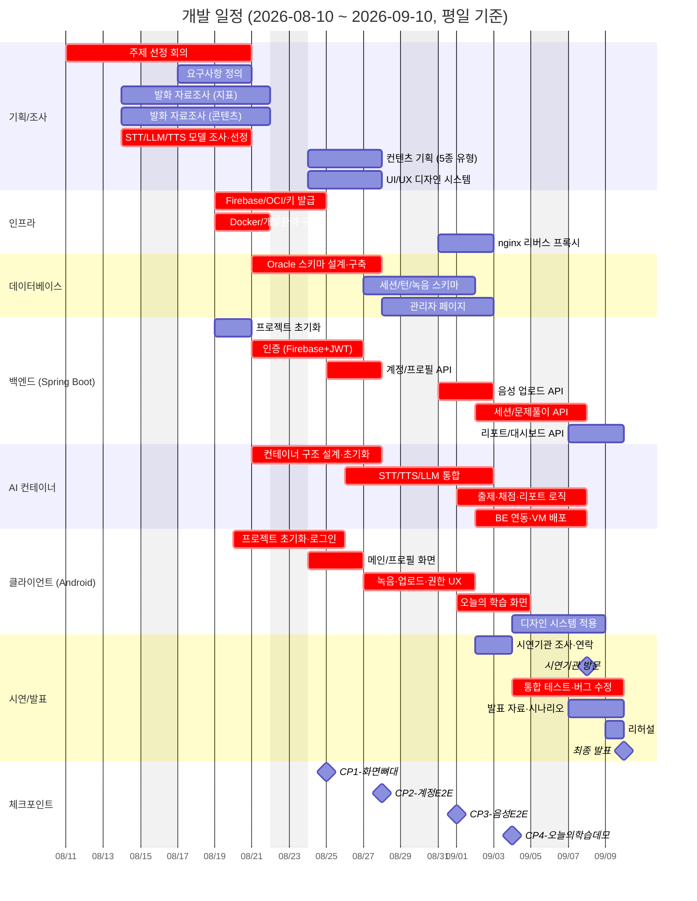

# WBS / 개발계획서 (Work Breakdown Structure & Development Plan)

> **버전:** v2.0 (2026-09-02)
> **프로젝트 기간:** 2026-08-10 (월) ~ 2026-09-10 (목, 최종 발표)
> **기준:** 평일 기준 (주말 제외)

## 1. 팀 구성 및 역할

| 성명 | 포지션 | 담당 영역 | 비고 |
|------|--------|-----------|------|
| **김윤혁** | 팀장 / 개발 총괄 (Tech Lead) | 클라이언트 코어 개발(계정·녹음·세션), 백엔드, 인프라, DB 전반 | 4개 도메인 겸임 — 병목 구간 관리 필수. 클라 코어 데모 완성 후 디자인 요소를 우연희에게 인계 |
| **손승운** | AI/ML 엔지니어 (Model Serving) | STT/LLM/TTS 모델 조사·선정, 서빙 아키텍처 설계, 통합 AI 컨테이너(FastAPI) 및 채점 로직 개발 | 로컬(Whisper·Qwen-TTS) + 클라우드(Ollama Cloud) 하이브리드 구성 결정. 시연기관 섭외 병행 |
| **서지원** | 언어재활 연구 / 채점·데이터 엔지니어 | 스스로말하기(SELF_TALK) 채점 로직 연구·개발, 콘텐츠 리소스 제작 및 태깅, 팀 서기·총무 | 태그 체계 설계 — 채점 JSON 규약의 기반 |
| **문현아** | 발화 평가 지표 연구원 (Speech Metrics) | 핵심 지표(음절 수·발화시간·조음시간 등) 조사 및 활용 방안 설계, 지표 산정 알고리즘 개발 | 산정식이 AI 컨테이너 채점·대시보드 시각화의 기준 |
| **우연희** | UX/UI 디자이너 & 콘텐츠 기획자 | 컨텐츠 기획(5종 유형), 화면 기획, UI/UX 디자인 시스템, 클라이언트 디자인 적용 | **8/20 중간 합류.** 8/20~21 온보딩, 이후 디자인 시스템 전체 구축 |

---

## 2. 마일스톤 개요

| 기간 (평일) | 단계 | 목표 | 산출물 / 체크포인트 |
|------------|------|------|---------------------|
| 8/10 (월) | 킥오프 | 팀 구성, 방향 설정, 협업 환경 준비 | 협업 채널·도구 셋업 |
| 8/11~8/18 | **주제 선정** | 주제 브레인스토밍 및 확정, 요구사항 정의 착수 | 주제 확정, 요구사항 초안 |
| 8/19~8/25 | **Sprint 1** | 인프라 구축 + 설계 문서 + 개발 착수 | **CP1 (8/25):** 로그인·메인 화면 뼈대 |
| 8/26~8/28 | **Sprint 2** | DB 구축 + 계정 도메인 완성 | **CP2 (8/28):** 로그인→회원가입→프로필 E2E |
| 8/31~9/1 | **Sprint 3** | 음성 파이프라인(녹음→업로드→저장) | **CP3 (9/1):** 음성 업로드 E2E |
| 9/2~9/4 | **Sprint 4** | 문제풀이 세션 통합(AI 컨테이너 연동) | **CP4 (9/4):** "오늘의 학습" 데모 |
| 9/7~9/9 | **Final Week** | 발표·시연 준비 집중 + 버그 수정·고도화 토의 | 최종 데모 버전, 발표 자료 |
| **9/10 (목)** | — | **최종 발표** | 🎉 |

---

## 3. 간트차트

---

## 4. 작업 분해 구조 (WBS)

### 4.1 주제 선정 및 기획 (8/11~8/18)

| ID | 작업 | 담당 | 산출물 |
|----|------|------|--------|
| P-01 | 주제 브레인스토밍 및 선정 회의 | 전원 | 주제 확정서 |
| P-02 | 타겟 사용자 정의 (실어증 환자) 및 서비스 컨셉 확정 | 전원 | 컨셉 문서 |
| P-03 | 발화 재활 관련 자료조사 — 평가 지표, 훈련 방법론 | 서지원, 문현아 | 조사 문서 |
| P-04 | 요구사항 정의 (SRS 초안) | 김윤혁 | 요구사항 정의서 |

### 4.2 조사/설계 (병렬, 8/14~8/27)

| ID | 작업 | 담당 | 산출물 |
|----|------|------|--------|
| R-01 | STT/LLM/TTS 모델 비교 조사 및 서빙 방법 결정 | 손승운 | 모델 선정 문서 (Whisper / Ollama Cloud / Qwen-TTS) |
| R-02 | 발화 평가 지표 정의 (음절 수·발화시간·조음시간) | 문현아 | 지표 정의서 |
| R-03 | 컨텐츠 유형 기획 (5종: 알아듣기/이름대기/따라말하기/스스로말하기/이야기하기) | 우연희 | 컨텐츠 명세서 |
| R-04 | UI/UX 디자인 시스템 (컬러·컴포넌트·화면 스케치 10종) | 우연희 | 디자인 토큰·컴포넌트 라이브러리 |
| R-05 | 시스템 설계 (아키텍처·API·DB 스키마) | 김윤혁 | 설계 문서 5종 |
| R-06 | 스스로말하기 채점 로직 연구 (태그 기반) | 서지원 | 채점 로직 설계 |
| R-07 | 지표 산정 알고리즘 개발 (AQ, 실력 산정식) | 문현아 | 산정 알고리즘 명세 |

### 4.3 인프라 (8/19~9/2)

| ID | 작업 | 담당 | 산출물 |
|----|------|------|--------|
| I-01 | Firebase 프로젝트 + Google OAuth 설정 | 김윤혁 | 인증 기반 |
| I-02 | OCI Object Storage 버킷 + API Key | 김윤혁 | 파일 저장소 |
| I-03 | VM Docker 환경 구축 | 김윤혁 | 실행 환경 |
| I-04 | Oracle XE 컨테이너 + 스키마 분리 | 김윤혁 | DB 환경 |
| I-05 | nginx 리버스 프록시 (업로드 50MB, :80 통합) | 김윤혁 | 트래픽 게이트웨이 |
| I-06 | 시크릿/키 관리 체계 (.env·secrets) | 김윤혁 | 보안 체계 |

### 4.4 백엔드 (8/19~9/4)

| ID | 작업 | 담당 | 산출물 |
|----|------|------|--------|
| B-01 | Spring Boot 프로젝트 초기화 | 김윤혁 | 프로젝트 뼈대 |
| B-02 | Firebase Auth + 자체 JWT 발급 | 김윤혁 | 인증 API 3종 |
| B-03 | 계정/프로필 API (가입·탈퇴·프로필 사진) | 김윤혁 | User API 5종 |
| B-04 | 음성 업로드 API (OCI 연동) | 김윤혁 | Voice API |
| B-05 | 세션/턴 스키마 + 문제풀이 API | 김윤혁 | 학습 API |
| B-06 | AI 컨테이너 연동 (계약 구현) | 김윤혁 + 손승운 | 통합 학습 플로우 |
| B-07 | 리포트/이어하기 API | 김윤혁 | 세션 종료 플로우 |

### 4.5 AI 컨테이너 (8/21~9/4)

| ID | 작업 | 담당 | 산출물 |
|----|------|------|--------|
| A-01 | 컨테이너 구조 설계 (FastAPI) | 손승운 | 아키텍처 설계 |
| A-02 | STT/TTS/LLM 통합 (Whisper·Qwen·Ollama) | 손승운 | 모델 서빙 |
| A-03 | 문제 출제 로직 (유형별 생성 + TTS) | 손승운 + 문현아 | 출제 엔진 |
| A-04 | 채점 로직 (평가지표 4종 + 발화지표 측정) | 손승운 + 서지원 + 문현아 | 채점 엔진 |
| A-05 | 리포트 생성 (AQ + 피드백) | 손승운 + 문현아 | 리포트 엔진 |
| A-06 | VM 배포 + BE 연동 테스트 | 손승운 + 김윤혁 | 통합 플로우 |

### 4.6 데이터베이스 (8/21~9/2)

| ID | 작업 | 담당 | 산출물 |
|----|------|------|--------|
| D-01 | 스키마 설계 (사용자/콘텐츠 분리) | 김윤혁 | ERD·DDL |
| D-02 | 세션/턴/녹음 스키마 + 마이그레이션 | 김윤혁 | 학습 데이터 모델 |
| D-03 | DB 관리자 페이지 (CRUD·이미지 업로드) | 김윤혁 | 운영 도구 |

### 4.7 클라이언트 (8/20~9/4)

| ID | 작업 | 담당 | 산출물 |
|----|------|------|--------|
| C-01 | Android 프로젝트 초기화 + 로그인 | 김윤혁 | 인증 화면 |
| C-02 | 메인 화면 + 4탭 네비게이션 | 김윤혁 | 앱 뼈대 |
| C-03 | 회원가입/프로필 화면 | 김윤혁 | 계정 플로우 |
| C-04 | 녹음·업로드·권한 온보딩 UX | 김윤혁 | 음성 입력 플로우 |
| C-05 | 오늘의 학습 화면 (문제풀이 세션) | 김윤혁 | 핵심 데모 화면 |
| C-06 | 디자인 시스템 적용 + 화면 다듬기 | 우연희 | 완성도 향상 (C-05 이후 인계) |

### 4.8 시연/발표 (9/2~9/10)

| ID | 작업 | 담당 | 산출물 |
|----|------|------|--------|
| S-01 | 시연기관 조사 및 연락 | 손승운 (9/2~9/3) | 기관 리스트·컨택 |
| S-02 | 시연기관 방문 | 손승운, 서지원 (9/8) | 피드백 |
| S-03 | 통합 테스트 및 버그 수정 | 전원 (9/4~9/9) | 안정화 |
| S-04 | 발표 자료 작성 | 전원 (김윤혁 총괄, 9/7~9/9) | 발표 자료 |
| S-05 | 데모 시나리오 작성·리허설 | 전원 (9/9) | 시연 스크립트 |
| S-06 | 최종 발표 | 전원 (9/10) | — |

---

## 5. 리스크 및 대응

| 리스크 | 영향 | 대응 |
|--------|------|------|
| AI 연동(LLM 응답 지연) | 세션 진행 UX 저하 | 이야기 턴이 채점 처리시간을 벌어주는 흐름 설계, 클라우드 모델 전환 옵션 확보 |
| 로컬 모델 동시 처리 한계 | 다중 접속 시 병목 | 1차 데모는 단일 컨테이너 직렬 처리, 고도화 단계에서 Redis+Celery 확장 계획 |
| 일정 밀림 (체크포인트 대비) | 발표 준비 압박 | 마지막 주(9/7~9/9)를 발표·시연 준비+버그 수정으로 확보, 데모 범위는 P0로 한정 |
| 시연기관 일정 불확실성 | 외부 피드백 지연 | 조사·연락을 9/2부터 선행 착수, 방문은 발표 직전 9/8로 확정 |

## 6. 변경 이력

| 버전 | 날짜 | 내용 |
|------|------|------|
| v2.0 | 2026-09-02 | 전면 재작성 — 팀원 5인 역할 배분(포지션명 정리), 실제 일정 기준(8/10 시작, 평일), 우연희 합류 반영, 체크포인트 4개, 시연기관 일정, 마지막 주 운영 계획 반영 |