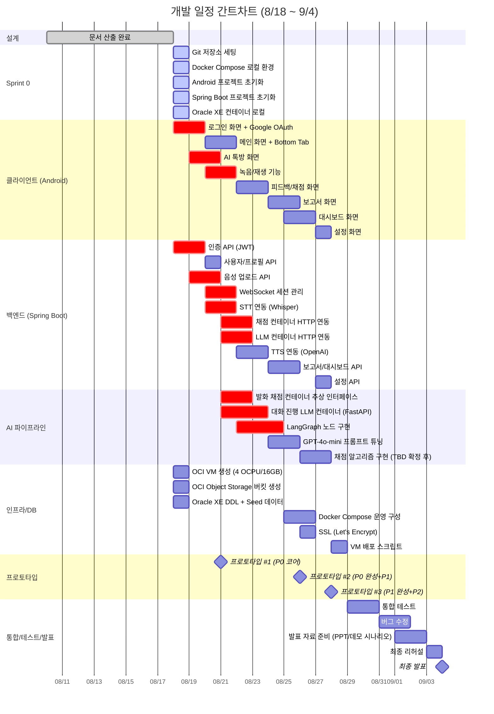
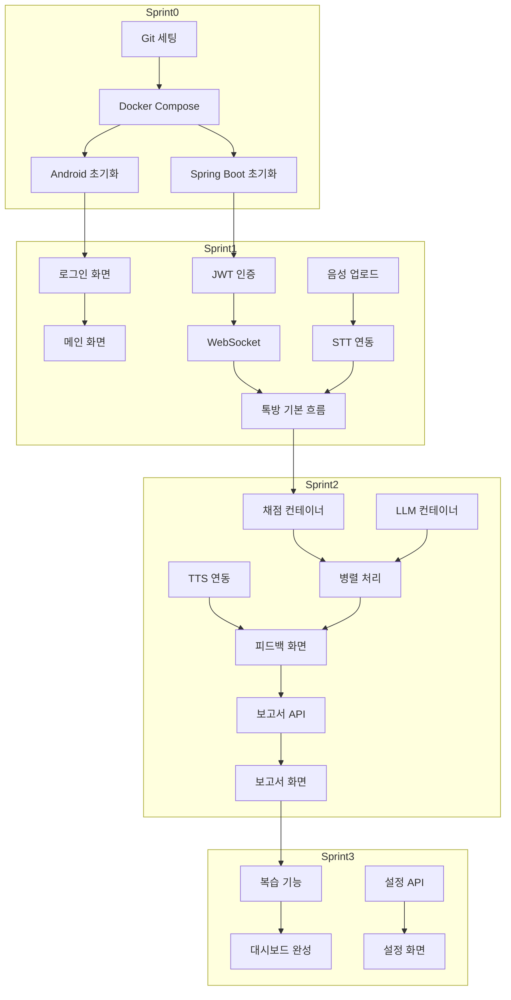

# WBS / 개발계획서 (Work Breakdown Structure & Development Plan)

## 1. 개발 일정 개요

| 기간 | 스프린트 | 목표 | 산출물 (프로토타입) |
|------|---------|------|-------------------|
| 8/18 (월) | **Sprint 0** | 개발 환경 세팅 | Git repo, Docker Compose 로컬, Android 프로젝트 초기화 |
| 8/18 ~ 8/21 (금) | **Sprint 1** | P0 코어 (로그인→톡방→녹음→STT→텍스트 피드백) | **프로토타입 #1**: 로그인 → 톡방 → 녹음 → STT → 텍스트 피드백 |
| 8/22 ~ 8/26 (수) | **Sprint 2** | P0 완성 + P1 시작 (채점/LLM/TTS 병렬 처리) | **프로토타입 #2**: 채점 점수, 보고서, 대시보드, 병렬 처리 완성 |
| 8/27 ~ 8/28 (금) | **Sprint 3** | P1 완성 + P2 시작 | **프로토타입 #3**: 복습, 설정, 알림, 연속 학습 |
| 8/29 ~ 9/3 (목) | **Sprint 4** | 통합/테스트 + 발표 준비 | 최종 데모 버전, 발표 자료, 버그 수정 |
| **9/4 (목)** | — | **최종 발표** | 🎉 |

---

## 2. 간트차트 (Gantt Chart)



---

## 3. 작업 분해 구조 (WBS)

### 3.1 클라이언트 개발 (Android / Kotlin)

| ID | 작업명 | 우선순위 | 시작일 | 종료일 | 산출물 |
|----|--------|---------|--------|--------|--------|
| C-001 | 프로젝트 초기화 + Gradle 설정 | P0 | 8/18 | 8/18 | Android Studio 프로젝트 |
| C-002 | 로그인 화면 (Google OAuth) | P0 | 8/18 | 8/19 | LoginActivity |
| C-003 | 메인 화면 + Bottom Tab Navigation | P0 | 8/19 | 8/20 | MainActivity + 3 Tabs |
| C-004 | AI 톡방 화면 (RecyclerView 채팅) | P0 | 8/19 | 8/20 | ChatActivity |
| C-005 | 마이크 녹음 (AudioRecord) + 권한 | P0 | 8/20 | 8/21 | VoiceRecorder |
| C-006 | 음성 파일 업로드 (REST multipart) | P0 | 8/20 | 8/21 | UploadManager |
| C-007 | WebSocket 연결 (OkHttp) + 이벤트 처리 | P0 | 8/20 | 8/21 | WebSocketManager |
| C-008 | 채점 결과 화면 (점수 카드 + 파라미터 바) | P0 | 8/22 | 8/23 | ScoringFragment |
| C-009 | AI 피드백 화면 (텍스트 + TTS 재생) | P0 | 8/22 | 8/23 | FeedbackFragment |
| C-010 | 보고서 화면 (종합점수 + 요약) | P0 | 8/24 | 8/25 | ReportActivity |
| C-011 | 대시보드 화면 (꺾은선 그래프 영역) | P1 | 8/25 | 8/26 | DashboardFragment |
| C-012 | 설정 화면 (토글 + 알림 시간) | P1 | 8/27 | 8/27 | SettingsFragment |
| C-013 | 복습 기능 UI (틀린 문제 재출제) | P1 | 8/27 | 8/28 | ReviewFragment |
| C-014 | 연속 학습 배지 (스트릭) | P2 | 8/28 | 8/28 | StreakView |
| C-015 | 접근성 (폰트 크기, 색약 모드) | P3 | 시간 남으면 | — | AccessibilitySettings |

### 3.2 백엔드 개발 (Spring Boot / Kotlin)

| ID | 작업명 | 우선순위 | 시작일 | 종료일 | 산출물 |
|----|--------|---------|--------|--------|--------|
| B-001 | 프로젝트 초기화 + Gradle + JPA | P0 | 8/18 | 8/18 | Spring Boot 프로젝트 |
| B-002 | JWT 인증 (Access/Refresh Token) | P0 | 8/18 | 8/19 | AuthController + Filter |
| B-003 | Google OAuth2 연동 | P0 | 8/18 | 8/19 | GoogleAuthService |
| B-004 | 사용자/프로필 API | P0 | 8/19 | 8/19 | UserController |
| B-005 | 음성 업로드 API (Object Storage 연동) | P0 | 8/19 | 8/20 | VoiceController + StorageService |
| B-006 | WebSocketConfig + ChatController | P0 | 8/20 | 8/21 | WebSocket Handler |
| B-007 | STT 연동 (OpenAI Whisper API) | P0 | 8/20 | 8/21 | WhisperService |
| B-008 | 발화 채점 컨테이너 HTTP 클라이언트 | P0 | 8/21 | 8/22 | ScoringService (@Async) |
| B-009 | 대화 진행 LLM 컨테이너 HTTP 클라이언트 | P0 | 8/21 | 8/22 | LlmService (@Async) |
| B-010 | TTS 연동 (OpenAI TTS + Object Storage 저장) | P0 | 8/22 | 8/23 | TtsService |
| B-011 | 병렬 처리 orchestration (CompletableFuture) | P0 | 8/22 | 8/23 | ChatOrchestrator |
| B-012 | 보고서 생성 API | P0 | 8/24 | 8/25 | ReportController |
| B-013 | 대시보드/학습 이력 API | P1 | 8/25 | 8/26 | DashboardController |
| B-014 | 설정 API (알림) | P1 | 8/27 | 8/27 | SettingsController |
| B-015 | 에러 핸들링 + 로깅 | P1 | 8/26 | 8/27 | GlobalExceptionHandler |

### 3.3 AI 파이프라인 개발 (Python / Docker)

| ID | 작업명 | 우선순위 | 시작일 | 종료일 | 산출물 |
|----|--------|---------|--------|--------|--------|
| A-001 | 발화 채점 컨테이너: FastAPI 프로젝트 초기화 | P0 | 8/21 | 8/21 | scoring-container/ |
| A-002 | 채점 API 엔드포인트 (`POST /api/v1/score`) | P0 | 8/21 | 8/22 | scoring router |
| A-003 | 채점 알고리즘 스텁 (랜덤 점수 반환) | P0 | 8/21 | 8/22 | scoring engine stub |
| A-004 | 대화 진행 LLM 컨테이너: FastAPI + LangGraph 초기화 | P0 | 8/21 | 8/22 | conversation-llm/ |
| A-005 | LangGraph 상태 그래프 구현 (8개 노드) | P0 | 8/22 | 8/24 | graph.py |
| A-006 | GPT-4o-mini API 연동 (OpenAI SDK) | P0 | 8/22 | 8/23 | llm_client.py |
| A-007 | 컨텍스트 로드 (DB Turn history 쿼리) | P0 | 8/23 | 8/24 | context_loader.py |
| A-008 | 프롬프트 설계 (시스템 프롬프트 + few-shot) | P0 | 8/24 | 8/25 | prompts/ |
| A-009 | 채점 알고리즼 실제 구현 (TBD 확정 후) | P1 | 8/26 | 8/28 | scoring engine v1 |
| A-010 | Docker 이미지 빌드 + Compose 통합 | P1 | 8/26 | 8/27 | Dockerfile, compose update |

### 3.4 인프라 / DB (OCI / Docker)

| ID | 작업명 | 우선순위 | 시작일 | 종료일 | 산출물 |
|----|--------|---------|--------|--------|--------|
| I-001 | OCI VM 생성 (4 OCPU/16GB) | P0 | 8/18 | 8/18 | VM 인스턴스 |
| I-002 | OCI Object Storage 버킷 + Lifecycle Rule | P0 | 8/18 | 8/18 | speech-app-voices |
| I-003 | Oracle XE Docker Compose 서비스 | P0 | 8/18 | 8/18 | docker-compose.yml |
| I-004 | DDL 실행 (9개 테이블) + Seed 데이터 | P0 | 8/18 | 8/19 | schema.sql, data.sql |
| I-005 | nginx 리버스 프록시 + SSL 설정 | P1 | 8/25 | 8/26 | nginx.conf |
| I-006 | Docker Compose 운영 환경 구성 | P1 | 8/26 | 8/27 | docker-compose.prod.yml |
| I-007 | VM 배포 스크립트 (SSH + docker-compose up) | P1 | 8/28 | 8/28 | deploy.sh |
| I-008 | OCI 모니터링 알림 설정 | P2 | 8/29 | 8/29 | 알림 규칙 |

### 3.5 통합 / 테스트 / QA

| ID | 작업명 | 우선순위 | 시작일 | 종료일 | 산출물 |
|----|--------|---------|--------|--------|--------|
| T-001 | API 단위 테스트 (JUnit) | P0 | 병행 | 병행 | Test 클래스 |
| T-002 | 클라이언트-백엔드 통합 테스트 | P0 | 8/22 | 8/23 | 수동 테스트 시나리오 |
| T-003 | WebSocket 흐름 통합 테스트 | P0 | 8/23 | 8/24 | E2E 시나리오 |
| T-004 | AI 파이프라인 통합 테스트 | P0 | 8/24 | 8/25 | Whisper → 채점 → LLM → TTS |
| T-004a | TTS 한국어 품질 A/B 테스트 | P0 | 8/22 | 8/22 | tts-1 vs Azure/Clova 샘플 비교 |
| T-005 | 성능 테스트 (첫 피드백 10초 / 전체 15초 확인) | P1 | 8/26 | 8/27 | 성능 측정 로그 |
| T-006 | 에러 케이스 테스트 (네트워크 끊김 등) | P1 | 8/27 | 8/28 | 장애 시나리오 |
| T-007 | 발표용 데모 시나리오 검증 | P0 | 9/1 | 9/2 | 시나리오 문서 |

### 3.6 발표 준비

| ID | 작업명 | 우선순위 | 시작일 | 종료일 | 산출물 |
|----|--------|---------|--------|--------|--------|
| P-001 | 발표 PPT 초안 | P0 | 8/31 | 9/1 | Google Slides / PPT |
| P-002 | 데모 시나리오 연습 (A→B→C 흐름) | P0 | 9/1 | 9/2 | 연습 로그 |
| P-003 | 발표 자료 검토 및 수정 | P0 | 9/2 | 9/3 | 최종 PPT |
| P-004 | 최종 리허설 | P0 | 9/3 | 9/3 | — |
| P-005 | **최종 발표** | P0 | **9/4** | **9/4** | 🎉 |

---

## 4. 마일스톤 및 프로토타입 정의

### 4.1 프로토타입 #1 (8/21 금요일)

**목표:** P0 코어 흐름이 "돌아간다"

```
[로그인] → [메인] → [톡방 입장] → [녹음] → [STT] → [텍스트 피드백]
```

| 포함 기능 | 상태 |
|----------|------|
| 구글 로그인 | 필수 |
| 메인 화면 + Bottom Tab | 필수 |
| AI 톡방 + 문제 표시 | 필수 |
| 마이크 녹음 + 업로드 | 필수 |
| Whisper STT 연동 | 필수 |
| WebSocket 실시간 통신 | 필수 |
| 기본 피드백 텍스트 표시 | 필수 (LLM 스텁 OK) |
| **채점 점수** | 없어도 OK (스텁) |
| **TTS 음성** | 없어도 OK (텍스트만) |

### 4.2 프로토타입 #2 (8/26 수요일)

**목표:** P0 완성 + 병렬 처리 + 보고서

| 추가 기능 | 상태 |
|----------|------|
| 채점 컨테이너 연동 (스텁 → 실제) | 필수 |
| 채점 결과 화면 (점수 + 파라미터 바) | 필수 |
| AI 피드백 음성 (TTS) | 필수 |
| 병렬 처리 (SCORING_READY + LLM_READY) | 필수 |
| 세션 종료 + 보고서 생성 | 필수 |
| 보고서 화면 | 필수 |
| 대시보드 (학습 이력 목록) | 포함 |

### 4.3 프로토타입 #3 (8/28 금요일)

**목표:** P1 완성 + P2 시작

| 추가 기능 | 상태 |
|----------|------|
| 복습 기능 (틀린 문제 재출제) | 필수 |
| 설정 (알림 ON/OFF, 시간) | 필수 |
| 대시보드 꺾은선 그래프 | 포함 |
| 연속 학습 배지 (스트릭) | 포함 |
| 고객센터 링크 | 포함 |

---

## 5. 리스크 및 버퍼

| 리스크 | 영향 | 대응 | 버퍼 |
|--------|------|------|------|
| 발화 채점 기준 미확정 (TBD) | AI 컨테이너 지연 | 8/21까지 스텁으로 진행, 8/26에 실제 알고리즘 교체 | 2일 |
| Whisper API 초기 연동 실패 | STT 지연 | 8/20까지 반드시 테스트, 실패 시 폴백 로직 | 1일 |
| WebSocket 끊김 (모바일 네트워크) | UX 저하 | 자동 재연결 로직 8/22까지 구현 | 1일 |
| OCI VM 생성 지연 | 전체 백엔드 지연 | 8/18 당일 완료를 목표, 실패 시 로컬 Docker로 개발 | 0일 (당일) |
| 팀원 역할 배분 지연 | 작업 시작 지연 | 8/19까지 팀 회의로 확정, 그 전엔 팀장이 몰빵 | 1일 |

**전체 버퍼:** 8/29 ~ 8/31 (3일) — 예상치 못한 지연을 흡수

---

## 6. 의존성 매트릭스



---


## 7. 변경 이력

| 버전 | 날짜 | 작성자 | 변경 내용 |
|------|------|--------|-----------|
| v0.1 | 2026-08-18 | 김윤혁 | 초안 작성 |
| v0.2 | 2026-08-18 | 김윤혁 | Sprint 1 범위 현실화(채점/LLM/TTS 병렬 처리는 Sprint 2로 이연). TTS 한국어 품질 A/B 테스트(T-004a) 추가. 성능 테스트 기준 10초→첫 피드백 10초/전체 15초로 갱신. DDL 테이블 수 10→9(FRIENDSHIP 제거 반영). 섹션 번호 8→7 정정. |
