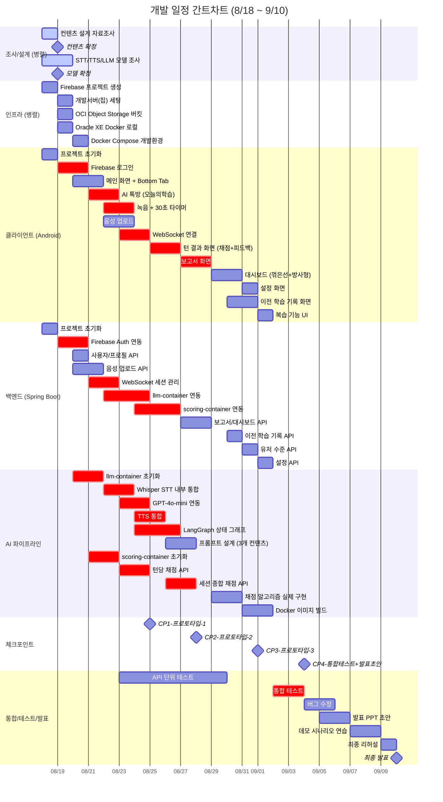
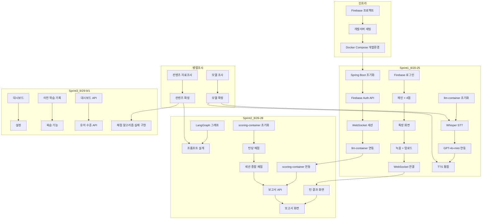

# WBS / 개발계획서 (Work Breakdown Structure & Development Plan)

## 1. 개발 일정 개요

| 기간 | 스프린트 | 목표 | 산출물 (프로토타입 / 체크포인트) |
|------|---------|------|-------------------|
| 8/18 (월) ~ 8/19 (화) | **Sprint 0** | 환경 세팅 + 병렬 조사/설계 | Git repo, Docker Compose, Android/Spring 초기화, Firebase 프로젝트, 개발서버(집) 세팅 |
| 8/20 (수) ~ 8/25 (화) | **Sprint 1** | P0 코어 개발 | **체크포인트 8/25**: 프로토타입 #1 (로그인→톡방→녹음→STT→텍스트 피드백) |
| 8/26 (수) ~ 8/28 (금) | **Sprint 2** | P0 완성 + P1 시작 | **체크포인트 8/28**: 프로토타입 #2 (채점 5지표 + TTS + 보고서 + 세션 종합 채점) |
| 8/29 (토) ~ 9/1 (화) | **Sprint 3** | P1 완성 + P3 시작 | **체크포인트 9/1**: 프로토타입 #3 (대시보드 방사형 + 유저 레벨 + 설정 + 복습 + 이전 기록) |
| 9/2 (수) ~ 9/4 (금) | **Sprint 4** | 통합/테스트 + 발표 준비 | **체크포인트 9/4**: 통합 테스트 완료, 발표 자료 초안 |
| 9/5 (토) ~ 9/9 (화) | **버퍼** | 최종 다듬기 + 리허설 | 최종 데모 버전, 버그 수정, 리허설 |
| **9/10 (수)** | — | **최종 발표** | 🎉 |

> **병렬 진행 중인 업무**
> - **팀원 2명**: 컨텐츠 설계 자료조사 (8/18) → 컨텐츠 확정 (8/19)
> - **팀원 1명**: STT / TTS / LLM 모델 조사 (8/18~8/19)
> - **팀장(개발총괄)**: 문서화 마무리 (8/18) → 인프라/개발환경 세팅 + 개발 착수 (8/19~)

---

## 2. 간트차트 (Gantt Chart)



---

## 3. 작업 분해 구조 (WBS)

### 3.1 조사/설계 (병렬 — 담당자 미정)

| ID | 작업명 | 기간 | 산출물 | 비고 |
|----|--------|------|--------|------|
| R-001 | 컨텐츠 설계 자료조사 (발화재활 관련) | 8/18 | 조사 문서 | 팀원 2명 병렬 |
| R-002 | **컨텐츠 확정** (A/B/C 유형 정의) | 8/19 | 컨텐츠 명세서 | Sprint 1 전 필수 |
| R-003 | STT/TTS/LLM 모델 기술 조사 | 8/18~8/19 | 모델 비교표 | 팀원 1명 |
| R-004 | **모델 확정** (Whisper / tts-1 / GPT-4o-mini) | 8/19 | 모델 선정 문서 | Sprint 1 전 필수 |

> **의존성**: R-002(컨텐츠 확정) → AI 프롬프트 설계(ai6), 채점 기준 확정. R-004(모델 확정) → AI 연동 개발. 두 조사 모두 Sprint 1 전(8/19)에 완료되어야 함.

### 3.2 인프라/환경 세팅 (병렬)

| ID | 작업명 | 기간 | 산출물 |
|----|--------|------|--------|
| I-001 | Git 저장소 세팅 | 8/18 | Git repo |
| I-002 | Firebase 프로젝트 생성 + Google OAuth 설정 | 8/18 | Firebase Console 설정 |
| I-003 | 개발서버(집) 세팅 — Docker, nginx 기본 설치 | 8/19 | 개발서버 접속 확인 |
| I-004 | OCI Object Storage 버킷 생성 | 8/19 | speech-app-voices |
| I-005 | Oracle XE Docker Compose 로컬 환경 | 8/19 | docker-compose.yml (local) |
| I-006 | Docker Compose 개발환경 통합 (Spring + Oracle + llm + scoring + nginx) | 8/20 | docker-compose.dev.yml |
| I-007 | SSL (Let's Encrypt) 운영 서버 | 8/27~8/28 | nginx + SSL |
| I-008 | VM 배포 스크립트 | 9/02 | deploy.sh |

### 3.3 클라이언트 개발 (Android / Kotlin)

| ID | 작업명 | 우선순위 | 기간 | 산출물 |
|----|--------|---------|------|--------|
| C-001 | Android 프로젝트 초기화 + Gradle 설정 | P0 | 8/18 | 프로젝트 구조 |
| C-002 | Firebase Google Sign-In 연동 | P0 | 8/19~8/20 | LoginActivity |
| C-003 | 메인 화면 + Bottom Tab Navigation (4개 탭) | P0 | 8/20~8/21 | MainActivity |
| C-004 | AI 톡방 화면 (RecyclerView, 세션 유형 표시) | P0 | 8/21~8/22 | ChatActivity |
| C-005 | 마이크 녹음 + 30초 타이머 + 권한 | P0 | 8/22~8/23 | VoiceRecorder |
| C-006 | 음성 파일 업로드 (multipart) | P0 | 8/22~8/23 | UploadManager |
| C-007 | WebSocket 연결 (OkHttp) + TURN_RESULT 처리 | P0 | 8/23~8/24 | WebSocketManager |
| C-008 | 턴 결과 화면 (5개 지표 + 종합 점수 + 피드백 + 다음문제) | P0 | 8/25~8/26 | TurnResultFragment |
| C-009 | AI 피드백 음성 재생 (TTS URL → ExoPlayer) | P0 | 8/25~8/26 | FeedbackPlayer |
| C-010 | 보고서 화면 (종합점수 + 5개 지표 + 요약) | P0 | 8/27~8/28 | ReportActivity |
| C-011 | 대시보드 화면 (꺾은선 그래프 + 방사형 그래프 + 레벨) | P1 | 8/29~8/30 | DashboardFragment |
| C-012 | 이전 학습 기록 화면 (세션 리스트 + 턴 상세 + 녹음 재생) | P3 | 8/30~8/31 | HistoryFragment |
| C-013 | 설정 화면 (알림 ON/OFF, 시간) | P1 | 8/31 | SettingsFragment |
| C-014 | 복습 기능 UI (점수 낮은 턴 재출제) | P1 | 9/01 | ReviewFragment |
| C-015 | 연속 학습 배지 (스트릭) | P2 | 시간 남으면 | StreakView |
| C-016 | 접근성 (폰트 크기, 색약 모드) | P3 | 시간 남으면 | — |

### 3.4 백엔드 개발 (Spring Boot / Kotlin)

| ID | 작업명 | 우선순위 | 기간 | 산출물 |
|----|--------|---------|------|--------|
| B-001 | Spring Boot 프로젝트 초기화 + Gradle + JPA | P0 | 8/18 | 프로젝트 구조 |
| B-002 | Firebase Auth 연동 (ID Token 검증 + JWT 발급) | P0 | 8/19~8/20 | AuthController |
| B-003 | 사용자/프로필 API (필수정보/민감정보 분리) | P0 | 8/20 | UserController |
| B-004 | 음성 업로드 API (Object Storage 연동) | P0 | 8/20~8/21 | VoiceController |
| B-005 | WebSocketConfig + ChatController (TURN_RESULT 통합) | P0 | 8/21~8/22 | WebSocket Handler |
| B-006 | Oracle XE DDL 실행 (13개 테이블) + Seed | P0 | 8/19~8/20 | schema.sql |
| B-007 | JPA Entity + Repository 작성 | P0 | 8/20~8/21 | Entity/Repository |
| B-008 | llm-container 연동 (음성→STT+LLM+TTS 일괄 호출) | P0 | 8/22~8/24 | LlmService (@Async) |
| B-009 | scoring-container 연동 (턴당 채점) | P0 | 8/24~8/25 | ScoringService |
| B-010 | scoring-container 연동 (세션 종합 보고서) | P0 | 8/26~8/27 | ReportService |
| B-011 | 결과 취합 및 DB 저장 (Turn, Score, VoiceRecord) | P0 | 8/25~8/26 | ChatOrchestrator |
| B-012 | 보고서 생성 API | P0 | 8/27~8/28 | ReportController |
| B-013 | 대시보드/학습 이력 API | P1 | 8/29~8/30 | DashboardController |
| B-014 | 이전 학습 기록 API (세션 리스트 + 턴 상세 + 녹음 URL) | P3 | 8/30 | HistoryController |
| B-015 | 유저 수준 API (계산 + 조회) | P4 | 8/31 | LevelController |
| B-016 | 설정 API (알림) | P1 | 9/01 | SettingsController |
| B-017 | 에러 핸들링 + 로깅 | P1 | 8/29~8/30 | GlobalExceptionHandler |

### 3.5 AI 파이프라인 개발 (Python / Docker)

| ID | 작업명 | 우선순위 | 기간 | 산출물 | 비고 |
|----|--------|---------|------|--------|------|
| A-001 | llm-container: FastAPI 프로젝트 초기화 | P0 | 8/20~8/21 | llm-container/ | |
| A-002 | Whisper STT 통합 (OpenAI API 내부 호출) | P0 | 8/22~8/23 | stt_module.py | |
| A-003 | GPT-4o-mini API 연동 (대화 진행) | P0 | 8/23~8/24 | llm_client.py | |
| A-004 | TTS 통합 (OpenAI tts-1) | P0 | 8/24~8/25 | tts_module.py | |
| A-005 | LangGraph 상태 그래프 구현 (STT→채점→LLM→TTS) | P0 | 8/24~8/26 | graph.py | |
| A-006 | 프롬프트 설계 (3개 컨텐츠 유형) | P0 | 8/26~8/27 | prompts/ | 컨텐츠 확정 후 진행 |
| A-007 | 컨텍스트 로드 (DB Turn history 쿼리) | P0 | 8/25~8/26 | context_loader.py | |
| A-008 | scoring-container: FastAPI 초기화 | P0 | 8/21~8/22 | scoring-container/ | |
| A-009 | 턴당 채점 API (`POST /api/v1/score`) | P0 | 8/23~8/24 | scoring router | |
| A-010 | 턴당 채점 알고리즘 스텁 (5개 지표 랜덤) | P0 | 8/23~8/24 | scoring stub | Sprint 1용 |
| A-011 | 세션 종합 채점 API (`POST /api/v1/score/session`) | P0 | 8/26~8/27 | session scoring router | |
| A-012 | 세션 종합 채점 알고리즘 스텁 | P0 | 8/26~8/27 | session scoring stub | Sprint 2용 |
| A-013 | 채점 알고리즘 실제 구현 (TBD 확정 후) | P1 | 8/29~8/30 | scoring engine v1 | 컨텐츠 확정 후 |
| A-014 | Docker 이미지 빌드 (llm + scoring) + Compose 통합 | P1 | 8/31~9/01 | Dockerfile, compose | |

### 3.6 테스트 / QA

| ID | 작업명 | 우선순위 | 기간 | 산출물 |
|----|--------|---------|------|--------|
| T-001 | API 단위 테스트 (JUnit) | P0 | 병행 | Test 클래스 |
| T-002 | 클라이언트-백엔드 통합 테스트 | P0 | 8/24~8/25 | 수동 테스트 시나리오 |
| T-003 | WebSocket 흐름 통합 테스트 (TURN_RESULT) | P0 | 8/25~8/26 | E2E 시나리오 |
| T-004 | AI 파이프라인 통합 테스트 (음성→STT→채점→LLM→TTS) | P0 | 8/26~8/27 | End-to-end 시나리오 |
| T-005 | TTS 한국어 품질 A/B 테스트 | P0 | 8/25 | tts-1 vs 기타 비교 |
| T-006 | 세션 종합 보고서 생성 테스트 | P0 | 8/27~8/28 | 채점 컨테이너 종합 테스트 |
| T-007 | 성능 테스트 (첫 피드백 10초 / 전체 15초) | P1 | 8/29~8/30 | 성능 측정 로그 |
| T-008 | 에러 케이스 테스트 (네트워크 끊김, 타임아웃) | P1 | 9/03~9/04 | 장애 시나리오 |
| T-009 | 발표용 데모 시나리오 검증 | P0 | 9/07~9/08 | 시나리오 문서 |

### 3.7 발표 준비

| ID | 작업명 | 우선순위 | 기간 | 산출물 |
|----|--------|---------|------|--------|
| P-001 | 발표 PPT 초안 | P0 | 9/05~9/06 | Google Slides / PPT |
| P-002 | 데모 시나리오 연습 (컨텐츠 A→B→C 흐름) | P0 | 9/07~9/08 | 연습 로그 |
| P-003 | 발표 자료 검토 및 수정 | P0 | 9/08~9/09 | 최종 PPT |
| P-004 | 최종 리허설 | P0 | 9/09 | — |
| P-005 | **최종 발표** | P0 | **9/10** | 🎉 |

---

## 4. 체크포인트별 산출물

### 4.1 체크포인트 #1 — 8/25 (화)

**목표:** P0 코어 흐름이 "돌아간다"

```
[Firebase 로그인] → [메인(4탭)] → [오늘의 학습 입장] → [녹음 30초] → [STT] → [텍스트 피드백]
```

| 포함 기능 | 상태 |
|----------|------|
| Firebase Google 로그인 | 필수 |
| 메인 화면 + Bottom Tab (4개: 학습/대시보드/이전기록/설정) | 필수 |
| AI 톡방 (오늘의 학습) + 세션 유형 표시 | 필수 |
| 마이크 녹음 (30초 제한) + 음성 업로드 | 필수 |
| Whisper STT (llm-container 내부) | 필수 |
| WebSocket TURN_RESULT 통합 이벤트 | 필수 |
| 기본 피드백 텍스트 표시 | 필수 (LLM 스텁 OK) |
| **채점 점수 (5개 지표)** | 없어도 OK (스텁) |
| **TTS 음성** | 없어도 OK (텍스트만) |
| **보고서** | 없어도 OK |

### 4.2 체크포인트 #2 — 8/28 (금)

**목표:** P0 완성 + 채점/TTS/보고서

| 추가 기능 | 상태 |
|----------|------|
| 채점 컨테이너 연동 (턴당 5개 지표) | 필수 |
| 턴 결과 화면 (5개 지표 + 종합 점수 + 다음문제) | 필수 |
| AI 피드백 음성 (TTS, llm-container 내부) | 필수 |
| TURN_RESULT 통합 이벤트 | 필수 |
| 세션 종료 + 채점 컨테이너 종합 보고서 생성 | 필수 |
| 보고서 화면 (5개 지표 + 종합 + 요약) | 필수 |
| 대시보드 (학습 이력 목록) | 포함 |

### 4.3 체크포인트 #3 — 9/1 (화)

**목표:** P1 완성 + P3 시작

| 추가 기능 | 상태 |
|----------|------|
| 대시보드 꺾은선 그래프 + 방사형 그래프(5개 지표) | 필수 |
| 유저 레벨 표시 (Lv.1~10) | 필수 |
| 설정 (알림 ON/OFF, 시간) | 필수 |
| 복습 기능 (점수 낮은 턴 재출제) | 필수 |
| 이전 학습 기록 (세션 리스트 + 턴별 상세 + 녹음 재생) | 포함 |
| 연속 학습 배지 (스트릭) | 포함 |
| 고객센터 링크 | 포함 |

### 4.4 체크포인트 #4 — 9/4 (금)

**목표:** 통합 테스트 완료 + 발표 준비 시작

| 산출물 | 상태 |
|--------|------|
| 통합 테스트 완료 (클라이언트 ↔ 백엔드 ↔ AI) | 필수 |
| 주요 버그 수정 완료 | 필수 |
| 발표 PPT 초안 | 필수 |
| 데모 시나리오 확정 | 필수 |

---

## 5. 리스크 및 버퍼

| 리스크 | 영향 | 대응 | 버퍼 |
|--------|------|------|------|
| 컨텐츠 설계 지연 (8/19 미확정) | AI 프롬프트/채점 기준 지연 | 8/20까지 스텁(랜덤)으로 개발 진행, 확정 후 교체 | 1일 |
| 모델 조사 지연 (8/19 미확정) | AI 연동 지연 | API 인터페이스 먼저 설계, 모델은 플러그인 교체 | 1일 |
| 개발서버(집) 네트워크 불안정 | 백엔드 테스트 지연 | 로컬 Docker로 대체 개발 가능 | 0일 |
| Whisper API 초기 연동 실패 | STT 지연 | 8/23까지 반드시 테스트, 실패 시 폴백 로직 | 1일 |
| WebSocket 끊김 (모바일 네트워크) | UX 저하 | 자동 재연결 로직 8/24까지 구현 | 1일 |
| 채점 알고리즘 TBD 지연 | scoring-container 지연 | 8/28까지 스텁 유지, 실제 알고리즘 9/1 교체 | 2일 |

**전체 버퍼:** 9/5 ~ 9/9 (5일) — 예상치 못한 지연 흡수 + 발표 준비 여유

---

## 6. 의존성 매트릭스



---

## 7. 변경 이력

| 버전 | 날짜 | 작성자 | 변경 내용 |
|------|------|--------|-----------|
| v0.1 | 2026-08-18 | 김윤혁 | 초안 작성 |
| v0.2 | 2026-08-18 | 김윤혁 | Sprint 1 범위 현실화, TTS A/B 테스트 추가 |
| v0.3 | 2026-08-19 | 김윤혁 | 발표일 9/4→9/10, 컨테이너/인증/컨텐츠 변경 반영 |
| v0.4 | 2026-08-19 | 김윤혁 | 체크포인트 4개 추가(8/25, 8/28, 9/1, 9/4), 병렬 작업(컨텐츠조사/모델조사/인프라세팅) 반영, 의존성 완화, 담당자 제외, 개발서버(집) 추가 |
