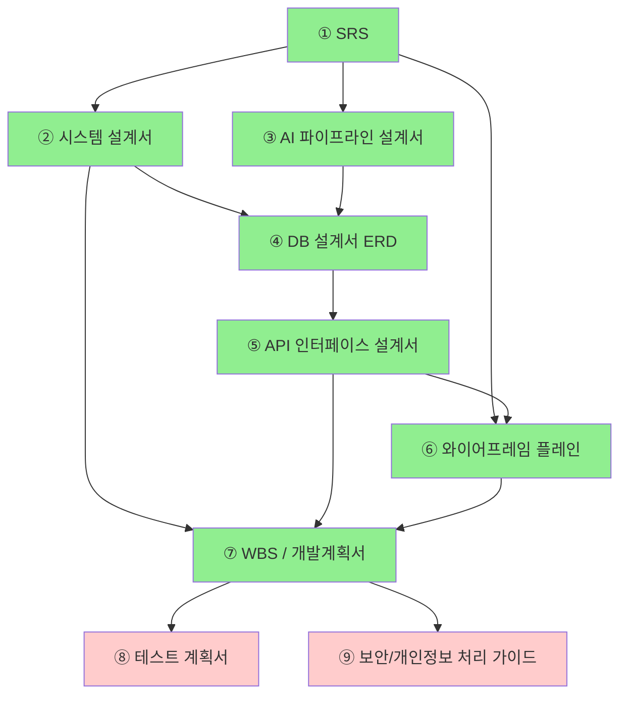

# 문서화 체크리스트 (Documentation Checklist)

> **용도:** 현재 작성된 문서들의 완료 현황과 남은 산출물을 정리한 체크리스트.  
> 각 문서의 작성 상태, 의존성, 그리고 아직 미작성인 산출물을 한눈에 확인한다.

---

## 1. 프로젝트 개요

| 항목 | 내용 |
|---|---|
| **프로젝트명** | AI 기반 발화 연습·대화형 에이전트 앱 |
| **타겟 사용자** | 발화에 어려움을 겪는 실어증 환자 |
| **플랫폼** | Android (Google Play) 단일 |
| **클라이언트** | Kotlin Native (Android Studio) |
| **백엔드** | Kotlin Spring Boot (모놀리틱) |
| **인프라** | OCI Compute VM + Docker Compose |
| **DB** | Oracle Database 21c XE (컨테이너) |
| **AI Stack** | Whisper API (STT), OpenAI TTS (tts-1), GPT-4o-mini + LangGraph (대화 진행), 발화 채점 컨테이너 (TBD) |
| **통신** | WebSocket (AI 대화), REST API (기타), Spring @Async (병렬 처리) |
| **기간** | 8/10 ~ **9/4 발표** |
| **팀 규모** | 4명 (개발 총괄 1명이 클라이언트/백엔드/인프라 전담) |

---

## 2. 문서 현황 요약

| 번호 | 문서명 | 파일명 | 상태 | 버전 |
|---|---|---|---|---|
| ① | 소프트웨어 요구사항 정의서 (SRS) | `01_Software_Requirements_Specification.md` | **✅ 완료** | v0.1 |
| ② | 시스템 설계서 | `02_System_Design_Document.md` | **✅ 완료** | v0.1 |
| ③ | AI 파이프라인 설계서 | `03_AI_Pipeline_Design.md` | **✅ 완료** | v0.1 |
| ④ | 데이터베이스 설계서 (ERD) | `04_Database_Design.md` | **✅ 완료** | v0.2-draft |
| ⑤ | API 인터페이스 설계서 | `05_API_Interface_Design.md` | **✅ 완료** | v0.1 |
| ⑥ | 와이어프레임 플레인 | `06_wireframe_plain.html` | **✅ 완료** | - |
| ⑦ | WBS / 개발계획서 | `07_WBS_Development_Plan.md` | **✅ 완료** | v0.1 |
| ⑧ | 테스트 계획서 | *(미작성)* | **⬜ 미작성** | - |
| ⑨ | 보안 / 개인정보 처리 가이드 | *(미작성)* | **⬜ 미작성** | - |
| ⑩ | 와이어프레임 테마 확장 (High-fidelity) | *(미작성)* | **⬜ 선택** | - |
| ⑪ | UI 디자인 가이드 | *(미작성)* | **⬜ 선택** | - |

---

## 3. 기능 우선순위 (P0 ~ P5)

### P0 — Must Have (없으면 데모 불가)
- 로그인 1개 이상 (소셜 or 일반)
- AI와의 음성 대화 흐름: 문제 출제 → 마이크 녹음 → STT → 발화 채점 → 피드백
- 최종 보고서 생성 및 DB 저장
- 사용자 보고서 확인 화면

### P1 — Should Have (데모 품질을 크게 높여줌)
- 복습 기능 (점수 낮은 문제 재출제)
- 간략화된 대시보드 (날짜별 점수 꺾은선 그래프)
- 설정 (알림 ON/OFF, 고객센터)

### P2 — Nice to Have (데이터 쌓여야 의미 있음)
- 연속 학습 기록 (스트릭)
- 컨텐츠 유형별 집중 연습
- 방사형 그래프 (내 현재 수준 시각화)

### P3 — Advanced (코어 완성 후 시간 남으면)
- 사람 간 매칭 대화 기능 (매칭 + 실시간 대화 + 평가지표)
- 소셜 기능 (친구 목록)
- 접근성 메뉴 (폰트 크기/스타일, 색약 모드)

### P4 — Future / BM (발표 언급 또는 곁다리)
- BM: 레벨별 맞춤 문제, 저장된 문제 재풀이, 사용량 기반 일일 무료 횟수

### P5 — Polish (QA 이후)
- 전체 UI 폴리싱, 성능 최적화, 에러 핸들링 강화

---

## 4. 문서 산출 의존성 다이어그램

> **색상 의미:** 초록 = 작성 완료 | 빨강 = 미작성

---

## 5. 문서별 상세 체크리스트

### ① 요구사항 정의서 (SRS) — ✅ 완료

| 항목 | 상태 | 비고 |
|---|---|---|
| **작성 시점** | 8/18 | |
| **의존성** | xmind 서비스 플로우 | |
| 기능적 요구사항 (P0~P5 분류) | ✅ | |
| 비기능적 요구사항 (성능, 보안, 확장성) | ✅ | |
| 외부 인터페이스 요구사항 | ✅ | Android ↔ Spring Boot, Spring Boot ↔ AI 컨테이너 |
| 제약 조건 (일정, 인력, 예산, Android 단일) | ✅ | |
| 용어 정의 (Glossary) | ✅ | "발화", "STT", "턴", "문제" 등 통일 |
| **작성자** | 팀장 | |
| **검토자** | 전체 팀 | |

---

### ② 시스템 설계서 — ✅ 완료

| 항목 | 상태 | 비고 |
|---|---|---|
| **작성 시점** | 8/18 | |
| **의존성** | ① SRS | |
| 클라이언트 기술 선정 (Kotlin Native) | ✅ | |
| 백엔드/인프라 기술 선정 (OCI + Docker Compose) | ✅ | |
| AI 서버/모델 기술 선정 | ✅ | Whisper, TTS, GPT-4o-mini, LangGraph |
| 서버 아키텍처 다이어그램 (mermaid) | ✅ | Spring Boot + Oracle XE + nginx |
| 데이터 흐름도 (DFD) | ✅ | 음성 파일 전송 → 채점 → 피드백 |
| 배포 환경 / DevOps 전략 | ✅ | Docker Compose, nginx 리버스 프록시 |
| **작성자** | 팀장 (개발 총괄) | |
| **검토자** | AI 담당 팀원 | |

---

### ③ AI 파이프라인 설계서 — ✅ 완료

| 항목 | 상태 | 비고 |
|---|---|---|
| **작성 시점** | 8/18 | |
| **의존성** | ① SRS (AI 관련 부분) | |
| STT → 텍스트 변환 파이프라인 (Whisper API) | ✅ | |
| 발화 채점 기준 / 알고리즘 | ✅ | 컨테이너 기반 (내부 구현 TBD) |
| LLM Agent 프롬프트 설계 (LangGraph) | ✅ | GPT-4o-mini 기반 대화 진행 |
| TTS 음성 생성 파이프라인 (OpenAI tts-1) | ✅ | |
| 음성 파일 저장 / 전송 규격 | ✅ | 포맷, 크기 제한, WebSocket |
| 턴(turn) 관리 / 세션 상태 설계 | ✅ | "오늘의 문제"별 문답 누적 |
| Spring @Async 병렬 처리 흐름 | ✅ | 발화 채점 + 대화 LLM 동시 호출 |
| **작성자** | AI 담당 팀원들 | |
| **검토자** | 팀장 (API 연동 관점) | |

---

### ④ 데이터베이스 설계서 (ERD) — ✅ 완료

| 항목 | 상태 | 비고 |
|---|---|---|
| **작성 시점** | 8/18 | |
| **의존성** | ② 시스템 설계서 + ③ AI 파이프라인 | |
| ERD 다이어그램 (mermaid) | ✅ | |
| 엔티티 목록 | ✅ | User, Session, Problem, Answer, Score, Report... |
| 필드 상세 정의 (타입, 제약, 인덱스) | ✅ | Oracle 21c 문법 기준 |
| 개인정보/민감정보 필드 별도 표시 | ✅ | 수술/질병 여부, 음성 파일 등 |
| 데이터 보관 / 삭제 정책 | ✅ | 음성 파일 보관 기간 |
| **작성자** | 팀장 | |
| **검토자** | AI 담당 팀원 | |

---

### ⑤ API 인터페이스 설계서 — ✅ 완료

| 항목 | 상태 | 비고 |
|---|---|---|
| **작성 시점** | 8/18 | |
| **의존성** | ④ DB 설계서 | |
| 인증 API (로그인/회원가입/자동로그인) | ✅ | JWT (Access/Refresh Token) |
| 문제/컨텐츠 API | ✅ | 오늘의 학습, 문제 유형별 조회 |
| 음성 업로드 / STT API | ✅ | 음성 파일 → Spring Boot → Whisper API |
| 채점/피드백 API | ✅ | 점수 + 텍스트 피드백 반환 |
| 보고서 API | ✅ | 최종 보고서 생성 및 조회 |
| 대시보드/학습 이력 API | ✅ | |
| WebSocket API (AI 대화 세션) | ✅ | 실시간 양방향 통신 규격 |
| 에러 코드 표준화 | ✅ | |
| **작성자** | 팀장 | |
| **검토자** | AI 담당 팀원 | |

---

### ⑥ 와이어프레임 플레인 — ✅ 완료

| 항목 | 상태 | 비고 |
|---|---|---|
| **작성 시점** | 8/18 | |
| **의존성** | ① SRS + ⑤ API 설계 | |
| 화면 흐름도 (Screen Flow) | ✅ | `06_wireframe_plain.html` |
| 핵심 화면 와이어프레임 (8~10개) | ✅ | 로그인, 메인, 톡방, 녹음, 피드백, 보고서, 설정 |
| 네비게이션 구조 | ✅ | Bottom Tab |
| P0 화면 우선 작성 | ✅ | |
| **작성자** | 팀장 + 디자인/기획 담당 팀원 | |
| **검토자** | 전체 팀 | |

> 📁 관련 파일: `wireframes/`, `service_flow/`

---

### ⑦ WBS / 개발계획서 — ✅ 완료

| 항목 | 상태 | 비고 |
|---|---|---|
| **작성 시점** | 8/18 | |
| **의존성** | ② 시스템 설계서 + ⑤ API 설계 + ⑥ 와이어프레임 | |
| 작업 분해 구조 (WBS) | ✅ | 기능별 태스크 |
| 간트차트 (Gantt Chart) | ✅ | mermaid gantt 사용 |
| 마일스톤 정의 | ✅ | Sprint 0~4, 9/4 발표 |
| 리스크 / 버퍼 일정 | ✅ | |
| **작성자** | 팀장 | |
| **검토자** | 전체 팀 | |

---

### ⑧ 테스트 계획서 — ⬜ 미작성

| 항목 | 상태 | 비고 |
|---|---|---|
| **작성 시점** | Sprint 3~4 (8/27 이후) | |
| **의존성** | ⑦ WBS | |
| 기능 테스트 (Unit / Integration) | ⬜ | 각 API, 화면 흐름 |
| 음성/AI 테스트 기준 | ⬜ | STT 정확도, 발화 채점 기준 |
| 장애/에러 케이스 시나리오 | ⬜ | 네트워크 끊김, 녹음 실패, LLM 타임아웃 |
| 데모 시나리오 (발표용) | ⬜ | 발표 때 보여줄 A→B→C 흐름 |
| **작성자** | 팀장 + QA 담당 | |
| **검토자** | 전체 팀 | |

---

### ⑨ 보안 / 개인정보 처리 가이드 — ⬜ 미작성

| 항목 | 상태 | 비고 |
|---|---|---|
| **작성 시점** | Sprint 3~4 (8/27 이후) | |
| **의존성** | ④ DB 설계서 | |
| 수집하는 개인정보 목록 | ⬜ | 식별정보 + 추가 개인화 정보 |
| 민감정보(건강/음성) 처리 방침 | ⬜ | 수술/질병 여부, 음성 녹음 파일 |
| 소셜 로그인 보안 (OAuth) | ⬜ | 토큰 관리, 로그아웃/회원탈퇴 |
| 서버 보안 (OCI VM, Docker, nginx) | ⬜ | 방화벽, SSL, 컨테이너 보안 |
| **작성자** | 팀장 | |
| **검토자** | 전체 팀 | |

---

### ⑩ 와이어프레임 테마 확장 (High-fidelity) — ⬜ 선택

| 항목 | 상태 | 비고 |
|---|---|---|
| **작성 시점** | 시간 남으면 | |
| **의존성** | ⑥ 와이어프레임 플레인 | |
| 색상 팔레트 / 타이포그래피 | ⬜ | 실어증 환자 고려한 가독성 |
| 디자인 토큰 정의 | ⬜ | |
| 고해상도 목업 (핵심 화면) | ⬜ | 발표용 슬라이드에 들어갈 수준 |
| **작성자** | 디자인/기획 담당 팀원 | |
| **검토자** | 전체 팀 | |

---

### ⑪ UI 디자인 가이드 — ⬜ 선택

| 항목 | 상태 | 비고 |
|---|---|---|
| **작성 시점** | 시간 남으면 | |
| **의존성** | ⑩ 테마 확장 | |
| 컴포넌트 라이브러리 정의 | ⬜ | Button, Card, Input 등 |
| 반응형 / 접근성 가이드 | ⬜ | 폰트 크기, 색약 모드 |
| **작성자** | 디자인 담당 | |

---

## 6. 현재 확정된 것 vs 미확정된 것

### ✅ 확정됨
- [x] 프로젝트 주제 및 타겟 사용자
- [x] 서비스 플로우 (xmind + wireframe)
- [x] 플랫폼 (Android)
- [x] 팀 규모 및 역할 (큰 틀)
- [x] AI Stack (Whisper API, OpenAI TTS, GPT-4o-mini + LangGraph)
- [x] 클라이언트 기술 (Kotlin Native)
- [x] 백엔드 (OCI + Docker Compose + Spring Boot)
- [x] DB (Oracle 21c XE 컨테이너)
- [x] 통신 방식 (WebSocket + REST + @Async)
- [x] 음성 파일 포맷 / 전송 방식 (WebSocket)
- [x] Git 저장소 생성 및 브랜치 전략

### ❓ 미확정 / 논의 필요
- [ ] 발화 채점 기준 구체화 (컨테이너 내부 알고리즘 TBD)
- [ ] 팀원별 세부 역할 분담 (Sprint 단위)
- [ ] 테스트 계획서 작성 여부 및 범위
- [ ] 보안/개인정보 처리 가이드 작성 여부

---

## 7. 다음 단계

1. **설계 문서(①~⑦) 픽스** — 팀원 전체 리뷰 및 사인오프
2. **Sprint 0 진행** — 개발 환경 세팅 (Git, Docker Compose 로컬, Android 프로젝트 초기화)
3. **⑧ 테스트 계획서** — Sprint 2~3경에 초안 작성 검토
4. **⑨ 보안/개인정보 처리 가이드** — Sprint 3 이후 작성 검토
5. **⑩~⑪ 디자인 산출물** — 시간 여유 확인 후 결정
