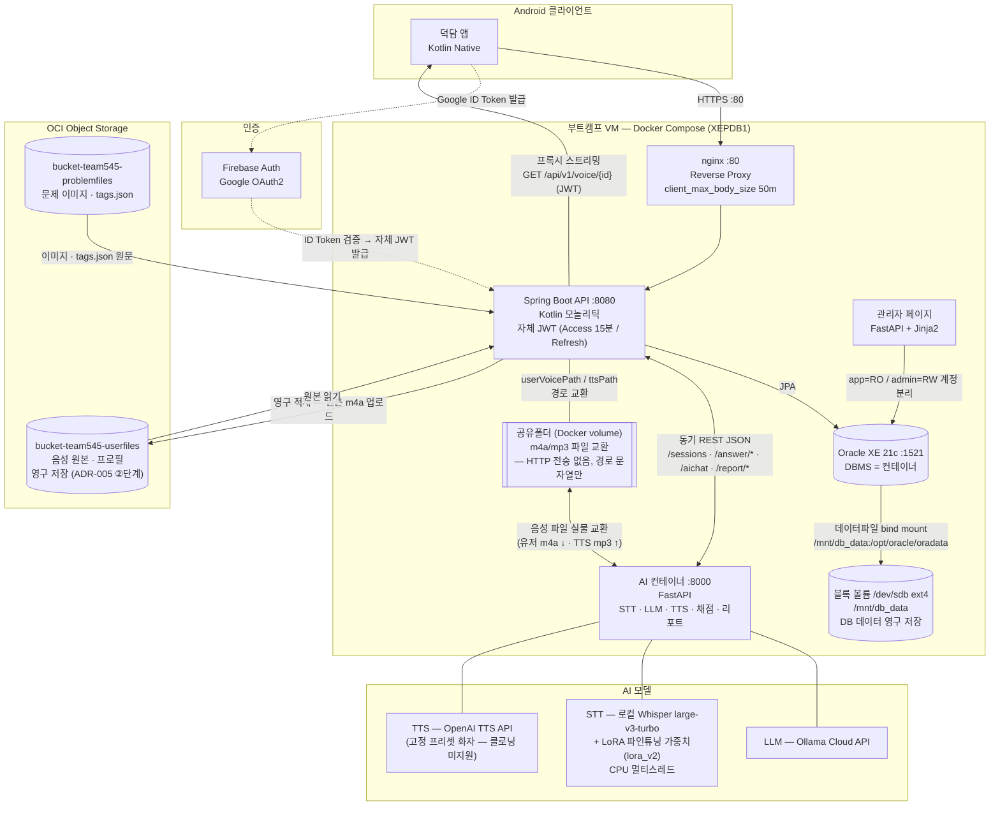

# 시스템 아키텍처 구조도 (v1.0 — 2026-09-09)

> **기준:** `02_Architecture.md` v2.1 §3 · `03a_AI_Container_API_Reference.md` v1.11 §0 · ADR-005 (음성 3단계 저장)
> **실측 근거 (2026-09-09 VM 실물):** Deployment compose — oracle-db volumes `/mnt/db_data:/opt/oracle/oradata` bind mount, `/mnt/db_data` = `/dev/sdb ext4 50GB` 블록 볼륨 · AI 컨테이너 `main.py`/`hf_stt.py`/`config.py` — STT=Whisper large-v3-turbo + LoRA 파인튜닝 가중치(lora_v2.pt), TTS=OpenAI API(고정 프리셋 화자), LLM=Ollama Cloud API

## 발표용 포인트

1. **음성 = HTTP 전송 없음** — BE↔AI컨테이너는 공유폴더 경로 문자열만 교환, 실물 파일은 Docker volume 경유 (03a §0)
2. **DBMS는 컨테이너, 데이터는 블록 볼륨** — Oracle XE 21c 컨테이너 + OCI 블록 볼륨(`/dev/sdb`) bind mount로 영구 저장
3. **음성 3단계 저장 (ADR-005)** — ①공유폴더(임시 교환) → ②OCI 버킷(영구 원본) → ③BE 프록시 스트리밍(JWT 인증)
4. **인증** — Firebase Google OAuth2 ID Token 검증 → 자체 JWT 발급(Access 15분/Refresh)
5. **AI 모델 스택(실측)** — LLM=Ollama Cloud API · STT=로컬 Whisper large-v3-turbo+LoRA(lora_v2) · TTS=OpenAI TTS API
